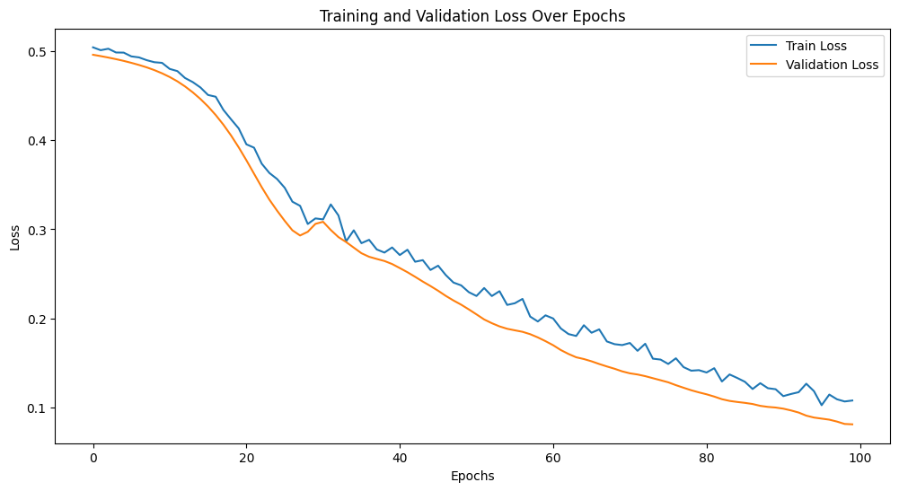

```python
import tensorflow as tf
import numpy as np
import matplotlib.pyplot as plt

x = np.linspace(0, 40, 200)
y = np.sin(x)

samples = y.shape[0]
timesteps = 1
features = 1

x_train = y[:180].reshape((180//timesteps, timesteps, features))
y_train = y[1:181].reshape((180//timesteps, timesteps))

x_val = y[180:199].reshape(((samples-181)//timesteps, timesteps, features))
y_val =  y[181:].reshape(((samples-181)//timesteps, timesteps))

model = tf.keras.models.Sequential()
model.add(tf.keras.layers.LSTM(50, activation='relu', input_shape=(None, 1)))
model.add(tf.keras.layers.Dense(1))

model.compile(optimizer='adam', loss='mse')

history = model.fit(x_train, y_train, epochs=100, validation_data=(x_val, y_val))

predicted = model.predict(x_train)

# Display the result
plt.figure(figsize=(12,6))
plt.plot(y, label='Actual')
plt.plot(predicted.flatten(), 'r', label='Predicted')
plt.legend()
plt.show()

```

    WARNING:tensorflow:Layer lstm_18 will not use cuDNN kernels since it doesn't meet the criteria. It will use a generic GPU kernel as fallback when running on GPU.
    Epoch 1/100
    6/6 [==============================] - 2s 53ms/step - loss: 0.5139 - val_loss: 0.5523
    Epoch 2/100
    6/6 [==============================] - 0s 11ms/step - loss: 0.4977 - val_loss: 0.5337
    Epoch 3/100
    6/6 [==============================] - 0s 11ms/step - loss: 0.4822 - val_loss: 0.5155
    Epoch 4/100
    6/6 [==============================] - 0s 12ms/step - loss: 0.4672 - val_loss: 0.4971
    Epoch 5/100
    6/6 [==============================] - 0s 12ms/step - loss: 0.4526 - val_loss: 0.4788
    Epoch 6/100
    6/6 [==============================] - 0s 12ms/step - loss: 0.4369 - val_loss: 0.4613
    Epoch 7/100
    6/6 [==============================] - 0s 15ms/step - loss: 0.4217 - val_loss: 0.4435
    Epoch 8/100
    6/6 [==============================] - 0s 13ms/step - loss: 0.4067 - val_loss: 0.4261
    Epoch 9/100
    6/6 [==============================] - 0s 12ms/step - loss: 0.3915 - val_loss: 0.4080
    Epoch 10/100
    6/6 [==============================] - 0s 12ms/step - loss: 0.3760 - val_loss: 0.3895
    Epoch 11/100
    6/6 [==============================] - 0s 11ms/step - loss: 0.3595 - val_loss: 0.3716
    Epoch 12/100
    6/6 [==============================] - 0s 11ms/step - loss: 0.3431 - val_loss: 0.3531
    Epoch 13/100
    6/6 [==============================] - 0s 11ms/step - loss: 0.3263 - val_loss: 0.3334
    Epoch 14/100
    6/6 [==============================] - 0s 12ms/step - loss: 0.3084 - val_loss: 0.3134
    Epoch 15/100
    6/6 [==============================] - 0s 12ms/step - loss: 0.2902 - val_loss: 0.2930
    Epoch 16/100
    6/6 [==============================] - 0s 12ms/step - loss: 0.2718 - val_loss: 0.2716
    Epoch 17/100
    6/6 [==============================] - 0s 12ms/step - loss: 0.2529 - val_loss: 0.2506
    Epoch 18/100
    6/6 [==============================] - 0s 14ms/step - loss: 0.2340 - val_loss: 0.2289
    Epoch 19/100
    6/6 [==============================] - 0s 11ms/step - loss: 0.2151 - val_loss: 0.2076
    Epoch 20/100
    6/6 [==============================] - 0s 12ms/step - loss: 0.1956 - val_loss: 0.1871
    Epoch 21/100
    6/6 [==============================] - 0s 11ms/step - loss: 0.1770 - val_loss: 0.1669
    Epoch 22/100
    6/6 [==============================] - 0s 12ms/step - loss: 0.1587 - val_loss: 0.1478
    Epoch 23/100
    6/6 [==============================] - 0s 12ms/step - loss: 0.1411 - val_loss: 0.1294
    Epoch 24/100
    6/6 [==============================] - 0s 12ms/step - loss: 0.1242 - val_loss: 0.1122
    Epoch 25/100
    6/6 [==============================] - 0s 14ms/step - loss: 0.1085 - val_loss: 0.0963
    Epoch 26/100
    6/6 [==============================] - 0s 13ms/step - loss: 0.0934 - val_loss: 0.0817
    Epoch 27/100
    6/6 [==============================] - 0s 13ms/step - loss: 0.0803 - val_loss: 0.0687
    Epoch 28/100
    6/6 [==============================] - 0s 13ms/step - loss: 0.0687 - val_loss: 0.0572
    Epoch 29/100
    6/6 [==============================] - 0s 13ms/step - loss: 0.0584 - val_loss: 0.0476
    Epoch 30/100
    6/6 [==============================] - 0s 13ms/step - loss: 0.0495 - val_loss: 0.0397
    Epoch 31/100
    6/6 [==============================] - 0s 12ms/step - loss: 0.0426 - val_loss: 0.0332
    Epoch 32/100
    6/6 [==============================] - 0s 12ms/step - loss: 0.0364 - val_loss: 0.0284
    Epoch 33/100
    6/6 [==============================] - 0s 14ms/step - loss: 0.0319 - val_loss: 0.0249
    Epoch 34/100
    6/6 [==============================] - 0s 13ms/step - loss: 0.0282 - val_loss: 0.0223
    Epoch 35/100
    6/6 [==============================] - 0s 13ms/step - loss: 0.0256 - val_loss: 0.0206
    Epoch 36/100
    6/6 [==============================] - 0s 13ms/step - loss: 0.0238 - val_loss: 0.0193
    Epoch 37/100
    6/6 [==============================] - 0s 13ms/step - loss: 0.0226 - val_loss: 0.0186
    Epoch 38/100
    6/6 [==============================] - 0s 14ms/step - loss: 0.0217 - val_loss: 0.0185
    Epoch 39/100
    6/6 [==============================] - 0s 14ms/step - loss: 0.0211 - val_loss: 0.0185
    Epoch 40/100
    6/6 [==============================] - 0s 13ms/step - loss: 0.0209 - val_loss: 0.0185
    Epoch 41/100
    6/6 [==============================] - 0s 12ms/step - loss: 0.0207 - val_loss: 0.0185
    Epoch 42/100
    6/6 [==============================] - 0s 11ms/step - loss: 0.0206 - val_loss: 0.0187
    Epoch 43/100
    6/6 [==============================] - 0s 13ms/step - loss: 0.0205 - val_loss: 0.0185
    Epoch 44/100
    6/6 [==============================] - 0s 11ms/step - loss: 0.0205 - val_loss: 0.0187
    Epoch 45/100
    6/6 [==============================] - 0s 11ms/step - loss: 0.0205 - val_loss: 0.0186
    Epoch 46/100
    6/6 [==============================] - 0s 12ms/step - loss: 0.0205 - val_loss: 0.0187
    Epoch 47/100
    6/6 [==============================] - 0s 12ms/step - loss: 0.0205 - val_loss: 0.0187
    Epoch 48/100
    6/6 [==============================] - 0s 11ms/step - loss: 0.0205 - val_loss: 0.0186
    Epoch 49/100
    6/6 [==============================] - 0s 12ms/step - loss: 0.0205 - val_loss: 0.0187
    Epoch 50/100
    6/6 [==============================] - 0s 12ms/step - loss: 0.0205 - val_loss: 0.0190
    Epoch 51/100
    6/6 [==============================] - 0s 13ms/step - loss: 0.0205 - val_loss: 0.0187
    Epoch 52/100
    6/6 [==============================] - 0s 13ms/step - loss: 0.0205 - val_loss: 0.0186
    Epoch 53/100
    6/6 [==============================] - 0s 13ms/step - loss: 0.0205 - val_loss: 0.0186
    Epoch 54/100
    6/6 [==============================] - 0s 11ms/step - loss: 0.0205 - val_loss: 0.0184
    Epoch 55/100
    6/6 [==============================] - 0s 12ms/step - loss: 0.0204 - val_loss: 0.0184
    Epoch 56/100
    6/6 [==============================] - 0s 12ms/step - loss: 0.0205 - val_loss: 0.0184
    Epoch 57/100
    6/6 [==============================] - 0s 13ms/step - loss: 0.0205 - val_loss: 0.0188
    Epoch 58/100
    6/6 [==============================] - 0s 14ms/step - loss: 0.0204 - val_loss: 0.0188
    Epoch 59/100
    6/6 [==============================] - 0s 14ms/step - loss: 0.0204 - val_loss: 0.0187
    Epoch 60/100
    6/6 [==============================] - 0s 12ms/step - loss: 0.0204 - val_loss: 0.0187
    Epoch 61/100
    6/6 [==============================] - 0s 11ms/step - loss: 0.0204 - val_loss: 0.0186
    Epoch 62/100
    6/6 [==============================] - 0s 12ms/step - loss: 0.0204 - val_loss: 0.0186
    Epoch 63/100
    6/6 [==============================] - 0s 12ms/step - loss: 0.0204 - val_loss: 0.0185
    Epoch 64/100
    6/6 [==============================] - 0s 13ms/step - loss: 0.0204 - val_loss: 0.0187
    Epoch 65/100
    6/6 [==============================] - 0s 12ms/step - loss: 0.0204 - val_loss: 0.0184
    Epoch 66/100
    6/6 [==============================] - 0s 12ms/step - loss: 0.0204 - val_loss: 0.0187
    Epoch 67/100
    6/6 [==============================] - 0s 11ms/step - loss: 0.0204 - val_loss: 0.0187
    Epoch 68/100
    6/6 [==============================] - 0s 11ms/step - loss: 0.0204 - val_loss: 0.0187
    Epoch 69/100
    6/6 [==============================] - 0s 11ms/step - loss: 0.0204 - val_loss: 0.0188
    Epoch 70/100
    6/6 [==============================] - 0s 12ms/step - loss: 0.0204 - val_loss: 0.0189
    Epoch 71/100
    6/6 [==============================] - 0s 11ms/step - loss: 0.0204 - val_loss: 0.0189
    Epoch 72/100
    6/6 [==============================] - 0s 12ms/step - loss: 0.0204 - val_loss: 0.0190
    Epoch 73/100
    6/6 [==============================] - 0s 12ms/step - loss: 0.0204 - val_loss: 0.0190
    Epoch 74/100
    6/6 [==============================] - 0s 12ms/step - loss: 0.0204 - val_loss: 0.0188
    Epoch 75/100
    6/6 [==============================] - 0s 13ms/step - loss: 0.0204 - val_loss: 0.0190
    Epoch 76/100
    6/6 [==============================] - 0s 13ms/step - loss: 0.0204 - val_loss: 0.0187
    Epoch 77/100
    6/6 [==============================] - 0s 11ms/step - loss: 0.0204 - val_loss: 0.0189
    Epoch 78/100
    6/6 [==============================] - 0s 13ms/step - loss: 0.0204 - val_loss: 0.0186
    Epoch 79/100
    6/6 [==============================] - 0s 13ms/step - loss: 0.0204 - val_loss: 0.0185
    Epoch 80/100
    6/6 [==============================] - 0s 13ms/step - loss: 0.0204 - val_loss: 0.0185
    Epoch 81/100
    6/6 [==============================] - 0s 13ms/step - loss: 0.0204 - val_loss: 0.0182
    Epoch 82/100
    6/6 [==============================] - 0s 12ms/step - loss: 0.0204 - val_loss: 0.0185
    Epoch 83/100
    6/6 [==============================] - 0s 12ms/step - loss: 0.0203 - val_loss: 0.0186
    Epoch 84/100
    6/6 [==============================] - 0s 13ms/step - loss: 0.0204 - val_loss: 0.0189
    Epoch 85/100
    6/6 [==============================] - 0s 12ms/step - loss: 0.0204 - val_loss: 0.0187
    Epoch 86/100
    6/6 [==============================] - 0s 12ms/step - loss: 0.0203 - val_loss: 0.0187
    Epoch 87/100
    6/6 [==============================] - 0s 11ms/step - loss: 0.0203 - val_loss: 0.0186
    Epoch 88/100
    6/6 [==============================] - 0s 12ms/step - loss: 0.0203 - val_loss: 0.0189
    Epoch 89/100
    6/6 [==============================] - 0s 12ms/step - loss: 0.0204 - val_loss: 0.0191
    Epoch 90/100
    6/6 [==============================] - 0s 12ms/step - loss: 0.0203 - val_loss: 0.0190
    Epoch 91/100
    6/6 [==============================] - 0s 12ms/step - loss: 0.0203 - val_loss: 0.0186
    Epoch 92/100
    6/6 [==============================] - 0s 12ms/step - loss: 0.0204 - val_loss: 0.0183
    Epoch 93/100
    6/6 [==============================] - 0s 11ms/step - loss: 0.0203 - val_loss: 0.0187
    Epoch 94/100
    6/6 [==============================] - 0s 11ms/step - loss: 0.0203 - val_loss: 0.0192
    Epoch 95/100
    6/6 [==============================] - 0s 12ms/step - loss: 0.0203 - val_loss: 0.0191
    Epoch 96/100
    6/6 [==============================] - 0s 11ms/step - loss: 0.0203 - val_loss: 0.0189
    Epoch 97/100
    6/6 [==============================] - 0s 12ms/step - loss: 0.0203 - val_loss: 0.0186
    Epoch 98/100
    6/6 [==============================] - 0s 13ms/step - loss: 0.0203 - val_loss: 0.0186
    Epoch 99/100
    6/6 [==============================] - 0s 12ms/step - loss: 0.0203 - val_loss: 0.0186
    Epoch 100/100
    6/6 [==============================] - 0s 11ms/step - loss: 0.0203 - val_loss: 0.0188
    6/6 [==============================] - 0s 3ms/step


    

    


```python
import tensorflow as tf
import numpy as np
import matplotlib.pyplot as plt

x = np.linspace(0, 40, 200)
y = np.column_stack((np.arange(x.shape[0]), np.sin(x)))

samples = y.shape[0]
timesteps = 1
features = 2

x_train = y[:180].reshape((180//timesteps, timesteps, features))
y_train = y[1:181].reshape((180//timesteps, timesteps, features))

x_val = y[180:199].reshape(((samples-181)//timesteps, timesteps, features))
y_val =  y[181:].reshape(((samples-181)//timesteps, timesteps, features))

model = tf.keras.models.Sequential()
model.add(tf.keras.layers.LSTM(50, activation='relu', input_shape=(None, 2)))
model.add(tf.keras.layers.Dense(2))

model.compile(optimizer='adam', loss='mse')

history = model.fit(x_train, y_train, epochs=100, validation_data=(x_val, y_val))

# Generate additional x values for prediction beyond the range of x_train
x_future = np.column_stack((np.arange(200, 250), np.sin(np.linspace(40, 45, 50))))
x_future = x_future.reshape((50//timesteps, timesteps, features))

# Combined original x and the future x
x_combined = np.concatenate((x_train, x_future))

# Make predictions for the combined x
predicted = model.predict(x_combined)

# Display the result
plt.figure(figsize=(12,6))
plt.plot(y[:, 1], label='Actual') # actual data
plt.plot(predicted[:, 0, 1].flatten(), 'r', label='Predicted')  # includes future predictions
plt.legend()
plt.show()

```

    WARNING:tensorflow:Layer lstm_1 will not use cuDNN kernels since it doesn't meet the criteria. It will use a generic GPU kernel as fallback when running on GPU.
    Epoch 1/100
    6/6 [==============================] - 2s 57ms/step - loss: 5484.5547 - val_loss: 17987.8867
    Epoch 2/100
    6/6 [==============================] - 0s 13ms/step - loss: 5380.9209 - val_loss: 17564.1270
    Epoch 3/100
    6/6 [==============================] - 0s 11ms/step - loss: 5279.0996 - val_loss: 17136.9609
    Epoch 4/100
    6/6 [==============================] - 0s 12ms/step - loss: 5189.2183 - val_loss: 16714.4902
    Epoch 5/100
    6/6 [==============================] - 0s 13ms/step - loss: 5100.7603 - val_loss: 16349.3896
    Epoch 6/100
    6/6 [==============================] - 0s 10ms/step - loss: 5025.1387 - val_loss: 16028.8311
    Epoch 7/100
    6/6 [==============================] - 0s 11ms/step - loss: 4943.1631 - val_loss: 15704.3633
    Epoch 8/100
    6/6 [==============================] - 0s 11ms/step - loss: 4849.8442 - val_loss: 15326.6709
    Epoch 9/100
    6/6 [==============================] - 0s 13ms/step - loss: 4742.4126 - val_loss: 14862.6123
    Epoch 10/100
    6/6 [==============================] - 0s 12ms/step - loss: 4626.9341 - val_loss: 14315.1123
    Epoch 11/100
    6/6 [==============================] - 0s 12ms/step - loss: 4442.6382 - val_loss: 13294.7871
    Epoch 12/100
    6/6 [==============================] - 0s 11ms/step - loss: 4131.6079 - val_loss: 11203.3271
    Epoch 13/100
    6/6 [==============================] - 0s 13ms/step - loss: 3756.8000 - val_loss: 9146.1191
    Epoch 14/100
    6/6 [==============================] - 0s 11ms/step - loss: 3372.9326 - val_loss: 7278.2778
    Epoch 15/100
    6/6 [==============================] - 0s 11ms/step - loss: 2965.3555 - val_loss: 4983.4316
    Epoch 16/100
    6/6 [==============================] - 0s 11ms/step - loss: 2627.5898 - val_loss: 2159.1294
    Epoch 17/100
    6/6 [==============================] - 0s 10ms/step - loss: 2454.4343 - val_loss: 940.0660
    Epoch 18/100
    6/6 [==============================] - 0s 13ms/step - loss: 2416.0569 - val_loss: 1087.1467
    Epoch 19/100
    6/6 [==============================] - 0s 13ms/step - loss: 2347.7383 - val_loss: 1556.4395
    Epoch 20/100
    6/6 [==============================] - 0s 12ms/step - loss: 2326.8857 - val_loss: 1713.6475
    Epoch 21/100
    6/6 [==============================] - 0s 12ms/step - loss: 2295.0298 - val_loss: 1723.2805
    Epoch 22/100
    6/6 [==============================] - 0s 13ms/step - loss: 2266.5144 - val_loss: 1620.0807
    Epoch 23/100
    6/6 [==============================] - 0s 10ms/step - loss: 2205.1296 - val_loss: 1624.7050
    Epoch 24/100
    6/6 [==============================] - 0s 11ms/step - loss: 2275.0542 - val_loss: 1696.7413
    Epoch 25/100
    6/6 [==============================] - 0s 10ms/step - loss: 2229.2759 - val_loss: 1771.1515
    Epoch 26/100
    6/6 [==============================] - 0s 11ms/step - loss: 2177.4641 - val_loss: 1717.9144
    Epoch 27/100
    6/6 [==============================] - 0s 11ms/step - loss: 2234.8975 - val_loss: 1557.9647
    Epoch 28/100
    6/6 [==============================] - 0s 11ms/step - loss: 2211.7522 - val_loss: 1688.9165
    Epoch 29/100
    6/6 [==============================] - 0s 13ms/step - loss: 2194.4800 - val_loss: 1677.8464
    Epoch 30/100
    6/6 [==============================] - 0s 14ms/step - loss: 2157.4763 - val_loss: 1686.5253
    Epoch 31/100
    6/6 [==============================] - 0s 14ms/step - loss: 2175.7903 - val_loss: 1691.2416
    Epoch 32/100
    6/6 [==============================] - 0s 12ms/step - loss: 2172.5754 - val_loss: 1726.1742
    Epoch 33/100
    6/6 [==============================] - 0s 11ms/step - loss: 2139.2854 - val_loss: 1682.4686
    Epoch 34/100
    6/6 [==============================] - 0s 12ms/step - loss: 2156.6470 - val_loss: 1773.1100
    Epoch 35/100
    6/6 [==============================] - 0s 13ms/step - loss: 2150.7625 - val_loss: 1773.8239
    Epoch 36/100
    6/6 [==============================] - 0s 12ms/step - loss: 2072.2900 - val_loss: 1773.6664
    Epoch 37/100
    6/6 [==============================] - 0s 11ms/step - loss: 2134.9146 - val_loss: 1811.6201
    Epoch 38/100
    6/6 [==============================] - 0s 11ms/step - loss: 2111.4644 - val_loss: 1868.3234
    Epoch 39/100
    6/6 [==============================] - 0s 11ms/step - loss: 2088.7476 - val_loss: 1915.5763
    Epoch 40/100
    6/6 [==============================] - 0s 12ms/step - loss: 2046.9929 - val_loss: 1856.4020
    Epoch 41/100
    6/6 [==============================] - 0s 13ms/step - loss: 1955.9366 - val_loss: 1709.9515
    Epoch 42/100
    6/6 [==============================] - 0s 12ms/step - loss: 2085.1951 - val_loss: 1827.2107
    Epoch 43/100
    6/6 [==============================] - 0s 14ms/step - loss: 2059.6172 - val_loss: 2095.4841
    Epoch 44/100
    6/6 [==============================] - 0s 11ms/step - loss: 2049.3276 - val_loss: 2027.7223
    Epoch 45/100
    6/6 [==============================] - 0s 13ms/step - loss: 2042.1670 - val_loss: 2019.2797
    Epoch 46/100
    6/6 [==============================] - 0s 12ms/step - loss: 2047.3901 - val_loss: 2026.1069
    Epoch 47/100
    6/6 [==============================] - 0s 10ms/step - loss: 2034.6771 - val_loss: 2032.2314
    Epoch 48/100
    6/6 [==============================] - 0s 11ms/step - loss: 2021.8069 - val_loss: 2194.8938
    Epoch 49/100
    6/6 [==============================] - 0s 12ms/step - loss: 2016.1299 - val_loss: 2188.8633
    Epoch 50/100
    6/6 [==============================] - 0s 11ms/step - loss: 2009.5599 - val_loss: 2145.7117
    Epoch 51/100
    6/6 [==============================] - 0s 11ms/step - loss: 1992.7393 - val_loss: 2254.6523
    Epoch 52/100
    6/6 [==============================] - 0s 11ms/step - loss: 1940.4557 - val_loss: 2393.4412
    Epoch 53/100
    6/6 [==============================] - 0s 11ms/step - loss: 1980.4625 - val_loss: 2150.2500
    Epoch 54/100
    6/6 [==============================] - 0s 12ms/step - loss: 1895.5698 - val_loss: 2299.4622
    Epoch 55/100
    6/6 [==============================] - 0s 11ms/step - loss: 1955.7422 - val_loss: 2427.0188
    Epoch 56/100
    6/6 [==============================] - 0s 11ms/step - loss: 1911.7007 - val_loss: 2441.9978
    Epoch 57/100
    6/6 [==============================] - 0s 12ms/step - loss: 1879.7102 - val_loss: 2476.7771
    Epoch 58/100
    6/6 [==============================] - 0s 13ms/step - loss: 1864.4655 - val_loss: 2459.4758
    Epoch 59/100
    6/6 [==============================] - 0s 13ms/step - loss: 1901.5184 - val_loss: 2461.9065
    Epoch 60/100
    6/6 [==============================] - 0s 12ms/step - loss: 1844.8458 - val_loss: 2714.6794
    Epoch 61/100
    6/6 [==============================] - 0s 11ms/step - loss: 1907.1714 - val_loss: 2534.5063
    Epoch 62/100
    6/6 [==============================] - 0s 11ms/step - loss: 1882.6272 - val_loss: 2586.0847
    Epoch 63/100
    6/6 [==============================] - 0s 12ms/step - loss: 1831.4705 - val_loss: 2795.3264
    Epoch 64/100
    6/6 [==============================] - 0s 11ms/step - loss: 1881.9873 - val_loss: 2687.1599
    Epoch 65/100
    6/6 [==============================] - 0s 12ms/step - loss: 1837.1990 - val_loss: 2707.1104
    Epoch 66/100
    6/6 [==============================] - 0s 13ms/step - loss: 1817.8794 - val_loss: 3001.7527
    Epoch 67/100
    6/6 [==============================] - 0s 12ms/step - loss: 1787.4559 - val_loss: 2775.2444
    Epoch 68/100
    6/6 [==============================] - 0s 13ms/step - loss: 1804.8087 - val_loss: 2566.9915
    Epoch 69/100
    6/6 [==============================] - 0s 10ms/step - loss: 1789.1530 - val_loss: 3054.3384
    Epoch 70/100
    6/6 [==============================] - 0s 11ms/step - loss: 1819.0370 - val_loss: 3211.6289
    Epoch 71/100
    6/6 [==============================] - 0s 11ms/step - loss: 1802.7793 - val_loss: 2936.1108
    Epoch 72/100
    6/6 [==============================] - 0s 12ms/step - loss: 1760.7493 - val_loss: 2829.9099
    Epoch 73/100
    6/6 [==============================] - 0s 12ms/step - loss: 1785.3202 - val_loss: 3288.5879
    Epoch 74/100
    6/6 [==============================] - 0s 12ms/step - loss: 1801.6123 - val_loss: 3304.8452
    Epoch 75/100
    6/6 [==============================] - 0s 12ms/step - loss: 1788.7546 - val_loss: 3101.5693
    Epoch 76/100
    6/6 [==============================] - 0s 11ms/step - loss: 1764.0667 - val_loss: 3115.2891
    Epoch 77/100
    6/6 [==============================] - 0s 12ms/step - loss: 1710.7361 - val_loss: 3135.9832
    Epoch 78/100
    6/6 [==============================] - 0s 11ms/step - loss: 1733.3746 - val_loss: 3324.3040
    Epoch 79/100
    6/6 [==============================] - 0s 11ms/step - loss: 1738.3965 - val_loss: 3255.2224
    Epoch 80/100
    6/6 [==============================] - 0s 10ms/step - loss: 1751.6550 - val_loss: 3466.0637
    Epoch 81/100
    6/6 [==============================] - 0s 10ms/step - loss: 1727.7368 - val_loss: 3389.6067
    Epoch 82/100
    6/6 [==============================] - 0s 11ms/step - loss: 1725.2820 - val_loss: 3253.1699
    Epoch 83/100
    6/6 [==============================] - 0s 10ms/step - loss: 1729.9486 - val_loss: 3564.4248
    Epoch 84/100
    6/6 [==============================] - 0s 11ms/step - loss: 1700.9856 - val_loss: 3632.6892
    Epoch 85/100
    6/6 [==============================] - 0s 11ms/step - loss: 1724.7762 - val_loss: 3335.9038
    Epoch 86/100
    6/6 [==============================] - 0s 10ms/step - loss: 1716.6078 - val_loss: 3506.4524
    Epoch 87/100
    6/6 [==============================] - 0s 11ms/step - loss: 1690.1808 - val_loss: 3652.2493
    Epoch 88/100
    6/6 [==============================] - 0s 12ms/step - loss: 1629.0059 - val_loss: 3672.2158
    Epoch 89/100
    6/6 [==============================] - 0s 10ms/step - loss: 1674.2802 - val_loss: 3533.9629
    Epoch 90/100
    6/6 [==============================] - 0s 12ms/step - loss: 1673.2733 - val_loss: 3537.7808
    Epoch 91/100
    6/6 [==============================] - 0s 12ms/step - loss: 1604.2676 - val_loss: 3572.6438
    Epoch 92/100
    6/6 [==============================] - 0s 11ms/step - loss: 1673.6300 - val_loss: 3649.0017
    Epoch 93/100
    6/6 [==============================] - 0s 12ms/step - loss: 1602.7726 - val_loss: 3606.8938
    Epoch 94/100
    6/6 [==============================] - 0s 12ms/step - loss: 1648.1023 - val_loss: 3844.3955
    Epoch 95/100
    6/6 [==============================] - 0s 11ms/step - loss: 1652.3159 - val_loss: 3811.2661
    Epoch 96/100
    6/6 [==============================] - 0s 12ms/step - loss: 1663.1362 - val_loss: 3550.6033
    Epoch 97/100
    6/6 [==============================] - 0s 11ms/step - loss: 1664.8671 - val_loss: 3770.2927
    Epoch 98/100
    6/6 [==============================] - 0s 11ms/step - loss: 1597.5715 - val_loss: 3779.7122
    Epoch 99/100
    6/6 [==============================] - 0s 13ms/step - loss: 1643.7814 - val_loss: 3862.8779
    Epoch 100/100
    6/6 [==============================] - 0s 12ms/step - loss: 1657.3301 - val_loss: 3775.3882
    8/8 [==============================] - 0s 2ms/step


    ---------------------------------------------------------------------------

    IndexError                                Traceback (most recent call last)

    Cell In[2], line 39
         37 plt.figure(figsize=(12,6))
         38 plt.plot(y[:, 1], label='Actual') # actual data
    ---> 39 plt.plot(predicted[:, 0, 1].flatten(), 'r', label='Predicted')  # includes future predictions
         40 plt.legend()
         41 plt.show()


    IndexError: too many indices for array: array is 2-dimensional, but 3 were indexed


    

    


```python
import tensorflow as tf 
import numpy as np 
import matplotlib.pyplot as plt 

x = np.linspace(0, 40, 200) 
y = np.column_stack((np.arange(x.shape[0]), np.sin(x)))

samples = y.shape[0] 
timesteps = 1 
features = 2 

x_train = y[:180].reshape((180//timesteps, timesteps, features)) 
y_train = y[1:181].reshape((180//timesteps, timesteps, features))

x_val = y[180:199].reshape(((samples-181)//timesteps, timesteps, features)) 
y_val = y[181:].reshape(((samples-181)//timesteps, timesteps, features))

model = tf.keras.models.Sequential() 
model.add(tf.keras.layers.LSTM(50, activation='relu', input_shape=(None, 2))) 
model.add(tf.keras.layers.Dense(2))

model.compile(optimizer='adam', loss='mse')

history = model.fit(x_train, y_train,verbose=0 ,epochs=100, validation_data=(x_val, y_val))

# Generate additional x values for prediction beyond the range of x_train 
x_future = np.column_stack((np.arange(200, 250), np.sin(np.linspace(40, 45, 50)))) 
x_future = x_future.reshape((50//timesteps, timesteps, features))

# Combined original x and the future x 
x_combined = np.concatenate((x_train, x_future))

# Make predictions for the combined x 
predicted = model.predict(x_combined)

# Display the result 
plt.figure(figsize=(12,6)) 
plt.plot(y[:, 1], label='Actual') # actual data 
plt.plot(predicted[:, 1].flatten(), 'r', label='Predicted') # includes future predictions 
plt.legend()
plt.show()

```

    WARNING:tensorflow:Layer lstm_3 will not use cuDNN kernels since it doesn't meet the criteria. It will use a generic GPU kernel as fallback when running on GPU.
    8/8 [==============================] - 0s 3ms/step


    

    


```python
import tensorflow as tf 
import numpy as np 
import matplotlib.pyplot as plt 

x = np.linspace(0, 40, 200) 
y = np.column_stack((np.arange(x.shape[0]), np.sin(x)))

samples = y.shape[0] 
timesteps = 1
features = 2

x_train = y[:180].reshape((180//timesteps, timesteps, features)) 
y_train = y[1:181].reshape((180//timesteps, timesteps, features))

x_val = y[180:199].reshape(((samples-181)//timesteps, timesteps, features)) 
y_val = y[181:].reshape(((samples-181)//timesteps, timesteps, features))

model = tf.keras.models.Sequential() 
model.add(tf.keras.layers.LSTM(100, activation='relu', input_shape=(None, 2))) 
model.add(tf.keras.layers.Dense(2))

model.compile(optimizer='adam', loss='mse')

history = model.fit(x_train, y_train, epochs=100, validation_data=(x_val, y_val))

# Generate additional x values for prediction beyond the range of x_train 
x_future = np.column_stack((np.arange(200, 250), np.sin(np.linspace(40, 45, 50)))) 
x_future = x_future.reshape((50//timesteps, timesteps, features))

# Combined original x and the future x 
x_combined = np.concatenate((x_train, x_future))

# Make predictions for the combined x 
predicted = model.predict(x_combined)

# Plot the training and validation loss over epochs 
plt.figure(figsize=(12, 6))
plt.plot(history.history['loss'], label='Train Loss')
plt.plot(history.history['val_loss'], label='Validation Loss')
plt.legend()
plt.title('Training and Validation Loss Over Epochs')
plt.xlabel('Epochs')
plt.ylabel('Loss')
plt.show()

# Plot the actual and predicted values
plt.figure(figsize=(12,6)) 
plt.plot(y[:, 1], label='Actual') # actual data 
plt.plot(predicted[:, 1].flatten(), 'r', label='Predicted') # includes future predictions 
plt.legend()
plt.show()
```

    WARNING:tensorflow:Layer lstm_9 will not use cuDNN kernels since it doesn't meet the criteria. It will use a generic GPU kernel as fallback when running on GPU.
    Epoch 1/100
    6/6 [==============================] - 2s 41ms/step - loss: 4863.7876 - val_loss: 15024.2471
    Epoch 2/100
    6/6 [==============================] - 0s 11ms/step - loss: 4704.6538 - val_loss: 14279.0859
    Epoch 3/100
    6/6 [==============================] - 0s 12ms/step - loss: 4505.2256 - val_loss: 13300.3711
    Epoch 4/100
    6/6 [==============================] - 0s 13ms/step - loss: 4289.8096 - val_loss: 11985.6230
    Epoch 5/100
    6/6 [==============================] - 0s 12ms/step - loss: 4015.7659 - val_loss: 10471.5957
    Epoch 6/100
    6/6 [==============================] - 0s 12ms/step - loss: 3731.7649 - val_loss: 8875.5830
    Epoch 7/100
    6/6 [==============================] - 0s 12ms/step - loss: 3439.4175 - val_loss: 7351.5220
    Epoch 8/100
    6/6 [==============================] - 0s 12ms/step - loss: 3144.4624 - val_loss: 5859.2515
    Epoch 9/100
    6/6 [==============================] - 0s 12ms/step - loss: 2867.1277 - val_loss: 4322.5610
    Epoch 10/100
    6/6 [==============================] - 0s 12ms/step - loss: 2647.2593 - val_loss: 2813.7402
    Epoch 11/100
    6/6 [==============================] - 0s 11ms/step - loss: 2478.7500 - val_loss: 1576.7886
    Epoch 12/100
    6/6 [==============================] - 0s 12ms/step - loss: 2456.1162 - val_loss: 1053.2424
    Epoch 13/100
    6/6 [==============================] - 0s 12ms/step - loss: 2429.1160 - val_loss: 1071.7081
    Epoch 14/100
    6/6 [==============================] - 0s 12ms/step - loss: 2409.2454 - val_loss: 1195.9989
    Epoch 15/100
    6/6 [==============================] - 0s 11ms/step - loss: 2393.2156 - val_loss: 1200.2327
    Epoch 16/100
    6/6 [==============================] - 0s 12ms/step - loss: 2381.4880 - val_loss: 1223.0491
    Epoch 17/100
    6/6 [==============================] - 0s 12ms/step - loss: 2367.5178 - val_loss: 1213.5508
    Epoch 18/100
    6/6 [==============================] - 0s 13ms/step - loss: 2344.1824 - val_loss: 1221.8186
    Epoch 19/100
    6/6 [==============================] - 0s 12ms/step - loss: 2329.7195 - val_loss: 1266.0074
    Epoch 20/100
    6/6 [==============================] - 0s 11ms/step - loss: 2273.6667 - val_loss: 1300.9972
    Epoch 21/100
    6/6 [==============================] - 0s 11ms/step - loss: 2335.1709 - val_loss: 1281.0178
    Epoch 22/100
    6/6 [==============================] - 0s 11ms/step - loss: 2314.1873 - val_loss: 1329.3658
    Epoch 23/100
    6/6 [==============================] - 0s 12ms/step - loss: 2295.1648 - val_loss: 1388.4546
    Epoch 24/100
    6/6 [==============================] - 0s 11ms/step - loss: 2272.7153 - val_loss: 1471.5376
    Epoch 25/100
    6/6 [==============================] - 0s 12ms/step - loss: 2257.2495 - val_loss: 1520.1346
    Epoch 26/100
    6/6 [==============================] - 0s 12ms/step - loss: 2180.2888 - val_loss: 1328.9948
    Epoch 27/100
    6/6 [==============================] - 0s 15ms/step - loss: 2183.8940 - val_loss: 1530.5336
    Epoch 28/100
    6/6 [==============================] - 0s 13ms/step - loss: 2176.1763 - val_loss: 1576.2687
    Epoch 29/100
    6/6 [==============================] - 0s 13ms/step - loss: 2184.8274 - val_loss: 1553.1925
    Epoch 30/100
    6/6 [==============================] - 0s 11ms/step - loss: 2153.0686 - val_loss: 1513.8391
    Epoch 31/100
    6/6 [==============================] - 0s 12ms/step - loss: 2156.2622 - val_loss: 1589.9263
    Epoch 32/100
    6/6 [==============================] - 0s 12ms/step - loss: 2156.5254 - val_loss: 1753.4143
    Epoch 33/100
    6/6 [==============================] - 0s 13ms/step - loss: 2092.2227 - val_loss: 1752.6515
    Epoch 34/100
    6/6 [==============================] - 0s 13ms/step - loss: 2099.9114 - val_loss: 1601.6672
    Epoch 35/100
    6/6 [==============================] - 0s 12ms/step - loss: 2120.6882 - val_loss: 1758.0726
    Epoch 36/100
    6/6 [==============================] - 0s 12ms/step - loss: 2091.8101 - val_loss: 1882.6553
    Epoch 37/100
    6/6 [==============================] - 0s 12ms/step - loss: 2085.2744 - val_loss: 1916.6713
    Epoch 38/100
    6/6 [==============================] - 0s 12ms/step - loss: 2067.1631 - val_loss: 1962.9685
    Epoch 39/100
    6/6 [==============================] - 0s 14ms/step - loss: 2039.1288 - val_loss: 1921.5835
    Epoch 40/100
    6/6 [==============================] - 0s 11ms/step - loss: 2001.5000 - val_loss: 2079.5234
    Epoch 41/100
    6/6 [==============================] - 0s 12ms/step - loss: 1951.3582 - val_loss: 2019.4072
    Epoch 42/100
    6/6 [==============================] - 0s 13ms/step - loss: 1968.7534 - val_loss: 2060.8569
    Epoch 43/100
    6/6 [==============================] - 0s 12ms/step - loss: 2000.4822 - val_loss: 2448.1199
    Epoch 44/100
    6/6 [==============================] - 0s 12ms/step - loss: 1968.5774 - val_loss: 2326.1648
    Epoch 45/100
    6/6 [==============================] - 0s 12ms/step - loss: 1973.1266 - val_loss: 2127.4902
    Epoch 46/100
    6/6 [==============================] - 0s 14ms/step - loss: 1937.6703 - val_loss: 2428.4478
    Epoch 47/100
    6/6 [==============================] - 0s 14ms/step - loss: 1896.0807 - val_loss: 2632.6187
    Epoch 48/100
    6/6 [==============================] - 0s 12ms/step - loss: 1890.3749 - val_loss: 2345.5818
    Epoch 49/100
    6/6 [==============================] - 0s 13ms/step - loss: 1877.7061 - val_loss: 2650.4644
    Epoch 50/100
    6/6 [==============================] - 0s 14ms/step - loss: 1892.2159 - val_loss: 2686.1401
    Epoch 51/100
    6/6 [==============================] - 0s 14ms/step - loss: 1862.8063 - val_loss: 2693.6602
    Epoch 52/100
    6/6 [==============================] - 0s 12ms/step - loss: 1857.0773 - val_loss: 2719.5654
    Epoch 53/100
    6/6 [==============================] - 0s 12ms/step - loss: 1812.4353 - val_loss: 2749.2117
    Epoch 54/100
    6/6 [==============================] - 0s 12ms/step - loss: 1823.0747 - val_loss: 3040.1292
    Epoch 55/100
    6/6 [==============================] - 0s 12ms/step - loss: 1795.0099 - val_loss: 3028.4131
    Epoch 56/100
    6/6 [==============================] - 0s 12ms/step - loss: 1771.3079 - val_loss: 2858.1157
    Epoch 57/100
    6/6 [==============================] - 0s 13ms/step - loss: 1757.2135 - val_loss: 3050.6401
    Epoch 58/100
    6/6 [==============================] - 0s 11ms/step - loss: 1743.6616 - val_loss: 3419.0771
    Epoch 59/100
    6/6 [==============================] - 0s 12ms/step - loss: 1787.4799 - val_loss: 3145.2046
    Epoch 60/100
    6/6 [==============================] - 0s 12ms/step - loss: 1725.7542 - val_loss: 3152.8494
    Epoch 61/100
    6/6 [==============================] - 0s 12ms/step - loss: 1734.3804 - val_loss: 3359.6802
    Epoch 62/100
    6/6 [==============================] - 0s 12ms/step - loss: 1735.0916 - val_loss: 3392.5918
    Epoch 63/100
    6/6 [==============================] - 0s 12ms/step - loss: 1725.0597 - val_loss: 3536.7500
    Epoch 64/100
    6/6 [==============================] - 0s 11ms/step - loss: 1706.1254 - val_loss: 3281.1604
    Epoch 65/100
    6/6 [==============================] - 0s 12ms/step - loss: 1706.7533 - val_loss: 3599.2771
    Epoch 66/100
    6/6 [==============================] - 0s 11ms/step - loss: 1698.3684 - val_loss: 3583.6772
    Epoch 67/100
    6/6 [==============================] - 0s 12ms/step - loss: 1692.4139 - val_loss: 3317.1953
    Epoch 68/100
    6/6 [==============================] - 0s 11ms/step - loss: 1712.9819 - val_loss: 3912.5657
    Epoch 69/100
    6/6 [==============================] - 0s 12ms/step - loss: 1682.5330 - val_loss: 3736.9248
    Epoch 70/100
    6/6 [==============================] - 0s 11ms/step - loss: 1675.1962 - val_loss: 3586.0437
    Epoch 71/100
    6/6 [==============================] - 0s 13ms/step - loss: 1633.7894 - val_loss: 3456.5125
    Epoch 72/100
    6/6 [==============================] - 0s 13ms/step - loss: 1672.4563 - val_loss: 4021.5046
    Epoch 73/100
    6/6 [==============================] - 0s 13ms/step - loss: 1670.5948 - val_loss: 3836.5132
    Epoch 74/100
    6/6 [==============================] - 0s 11ms/step - loss: 1635.1150 - val_loss: 3551.5227
    Epoch 75/100
    6/6 [==============================] - 0s 12ms/step - loss: 1650.8824 - val_loss: 3769.7529
    Epoch 76/100
    6/6 [==============================] - 0s 12ms/step - loss: 1647.4419 - val_loss: 4134.2661
    Epoch 77/100
    6/6 [==============================] - 0s 12ms/step - loss: 1641.4617 - val_loss: 3800.7375
    Epoch 78/100
    6/6 [==============================] - 0s 13ms/step - loss: 1645.1506 - val_loss: 3666.2615
    Epoch 79/100
    6/6 [==============================] - 0s 12ms/step - loss: 1635.7838 - val_loss: 3931.5137
    Epoch 80/100
    6/6 [==============================] - 0s 11ms/step - loss: 1634.0930 - val_loss: 4172.2979
    Epoch 81/100
    6/6 [==============================] - 0s 11ms/step - loss: 1623.2670 - val_loss: 4120.4980
    Epoch 82/100
    6/6 [==============================] - 0s 12ms/step - loss: 1590.6316 - val_loss: 3726.2312
    Epoch 83/100
    6/6 [==============================] - 0s 12ms/step - loss: 1643.6672 - val_loss: 3596.1492
    Epoch 84/100
    6/6 [==============================] - 0s 12ms/step - loss: 1609.2208 - val_loss: 4082.9797
    Epoch 85/100
    6/6 [==============================] - 0s 13ms/step - loss: 1622.2814 - val_loss: 4206.9463
    Epoch 86/100
    6/6 [==============================] - 0s 11ms/step - loss: 1603.5580 - val_loss: 3980.6152
    Epoch 87/100
    6/6 [==============================] - 0s 11ms/step - loss: 1599.1337 - val_loss: 3800.1660
    Epoch 88/100
    6/6 [==============================] - 0s 14ms/step - loss: 1587.4331 - val_loss: 3884.7104
    Epoch 89/100
    6/6 [==============================] - 0s 13ms/step - loss: 1598.1389 - val_loss: 4043.8433
    Epoch 90/100
    6/6 [==============================] - 0s 12ms/step - loss: 1560.5155 - val_loss: 3882.7878
    Epoch 91/100
    6/6 [==============================] - 0s 12ms/step - loss: 1592.4177 - val_loss: 3794.7139
    Epoch 92/100
    6/6 [==============================] - 0s 11ms/step - loss: 1578.2522 - val_loss: 3826.9141
    Epoch 93/100
    6/6 [==============================] - 0s 11ms/step - loss: 1535.4462 - val_loss: 3926.6160
    Epoch 94/100
    6/6 [==============================] - 0s 12ms/step - loss: 1585.7944 - val_loss: 3977.1411
    Epoch 95/100
    6/6 [==============================] - 0s 13ms/step - loss: 1589.8577 - val_loss: 4005.3396
    Epoch 96/100
    6/6 [==============================] - 0s 12ms/step - loss: 1584.3420 - val_loss: 3951.4014
    Epoch 97/100
    6/6 [==============================] - 0s 11ms/step - loss: 1548.9154 - val_loss: 3753.2285
    Epoch 98/100
    6/6 [==============================] - 0s 11ms/step - loss: 1574.9851 - val_loss: 3726.1064
    Epoch 99/100
    6/6 [==============================] - 0s 12ms/step - loss: 1564.3625 - val_loss: 3816.2156
    Epoch 100/100
    6/6 [==============================] - 0s 11ms/step - loss: 1571.7974 - val_loss: 3887.4592
    8/8 [==============================] - 0s 2ms/step


    

    


    

    


```python
import tensorflow as tf 
import numpy as np 
import matplotlib.pyplot as plt 

x = np.linspace(0, 40, 200) 
y = np.column_stack((np.arange(x.shape[0]), np.sin(x)))

samples = y.shape[0] 
timesteps = 1
features = 2

x_train = y[:180].reshape((180//timesteps, timesteps, features)) 
y_train = y[1:181].reshape((180//timesteps, timesteps, features))

x_val = y[180:199].reshape(((samples-181)//timesteps, timesteps, features)) 
y_val = y[181:].reshape(((samples-181)//timesteps, timesteps, features))

model = tf.keras.models.Sequential() 
model.add(tf.keras.layers.LSTM(100, activation='relu', return_sequences=True, input_shape=(None, 2)))
model.add(tf.keras.layers.Dropout(0.2))
model.add(tf.keras.layers.LSTM(50, activation='relu'))
model.add(tf.keras.layers.Dropout(0.2))
model.add(tf.keras.layers.Dense(2))

model.compile(optimizer='adam', loss='mse')

history = model.fit(x_train, y_train, epochs=100, validation_data=(x_val, y_val))

# Generate additional x values for prediction beyond the range of x_train 
x_future = np.column_stack((np.arange(200, 250), np.sin(np.linspace(40, 45, 50)))) 
x_future = x_future.reshape((50//timesteps, timesteps, features))

# Combined original x and the future x 
x_combined = np.concatenate((x_train, x_future))

# Make predictions for the combined x 
predicted = model.predict(x_combined)

# Plot the training and validation loss over epochs 
plt.figure(figsize=(12, 6))
plt.plot(history.history['loss'], label='Train Loss')
plt.plot(history.history['val_loss'], label='Validation Loss')
plt.legend()
plt.title('Training and Validation Loss Over Epochs')
plt.xlabel('Epochs')
plt.ylabel('Loss')
plt.show()

# Plot the actual and predicted values
plt.figure(figsize=(12,6)) 
plt.plot(y[:, 1], label='Actual') # actual data 
plt.plot(predicted[:, 1].flatten(), 'r', label='Predicted') # includes future predictions 
plt.legend()
plt.show()
```

    WARNING:tensorflow:Layer lstm_10 will not use cuDNN kernels since it doesn't meet the criteria. It will use a generic GPU kernel as fallback when running on GPU.
    WARNING:tensorflow:Layer lstm_11 will not use cuDNN kernels since it doesn't meet the criteria. It will use a generic GPU kernel as fallback when running on GPU.
    Epoch 1/100
    6/6 [==============================] - 3s 67ms/step - loss: 5397.5806 - val_loss: 17593.5254
    Epoch 2/100
    6/6 [==============================] - 0s 14ms/step - loss: 5320.6416 - val_loss: 17150.6836
    Epoch 3/100
    6/6 [==============================] - 0s 14ms/step - loss: 5210.2661 - val_loss: 16426.0176
    Epoch 4/100
    6/6 [==============================] - 0s 14ms/step - loss: 5028.2275 - val_loss: 15315.9902
    Epoch 5/100
    6/6 [==============================] - 0s 15ms/step - loss: 4692.6270 - val_loss: 13453.6797
    Epoch 6/100
    6/6 [==============================] - 0s 14ms/step - loss: 4236.2075 - val_loss: 10423.2402
    Epoch 7/100
    6/6 [==============================] - 0s 14ms/step - loss: 3645.9285 - val_loss: 6641.5679
    Epoch 8/100
    6/6 [==============================] - 0s 14ms/step - loss: 2992.8501 - val_loss: 3450.3833
    Epoch 9/100
    6/6 [==============================] - 0s 14ms/step - loss: 2583.1104 - val_loss: 1119.1350
    Epoch 10/100
    6/6 [==============================] - 0s 14ms/step - loss: 2560.1980 - val_loss: 639.0704
    Epoch 11/100
    6/6 [==============================] - 0s 14ms/step - loss: 2428.7346 - val_loss: 1185.0090
    Epoch 12/100
    6/6 [==============================] - 0s 14ms/step - loss: 2346.6997 - val_loss: 1695.2479
    Epoch 13/100
    6/6 [==============================] - 0s 14ms/step - loss: 2239.5977 - val_loss: 1977.6863
    Epoch 14/100
    6/6 [==============================] - 0s 13ms/step - loss: 2119.0217 - val_loss: 2051.5132
    Epoch 15/100
    6/6 [==============================] - 0s 14ms/step - loss: 2109.5757 - val_loss: 2165.3608
    Epoch 16/100
    6/6 [==============================] - 0s 14ms/step - loss: 2000.7471 - val_loss: 2951.1375
    Epoch 17/100
    6/6 [==============================] - 0s 14ms/step - loss: 1962.3256 - val_loss: 2633.0457
    Epoch 18/100
    6/6 [==============================] - 0s 14ms/step - loss: 1948.7018 - val_loss: 3157.2383
    Epoch 19/100
    6/6 [==============================] - 0s 16ms/step - loss: 1852.0792 - val_loss: 3468.3022
    Epoch 20/100
    6/6 [==============================] - 0s 15ms/step - loss: 1822.8391 - val_loss: 3928.4182
    Epoch 21/100
    6/6 [==============================] - 0s 14ms/step - loss: 1782.6257 - val_loss: 3704.8352
    Epoch 22/100
    6/6 [==============================] - 0s 14ms/step - loss: 1760.0378 - val_loss: 3776.8799
    Epoch 23/100
    6/6 [==============================] - 0s 14ms/step - loss: 1770.9587 - val_loss: 4537.3936
    Epoch 24/100
    6/6 [==============================] - 0s 14ms/step - loss: 1725.9272 - val_loss: 4475.3506
    Epoch 25/100
    6/6 [==============================] - 0s 13ms/step - loss: 1676.1489 - val_loss: 4247.5913
    Epoch 26/100
    6/6 [==============================] - 0s 13ms/step - loss: 1696.2556 - val_loss: 4018.1245
    Epoch 27/100
    6/6 [==============================] - 0s 14ms/step - loss: 1661.9667 - val_loss: 4501.0498
    Epoch 28/100
    6/6 [==============================] - 0s 14ms/step - loss: 1647.2684 - val_loss: 4189.3491
    Epoch 29/100
    6/6 [==============================] - 0s 15ms/step - loss: 1679.9995 - val_loss: 4003.4265
    Epoch 30/100
    6/6 [==============================] - 0s 14ms/step - loss: 1677.3040 - val_loss: 4373.6265
    Epoch 31/100
    6/6 [==============================] - 0s 13ms/step - loss: 1667.4753 - val_loss: 4459.7134
    Epoch 32/100
    6/6 [==============================] - 0s 15ms/step - loss: 1636.2690 - val_loss: 4294.5410
    Epoch 33/100
    6/6 [==============================] - 0s 14ms/step - loss: 1648.7488 - val_loss: 3736.7483
    Epoch 34/100
    6/6 [==============================] - 0s 18ms/step - loss: 1677.9257 - val_loss: 4209.5015
    Epoch 35/100
    6/6 [==============================] - 0s 13ms/step - loss: 1652.6497 - val_loss: 4154.9619
    Epoch 36/100
    6/6 [==============================] - 0s 14ms/step - loss: 1698.3416 - val_loss: 3743.4211
    Epoch 37/100
    6/6 [==============================] - 0s 13ms/step - loss: 1626.8984 - val_loss: 3426.8428
    Epoch 38/100
    6/6 [==============================] - 0s 16ms/step - loss: 1672.3018 - val_loss: 3686.7146
    Epoch 39/100
    6/6 [==============================] - 0s 16ms/step - loss: 1632.0547 - val_loss: 4077.4551
    Epoch 40/100
    6/6 [==============================] - 0s 18ms/step - loss: 1627.1045 - val_loss: 3956.2278
    Epoch 41/100
    6/6 [==============================] - 0s 16ms/step - loss: 1641.0135 - val_loss: 3790.3955
    Epoch 42/100
    6/6 [==============================] - 0s 17ms/step - loss: 1608.1997 - val_loss: 3952.2073
    Epoch 43/100
    6/6 [==============================] - 0s 16ms/step - loss: 1617.0112 - val_loss: 4177.3076
    Epoch 44/100
    6/6 [==============================] - 0s 15ms/step - loss: 1643.5468 - val_loss: 4001.6924
    Epoch 45/100
    6/6 [==============================] - 0s 17ms/step - loss: 1587.4847 - val_loss: 3563.3054
    Epoch 46/100
    6/6 [==============================] - 0s 17ms/step - loss: 1577.1558 - val_loss: 3456.2229
    Epoch 47/100
    6/6 [==============================] - 0s 17ms/step - loss: 1577.4606 - val_loss: 3570.3208
    Epoch 48/100
    6/6 [==============================] - 0s 14ms/step - loss: 1596.1342 - val_loss: 3855.2688
    Epoch 49/100
    6/6 [==============================] - 0s 15ms/step - loss: 1575.1160 - val_loss: 3977.5259
    Epoch 50/100
    6/6 [==============================] - 0s 14ms/step - loss: 1610.7969 - val_loss: 3862.7373
    Epoch 51/100
    6/6 [==============================] - 0s 14ms/step - loss: 1610.3458 - val_loss: 3583.4771
    Epoch 52/100
    6/6 [==============================] - 0s 14ms/step - loss: 1594.5795 - val_loss: 3583.2117
    Epoch 53/100
    6/6 [==============================] - 0s 16ms/step - loss: 1582.6998 - val_loss: 3868.0205
    Epoch 54/100
    6/6 [==============================] - 0s 16ms/step - loss: 1579.2817 - val_loss: 3942.9382
    Epoch 55/100
    6/6 [==============================] - 0s 14ms/step - loss: 1586.6047 - val_loss: 3306.7563
    Epoch 56/100
    6/6 [==============================] - 0s 14ms/step - loss: 1554.1033 - val_loss: 3102.1184
    Epoch 57/100
    6/6 [==============================] - 0s 14ms/step - loss: 1609.8549 - val_loss: 3354.4834
    Epoch 58/100
    6/6 [==============================] - 0s 14ms/step - loss: 1605.5458 - val_loss: 3899.6296
    Epoch 59/100
    6/6 [==============================] - 0s 13ms/step - loss: 1605.6288 - val_loss: 3424.7178
    Epoch 60/100
    6/6 [==============================] - 0s 15ms/step - loss: 1566.9941 - val_loss: 3583.5552
    Epoch 61/100
    6/6 [==============================] - 0s 15ms/step - loss: 1563.9564 - val_loss: 3648.2842
    Epoch 62/100
    6/6 [==============================] - 0s 15ms/step - loss: 1565.8656 - val_loss: 3531.5703
    Epoch 63/100
    6/6 [==============================] - 0s 14ms/step - loss: 1554.9948 - val_loss: 3674.0889
    Epoch 64/100
    6/6 [==============================] - 0s 16ms/step - loss: 1549.0365 - val_loss: 3747.2817
    Epoch 65/100
    6/6 [==============================] - 0s 16ms/step - loss: 1567.8577 - val_loss: 3321.3320
    Epoch 66/100
    6/6 [==============================] - 0s 17ms/step - loss: 1566.7664 - val_loss: 3386.7126
    Epoch 67/100
    6/6 [==============================] - 0s 17ms/step - loss: 1571.3212 - val_loss: 3838.3286
    Epoch 68/100
    6/6 [==============================] - 0s 17ms/step - loss: 1562.4878 - val_loss: 3786.3079
    Epoch 69/100
    6/6 [==============================] - 0s 15ms/step - loss: 1562.0924 - val_loss: 3697.0645
    Epoch 70/100
    6/6 [==============================] - 0s 16ms/step - loss: 1536.8680 - val_loss: 3742.4875
    Epoch 71/100
    6/6 [==============================] - 0s 17ms/step - loss: 1563.9972 - val_loss: 4034.1323
    Epoch 72/100
    6/6 [==============================] - 0s 15ms/step - loss: 1549.7040 - val_loss: 3982.4656
    Epoch 73/100
    6/6 [==============================] - 0s 14ms/step - loss: 1554.5546 - val_loss: 3600.4382
    Epoch 74/100
    6/6 [==============================] - 0s 14ms/step - loss: 1567.4528 - val_loss: 3913.3083
    Epoch 75/100
    6/6 [==============================] - 0s 14ms/step - loss: 1518.2343 - val_loss: 4075.4470
    Epoch 76/100
    6/6 [==============================] - 0s 15ms/step - loss: 1527.5173 - val_loss: 3718.8677
    Epoch 77/100
    6/6 [==============================] - 0s 15ms/step - loss: 1553.6460 - val_loss: 3432.2551
    Epoch 78/100
    6/6 [==============================] - 0s 15ms/step - loss: 1556.1003 - val_loss: 3876.0583
    Epoch 79/100
    6/6 [==============================] - 0s 16ms/step - loss: 1522.6735 - val_loss: 4182.5483
    Epoch 80/100
    6/6 [==============================] - 0s 15ms/step - loss: 1517.6200 - val_loss: 4096.7607
    Epoch 81/100
    6/6 [==============================] - 0s 15ms/step - loss: 1560.1440 - val_loss: 3623.3906
    Epoch 82/100
    6/6 [==============================] - 0s 15ms/step - loss: 1532.2207 - val_loss: 3919.4333
    Epoch 83/100
    6/6 [==============================] - 0s 16ms/step - loss: 1517.0770 - val_loss: 4134.5708
    Epoch 84/100
    6/6 [==============================] - 0s 15ms/step - loss: 1531.2102 - val_loss: 4422.1904
    Epoch 85/100
    6/6 [==============================] - 0s 16ms/step - loss: 1524.6472 - val_loss: 4149.8809
    Epoch 86/100
    6/6 [==============================] - 0s 14ms/step - loss: 1511.5818 - val_loss: 3551.6953
    Epoch 87/100
    6/6 [==============================] - 0s 14ms/step - loss: 1532.5441 - val_loss: 4137.4185
    Epoch 88/100
    6/6 [==============================] - 0s 14ms/step - loss: 1533.1456 - val_loss: 4054.8755
    Epoch 89/100
    6/6 [==============================] - 0s 14ms/step - loss: 1545.2446 - val_loss: 3566.7468
    Epoch 90/100
    6/6 [==============================] - 0s 14ms/step - loss: 1516.7240 - val_loss: 4039.5396
    Epoch 91/100
    6/6 [==============================] - 0s 15ms/step - loss: 1535.2283 - val_loss: 4271.9658
    Epoch 92/100
    6/6 [==============================] - 0s 14ms/step - loss: 1503.9563 - val_loss: 3718.6609
    Epoch 93/100
    6/6 [==============================] - 0s 14ms/step - loss: 1533.3112 - val_loss: 3303.7300
    Epoch 94/100
    6/6 [==============================] - 0s 17ms/step - loss: 1539.3962 - val_loss: 3803.4021
    Epoch 95/100
    6/6 [==============================] - 0s 15ms/step - loss: 1506.7212 - val_loss: 3973.0986
    Epoch 96/100
    6/6 [==============================] - 0s 15ms/step - loss: 1504.2635 - val_loss: 4137.9551
    Epoch 97/100
    6/6 [==============================] - 0s 14ms/step - loss: 1535.0486 - val_loss: 4176.2163
    Epoch 98/100
    6/6 [==============================] - 0s 14ms/step - loss: 1536.4646 - val_loss: 4206.1655
    Epoch 99/100
    6/6 [==============================] - 0s 16ms/step - loss: 1507.8439 - val_loss: 4002.8745
    Epoch 100/100
    6/6 [==============================] - 0s 15ms/step - loss: 1540.6986 - val_loss: 4124.0083
    8/8 [==============================] - 0s 3ms/step


    

    


    

    


```python
import tensorflow as tf 
import numpy as np 
import matplotlib.pyplot as plt 

x = np.linspace(0, 40, 200) 
y = np.column_stack((np.arange(x.shape[0]), np.sin(x)))

samples = y.shape[0] 
timesteps = 1
features = 2

x_train = y[:180].reshape((180//timesteps, timesteps, features)) 
y_train = y[1:181].reshape((180//timesteps, timesteps, features))

x_val = y[180:199].reshape(((samples-181)//timesteps, timesteps, features)) 
y_val = y[181:].reshape(((samples-181)//timesteps, timesteps, features))

model = tf.keras.models.Sequential() 
model.add(tf.keras.layers.LSTM(100, activation='relu', return_sequences=True, input_shape=(None, 2)))
model.add(tf.keras.layers.Dropout(0.2))
model.add(tf.keras.layers.LSTM(50, activation='relu'))
model.add(tf.keras.layers.Dropout(0.2))
model.add(tf.keras.layers.Dense(2))

model.compile(optimizer='adam', loss='mse')

history = model.fit(x_train, y_train, epochs=100, verbose=0,validation_data=(x_val, y_val))

# Generate additional x values for prediction beyond the range of x_train 
x_future = np.column_stack((np.arange(200, 250), np.sin(np.linspace(40, 45, 50)))) 
x_future = x_future.reshape((50//timesteps, timesteps, features))

# Combined original x and the future x 
x_combined = np.concatenate((x_train, x_future))

# Make predictions for the combined x 
predicted = model.predict(x_combined)

# Plot the training and validation loss over epochs 
plt.figure(figsize=(12, 6))
plt.plot(history.history['loss'], label='Train Loss')
plt.plot(history.history['val_loss'], label='Validation Loss')
plt.legend()
plt.title('Training and Validation Loss Over Epochs')
plt.xlabel('Epochs')
plt.ylabel('Loss')
plt.show()

# Plot the actual and predicted values
plt.figure(figsize=(12,6)) 
plt.plot(y[:, 1], label='Actual') # actual data 
plt.plot(predicted[:, 1].flatten(), 'r', label='Predicted') # includes future predictions 
plt.legend()
plt.show()
```

    WARNING:tensorflow:Layer lstm_14 will not use cuDNN kernels since it doesn't meet the criteria. It will use a generic GPU kernel as fallback when running on GPU.
    WARNING:tensorflow:Layer lstm_15 will not use cuDNN kernels since it doesn't meet the criteria. It will use a generic GPU kernel as fallback when running on GPU.
    8/8 [==============================] - 0s 2ms/step


    

    


    

    


```python
import tensorflow as tf 
import numpy as np 
import matplotlib.pyplot as plt 

x = np.linspace(0, 40, 200) 
y = np.column_stack((np.arange(x.shape[0]), np.sin(x)))

samples = y.shape[0] 
timesteps = 1
features = 2

x_train = y[:180].reshape((180//timesteps, timesteps, features)) 
y_train = y[1:181].reshape((180//timesteps, timesteps, features))

x_val = y[180:199].reshape(((samples-181)//timesteps, timesteps, features)) 
y_val = y[181:].reshape(((samples-181)//timesteps, timesteps, features))

model = tf.keras.models.Sequential() 
model.add(tf.keras.layers.LSTM(100, activation='relu', return_sequences=True, input_shape=(None, 2)))
model.add(tf.keras.layers.Dropout(0.2))
model.add(tf.keras.layers.LSTM(50, activation='relu'))
model.add(tf.keras.layers.Dropout(0.2))
model.add(tf.keras.layers.Dense(2))

model.compile(optimizer='adam', loss='mse')

history = model.fit(x_train, y_train, epochs=100, validation_data=(x_val, y_val))

# Generate additional x values for prediction beyond the range of x_train 
x_future = np.column_stack((np.arange(200, 250), np.sin(np.linspace(40, 45, 50)))) 
x_future = x_future.reshape((50//timesteps, timesteps, features))

# Combined original x and the future x 
x_combined = np.concatenate((x_train, x_future))

# Make predictions for the combined x 
predicted = model.predict(x_combined)

# Plot the training and validation loss over epochs 
plt.figure(figsize=(12, 6))
plt.plot(history.history['loss'], label='Train Loss')
plt.plot(history.history['val_loss'], label='Validation Loss')
plt.legend()
plt.title('Training and Validation Loss Over Epochs')
plt.xlabel('Epochs')
plt.ylabel('Loss')
plt.show()

# Plot the actual and predicted values
plt.figure(figsize=(12,6)) 
plt.plot(y[:, 1], label='Actual') # actual data 
plt.plot(predicted[:, 1].flatten(), 'r', label='Predicted') # includes future predictions 
plt.legend()
plt.show()
```

    WARNING:tensorflow:Layer lstm_16 will not use cuDNN kernels since it doesn't meet the criteria. It will use a generic GPU kernel as fallback when running on GPU.
    WARNING:tensorflow:Layer lstm_17 will not use cuDNN kernels since it doesn't meet the criteria. It will use a generic GPU kernel as fallback when running on GPU.
    Epoch 1/100
    6/6 [==============================] - 3s 59ms/step - loss: 5373.0620 - val_loss: 17311.0840
    Epoch 2/100
    6/6 [==============================] - 0s 14ms/step - loss: 5222.4536 - val_loss: 16331.3408
    Epoch 3/100
    6/6 [==============================] - 0s 15ms/step - loss: 4993.0068 - val_loss: 14867.9355
    Epoch 4/100
    6/6 [==============================] - 0s 16ms/step - loss: 4706.0645 - val_loss: 12779.1064
    Epoch 5/100
    6/6 [==============================] - 0s 15ms/step - loss: 4183.1509 - val_loss: 9911.8242
    Epoch 6/100
    6/6 [==============================] - 0s 14ms/step - loss: 3556.2612 - val_loss: 6723.9028
    Epoch 7/100
    6/6 [==============================] - 0s 13ms/step - loss: 2877.4182 - val_loss: 3143.9153
    Epoch 8/100
    6/6 [==============================] - 0s 16ms/step - loss: 2569.6235 - val_loss: 859.8700
    Epoch 9/100
    6/6 [==============================] - 0s 14ms/step - loss: 2553.9048 - val_loss: 908.0227
    Epoch 10/100
    6/6 [==============================] - 0s 15ms/step - loss: 2324.9910 - val_loss: 1720.5269
    Epoch 11/100
    6/6 [==============================] - 0s 16ms/step - loss: 2277.4390 - val_loss: 2078.8657
    Epoch 12/100
    6/6 [==============================] - 0s 14ms/step - loss: 2178.2075 - val_loss: 2378.0068
    Epoch 13/100
    6/6 [==============================] - 0s 14ms/step - loss: 2074.1702 - val_loss: 2902.4021
    Epoch 14/100
    6/6 [==============================] - 0s 15ms/step - loss: 1955.6772 - val_loss: 3291.9050
    Epoch 15/100
    6/6 [==============================] - 0s 14ms/step - loss: 1889.6711 - val_loss: 3659.4951
    Epoch 16/100
    6/6 [==============================] - 0s 14ms/step - loss: 1841.9481 - val_loss: 3888.9893
    Epoch 17/100
    6/6 [==============================] - 0s 15ms/step - loss: 1853.9310 - val_loss: 4160.9351
    Epoch 18/100
    6/6 [==============================] - 0s 14ms/step - loss: 1785.9333 - val_loss: 4407.4951
    Epoch 19/100
    6/6 [==============================] - 0s 14ms/step - loss: 1796.4746 - val_loss: 4512.8945
    Epoch 20/100
    6/6 [==============================] - 0s 14ms/step - loss: 1677.9165 - val_loss: 4421.3838
    Epoch 21/100
    6/6 [==============================] - 0s 14ms/step - loss: 1716.8529 - val_loss: 4453.5918
    Epoch 22/100
    6/6 [==============================] - 0s 16ms/step - loss: 1746.7394 - val_loss: 4628.9995
    Epoch 23/100
    6/6 [==============================] - 0s 17ms/step - loss: 1700.3285 - val_loss: 4421.7412
    Epoch 24/100
    6/6 [==============================] - 0s 16ms/step - loss: 1683.7493 - val_loss: 4555.7607
    Epoch 25/100
    6/6 [==============================] - 0s 14ms/step - loss: 1696.4827 - val_loss: 4505.2979
    Epoch 26/100
    6/6 [==============================] - 0s 14ms/step - loss: 1697.9178 - val_loss: 4079.9536
    Epoch 27/100
    6/6 [==============================] - 0s 15ms/step - loss: 1697.7830 - val_loss: 4049.9658
    Epoch 28/100
    6/6 [==============================] - 0s 15ms/step - loss: 1690.9500 - val_loss: 4036.9524
    Epoch 29/100
    6/6 [==============================] - 0s 19ms/step - loss: 1640.4403 - val_loss: 3902.4346
    Epoch 30/100
    6/6 [==============================] - 0s 15ms/step - loss: 1656.5332 - val_loss: 4224.8857
    Epoch 31/100
    6/6 [==============================] - 0s 17ms/step - loss: 1653.6566 - val_loss: 4077.7729
    Epoch 32/100
    6/6 [==============================] - 0s 14ms/step - loss: 1627.5939 - val_loss: 4008.9658
    Epoch 33/100
    6/6 [==============================] - 0s 14ms/step - loss: 1680.0813 - val_loss: 4012.6204
    Epoch 34/100
    6/6 [==============================] - 0s 15ms/step - loss: 1674.8623 - val_loss: 4401.1055
    Epoch 35/100
    6/6 [==============================] - 0s 17ms/step - loss: 1676.6316 - val_loss: 4479.5942
    Epoch 36/100
    6/6 [==============================] - 0s 16ms/step - loss: 1664.7529 - val_loss: 3777.7988
    Epoch 37/100
    6/6 [==============================] - 0s 17ms/step - loss: 1645.2405 - val_loss: 3675.8093
    Epoch 38/100
    6/6 [==============================] - 0s 15ms/step - loss: 1621.2010 - val_loss: 3887.6870
    Epoch 39/100
    6/6 [==============================] - 0s 14ms/step - loss: 1598.6238 - val_loss: 4008.8936
    Epoch 40/100
    6/6 [==============================] - 0s 17ms/step - loss: 1610.0677 - val_loss: 4006.2236
    Epoch 41/100
    6/6 [==============================] - 0s 18ms/step - loss: 1587.5164 - val_loss: 3996.7505
    Epoch 42/100
    6/6 [==============================] - 0s 20ms/step - loss: 1605.9301 - val_loss: 3994.6125
    Epoch 43/100
    6/6 [==============================] - 0s 17ms/step - loss: 1578.6711 - val_loss: 3726.3252
    Epoch 44/100
    6/6 [==============================] - 0s 18ms/step - loss: 1608.6510 - val_loss: 3399.9949
    Epoch 45/100
    6/6 [==============================] - 0s 17ms/step - loss: 1595.1041 - val_loss: 3817.6604
    Epoch 46/100
    6/6 [==============================] - 0s 17ms/step - loss: 1585.7513 - val_loss: 3917.6125
    Epoch 47/100
    6/6 [==============================] - 0s 15ms/step - loss: 1594.4941 - val_loss: 3635.5776
    Epoch 48/100
    6/6 [==============================] - 0s 15ms/step - loss: 1575.0354 - val_loss: 3768.5107
    Epoch 49/100
    6/6 [==============================] - 0s 15ms/step - loss: 1614.1985 - val_loss: 4250.7969
    Epoch 50/100
    6/6 [==============================] - 0s 14ms/step - loss: 1589.8552 - val_loss: 4057.2368
    Epoch 51/100
    6/6 [==============================] - 0s 14ms/step - loss: 1569.3589 - val_loss: 3881.1453
    Epoch 52/100
    6/6 [==============================] - 0s 16ms/step - loss: 1589.4683 - val_loss: 4082.0083
    Epoch 53/100
    6/6 [==============================] - 0s 14ms/step - loss: 1568.4220 - val_loss: 4275.0366
    Epoch 54/100
    6/6 [==============================] - 0s 14ms/step - loss: 1581.8442 - val_loss: 4065.6201
    Epoch 55/100
    6/6 [==============================] - 0s 14ms/step - loss: 1554.5988 - val_loss: 3792.8799
    Epoch 56/100
    6/6 [==============================] - 0s 14ms/step - loss: 1583.7982 - val_loss: 4142.9727
    Epoch 57/100
    6/6 [==============================] - 0s 14ms/step - loss: 1594.3021 - val_loss: 4134.2124
    Epoch 58/100
    6/6 [==============================] - 0s 15ms/step - loss: 1567.4689 - val_loss: 3588.1233
    Epoch 59/100
    6/6 [==============================] - 0s 16ms/step - loss: 1571.8453 - val_loss: 4020.2664
    Epoch 60/100
    6/6 [==============================] - 0s 16ms/step - loss: 1557.4923 - val_loss: 4364.8047
    Epoch 61/100
    6/6 [==============================] - 0s 16ms/step - loss: 1565.1033 - val_loss: 3967.7146
    Epoch 62/100
    6/6 [==============================] - 0s 14ms/step - loss: 1538.7799 - val_loss: 3862.6479
    Epoch 63/100
    6/6 [==============================] - 0s 14ms/step - loss: 1522.0042 - val_loss: 4199.3174
    Epoch 64/100
    6/6 [==============================] - 0s 15ms/step - loss: 1568.4927 - val_loss: 4322.0405
    Epoch 65/100
    6/6 [==============================] - 0s 16ms/step - loss: 1563.8335 - val_loss: 3651.4729
    Epoch 66/100
    6/6 [==============================] - 0s 17ms/step - loss: 1573.9022 - val_loss: 3954.4929
    Epoch 67/100
    6/6 [==============================] - 0s 16ms/step - loss: 1557.2961 - val_loss: 4284.5352
    Epoch 68/100
    6/6 [==============================] - 0s 15ms/step - loss: 1539.5782 - val_loss: 3992.9980
    Epoch 69/100
    6/6 [==============================] - 0s 14ms/step - loss: 1551.1229 - val_loss: 3820.1191
    Epoch 70/100
    6/6 [==============================] - 0s 15ms/step - loss: 1560.0304 - val_loss: 4183.1362
    Epoch 71/100
    6/6 [==============================] - 0s 15ms/step - loss: 1512.1915 - val_loss: 4286.8931
    Epoch 72/100
    6/6 [==============================] - 0s 14ms/step - loss: 1547.2622 - val_loss: 4252.4937
    Epoch 73/100
    6/6 [==============================] - 0s 15ms/step - loss: 1553.8989 - val_loss: 4136.7573
    Epoch 74/100
    6/6 [==============================] - 0s 17ms/step - loss: 1539.5305 - val_loss: 4545.4521
    Epoch 75/100
    6/6 [==============================] - 0s 15ms/step - loss: 1548.2528 - val_loss: 4157.2632
    Epoch 76/100
    6/6 [==============================] - 0s 15ms/step - loss: 1516.4403 - val_loss: 3948.8811
    Epoch 77/100
    6/6 [==============================] - 0s 15ms/step - loss: 1519.9515 - val_loss: 3730.8030
    Epoch 78/100
    6/6 [==============================] - 0s 16ms/step - loss: 1521.5029 - val_loss: 4457.2207
    Epoch 79/100
    6/6 [==============================] - 0s 18ms/step - loss: 1514.3953 - val_loss: 4563.0146
    Epoch 80/100
    6/6 [==============================] - 0s 17ms/step - loss: 1518.0583 - val_loss: 4239.7744
    Epoch 81/100
    6/6 [==============================] - 0s 19ms/step - loss: 1527.6410 - val_loss: 3979.5007
    Epoch 82/100
    6/6 [==============================] - 0s 17ms/step - loss: 1528.9257 - val_loss: 4755.4141
    Epoch 83/100
    6/6 [==============================] - 0s 18ms/step - loss: 1498.4146 - val_loss: 4225.5049
    Epoch 84/100
    6/6 [==============================] - 0s 17ms/step - loss: 1512.8862 - val_loss: 3356.7368
    Epoch 85/100
    6/6 [==============================] - 0s 18ms/step - loss: 1542.0095 - val_loss: 4188.7544
    Epoch 86/100
    6/6 [==============================] - 0s 17ms/step - loss: 1483.2106 - val_loss: 4211.0684
    Epoch 87/100
    6/6 [==============================] - 0s 20ms/step - loss: 1529.7920 - val_loss: 4318.7422
    Epoch 88/100
    6/6 [==============================] - 0s 17ms/step - loss: 1523.9951 - val_loss: 4231.7349
    Epoch 89/100
    6/6 [==============================] - 0s 17ms/step - loss: 1514.2858 - val_loss: 4263.1084
    Epoch 90/100
    6/6 [==============================] - 0s 18ms/step - loss: 1506.7526 - val_loss: 4425.9995
    Epoch 91/100
    6/6 [==============================] - 0s 16ms/step - loss: 1508.5983 - val_loss: 4644.9043
    Epoch 92/100
    6/6 [==============================] - 0s 16ms/step - loss: 1522.3611 - val_loss: 4478.3960
    Epoch 93/100
    6/6 [==============================] - 0s 15ms/step - loss: 1512.1627 - val_loss: 4041.3689
    Epoch 94/100
    6/6 [==============================] - 0s 14ms/step - loss: 1513.8099 - val_loss: 4679.6606
    Epoch 95/100
    6/6 [==============================] - 0s 14ms/step - loss: 1521.8311 - val_loss: 4821.9585
    Epoch 96/100
    6/6 [==============================] - 0s 14ms/step - loss: 1531.4993 - val_loss: 4198.3525
    Epoch 97/100
    6/6 [==============================] - 0s 15ms/step - loss: 1520.9257 - val_loss: 4404.9482
    Epoch 98/100
    6/6 [==============================] - 0s 14ms/step - loss: 1521.5942 - val_loss: 4848.0703
    Epoch 99/100
    6/6 [==============================] - 0s 14ms/step - loss: 1477.2213 - val_loss: 4290.0083
    Epoch 100/100
    6/6 [==============================] - 0s 15ms/step - loss: 1475.7174 - val_loss: 4431.0918
    8/8 [==============================] - 0s 2ms/step


    

    


    

    


```python

```


```python

```


```python
import tensorflow as tf
import numpy as np
import matplotlib.pyplot as plt

x = np.linspace(0, 40, 200)
y = np.sin(x)

samples = y.shape[0]
timesteps = 1
features = 1

x_train = y[:180].reshape((180//timesteps, timesteps, features))
y_train = y[1:181].reshape((180//timesteps, timesteps))

x_val = y[180:199].reshape(((samples-181)//timesteps, timesteps, features))
y_val =  y[181:].reshape(((samples-181)//timesteps, timesteps))

model = tf.keras.models.Sequential()
model.add(tf.keras.layers.LSTM(50, activation='relu', input_shape=(None, 1)))
model.add(tf.keras.layers.Dense(1))

model.compile(optimizer='adam', loss='mse')

history = model.fit(x_train, y_train, epochs=100, verbose=0,validation_data=(x_val, y_val))

predicted = model.predict(x_train)

# Plot the training and validation loss over epochs 
plt.figure(figsize=(12, 6))
plt.plot(history.history['loss'], label='Train Loss')
plt.plot(history.history['val_loss'], label='Validation Loss')
plt.legend()
plt.title('Training and Validation Loss Over Epochs')
plt.xlabel('Epochs')
plt.ylabel('Loss')
plt.show()

# Display the result
plt.figure(figsize=(12,6))
plt.plot(y, label='Actual')
plt.plot(predicted.flatten(), 'r', label='Predicted')
plt.legend()
plt.show()

```

    WARNING:tensorflow:Layer lstm_21 will not use cuDNN kernels since it doesn't meet the criteria. It will use a generic GPU kernel as fallback when running on GPU.
    6/6 [==============================] - 0s 2ms/step


    

    


    

    


```python
import tensorflow as tf 
import numpy as np 
import matplotlib.pyplot as plt

# Extend the x-axis values and samples  
x = np.linspace(0, 140, 300)
y = np.sin(x)

samples = y.shape[0] 
timesteps = 1 
features = 1

# Modify the inputs for training and validation
x_train = y[:280].reshape((280//timesteps, timesteps, features)) 
y_train = y[1:281].reshape((280//timesteps, timesteps)) 

x_val = y[280:299].reshape(((samples-281)//timesteps, timesteps, features)) 
y_val = y[281:300].reshape(((samples-281)//timesteps, timesteps)) 

model = tf.keras.models.Sequential() 
model.add(tf.keras.layers.LSTM(50, activation='relu', input_shape=(None, 1))) 
model.add(tf.keras.layers.Dense(1)) 
model.compile(optimizer='adam', loss='mse') 

history = model.fit(x_train, y_train, epochs=100, verbose=0, validation_data=(x_val, y_val)) 

# Predict next 100 timesteps
test_input = x_val[-1].reshape((1, timesteps, features)) 
predicted = []
for _ in range(100): 
    test_output = model.predict(test_input) 
    predicted.append(test_output[0]) 
    test_input = np.append(test_input[0][1:], test_output).reshape((1, timesteps, features)) 

# Plot the training and validation loss over epochs 
plt.figure(figsize=(12, 6)) 
plt.plot(history.history['loss'], label='Train Loss') 
plt.plot(history.history['val_loss'], label='Validation Loss') 
plt.legend() 
plt.title('Training and Validation Loss Over Epochs') 
plt.xlabel('Epochs') 
plt.ylabel('Loss') 
plt.show()

# Display the result 
plt.figure(figsize=(12,6)) 
plt.plot(y, label='Actual') 
predicted = np.array(predicted).flatten()  # Convert list to numpy array
plt.plot(predicted, 'r', label='Predicted') 
plt.legend()
plt.show()
```

    WARNING:tensorflow:Layer lstm_23 will not use cuDNN kernels since it doesn't meet the criteria. It will use a generic GPU kernel as fallback when running on GPU.
    1/1 [==============================] - 0s 128ms/step
    1/1 [==============================] - 0s 26ms/step
    1/1 [==============================] - 0s 25ms/step
    1/1 [==============================] - 0s 26ms/step
    1/1 [==============================] - 0s 20ms/step
    1/1 [==============================] - 0s 21ms/step
    1/1 [==============================] - 0s 20ms/step
    1/1 [==============================] - 0s 30ms/step
    1/1 [==============================] - 0s 30ms/step
    1/1 [==============================] - 0s 20ms/step
    1/1 [==============================] - 0s 24ms/step
    1/1 [==============================] - 0s 24ms/step
    1/1 [==============================] - 0s 19ms/step
    1/1 [==============================] - 0s 23ms/step
    1/1 [==============================] - 0s 19ms/step
    1/1 [==============================] - 0s 24ms/step
    1/1 [==============================] - 0s 20ms/step
    1/1 [==============================] - 0s 21ms/step
    1/1 [==============================] - 0s 20ms/step
    1/1 [==============================] - 0s 29ms/step
    1/1 [==============================] - 0s 24ms/step
    1/1 [==============================] - 0s 19ms/step
    1/1 [==============================] - 0s 19ms/step
    1/1 [==============================] - 0s 21ms/step
    1/1 [==============================] - 0s 22ms/step
    1/1 [==============================] - 0s 20ms/step
    1/1 [==============================] - 0s 22ms/step
    1/1 [==============================] - 0s 25ms/step
    1/1 [==============================] - 0s 20ms/step
    1/1 [==============================] - 0s 19ms/step
    1/1 [==============================] - 0s 19ms/step
    1/1 [==============================] - 0s 24ms/step
    1/1 [==============================] - 0s 22ms/step
    1/1 [==============================] - 0s 20ms/step
    1/1 [==============================] - 0s 19ms/step
    1/1 [==============================] - 0s 19ms/step
    1/1 [==============================] - 0s 19ms/step
    1/1 [==============================] - 0s 19ms/step
    1/1 [==============================] - 0s 19ms/step
    1/1 [==============================] - 0s 20ms/step
    1/1 [==============================] - 0s 21ms/step
    1/1 [==============================] - 0s 19ms/step
    1/1 [==============================] - 0s 20ms/step
    1/1 [==============================] - 0s 21ms/step
    1/1 [==============================] - 0s 22ms/step
    1/1 [==============================] - 0s 20ms/step
    1/1 [==============================] - 0s 20ms/step
    1/1 [==============================] - 0s 20ms/step
    1/1 [==============================] - 0s 21ms/step
    1/1 [==============================] - 0s 20ms/step
    1/1 [==============================] - 0s 20ms/step
    1/1 [==============================] - 0s 19ms/step
    1/1 [==============================] - 0s 21ms/step
    1/1 [==============================] - 0s 23ms/step
    1/1 [==============================] - 0s 24ms/step
    1/1 [==============================] - 0s 21ms/step
    1/1 [==============================] - 0s 23ms/step
    1/1 [==============================] - 0s 20ms/step
    1/1 [==============================] - 0s 19ms/step
    1/1 [==============================] - 0s 23ms/step
    1/1 [==============================] - 0s 21ms/step
    1/1 [==============================] - 0s 20ms/step
    1/1 [==============================] - 0s 21ms/step
    1/1 [==============================] - 0s 21ms/step
    1/1 [==============================] - 0s 25ms/step
    1/1 [==============================] - 0s 21ms/step
    1/1 [==============================] - 0s 21ms/step
    1/1 [==============================] - 0s 20ms/step
    1/1 [==============================] - 0s 19ms/step
    1/1 [==============================] - 0s 20ms/step
    1/1 [==============================] - 0s 21ms/step
    1/1 [==============================] - 0s 19ms/step
    1/1 [==============================] - 0s 24ms/step
    1/1 [==============================] - 0s 23ms/step
    1/1 [==============================] - 0s 25ms/step
    1/1 [==============================] - 0s 19ms/step
    1/1 [==============================] - 0s 20ms/step
    1/1 [==============================] - 0s 20ms/step
    1/1 [==============================] - 0s 20ms/step
    1/1 [==============================] - 0s 19ms/step
    1/1 [==============================] - 0s 21ms/step
    1/1 [==============================] - 0s 20ms/step
    1/1 [==============================] - 0s 20ms/step
    1/1 [==============================] - 0s 20ms/step
    1/1 [==============================] - 0s 19ms/step
    1/1 [==============================] - 0s 18ms/step
    1/1 [==============================] - 0s 19ms/step
    1/1 [==============================] - 0s 19ms/step
    1/1 [==============================] - 0s 22ms/step
    1/1 [==============================] - 0s 20ms/step
    1/1 [==============================] - 0s 20ms/step
    1/1 [==============================] - 0s 20ms/step
    1/1 [==============================] - 0s 19ms/step
    1/1 [==============================] - 0s 19ms/step
    1/1 [==============================] - 0s 19ms/step
    1/1 [==============================] - 0s 19ms/step
    1/1 [==============================] - 0s 20ms/step
    1/1 [==============================] - 0s 19ms/step
    1/1 [==============================] - 0s 19ms/step
    1/1 [==============================] - 0s 19ms/step


    

    


    

    


```python
import tensorflow as tf 
import numpy as np 
import matplotlib.pyplot as plt 
from tensorflow.keras.layers import LSTM, Dense, Dropout 
from tensorflow.keras.models import Sequential

# Parameter setting
timesteps = 10
features = 1

# Generate data
x = np.linspace(0, 140, 300)
y = np.sin(x)

samples = len(y) - 1  # minus one because we shift y by one position

# Initialize x and y data
x_data = np.zeros((samples//timesteps, timesteps, features))
y_data = np.zeros((samples//timesteps, timesteps))

# Prepare data
for i in range(samples//timesteps):
    x_data[i] = y[i*timesteps:(i+1)*timesteps].reshape((timesteps, features))
    y_data[i] = y[i*timesteps+1:(i+1)*timesteps+1].reshape((timesteps,))

# Split into train and validation data 
train_size = (18 * len(x_data)) // 19
x_train, y_train = x_data[:train_size], y_data[:train_size]
x_val, y_val = x_data[train_size:], y_data[train_size:]

# Model creation
model = Sequential()
model.add(LSTM(100, activation='relu', return_sequences=True, input_shape=(None, 1)))
model.add(Dropout(0.2))
model.add(LSTM(50, activation='relu', return_sequences=True))
model.add(Dropout(0.2))
model.add(Dense(1))

# Compile and fit model
model.compile(optimizer='adam', loss='mse')
history = model.fit(x_train, y_train, epochs=100, verbose=0, validation_data=(x_val, y_val))

# Make predictions
test_input = y[-timesteps:]
predicted = []
for _ in range(100):
    test_input_reshaped = test_input.reshape((1, timesteps, 1))
    test_output = model.predict(test_input_reshaped, verbose=0)
    predicted.append(test_output[0, -1, 0])
    test_input = np.roll(test_input, -1)
    test_input[-1] = test_output[0, -1, 0]

# Plot training and validation loss
plt.figure(figsize=(12, 6))
plt.plot(history.history['loss'], label='Train Loss')
plt.plot(history.history['val_loss'], label='Validation Loss')
plt.legend()
plt.title('Training and Validation Loss Over Epochs')
plt.xlabel('Epochs')
plt.ylabel('Loss')
plt.show()

# Plot actual and predicted data
plt.figure(figsize=(12, 6))
plt.plot(y, label='Actual')
plt.plot(range(len(y), len(y) + len(predicted)), predicted, label='Predicted')
plt.legend()
plt.title('Actual and Predicted Values')
plt.show()
```

    WARNING:tensorflow:Layer lstm_8 will not use cuDNN kernels since it doesn't meet the criteria. It will use a generic GPU kernel as fallback when running on GPU.
    WARNING:tensorflow:Layer lstm_9 will not use cuDNN kernels since it doesn't meet the criteria. It will use a generic GPU kernel as fallback when running on GPU.


    

    


    

    


```python

import tensorflow as tf 
import numpy as np 
import matplotlib.pyplot as plt 
from tensorflow.keras.layers import LSTM, Dense, Dropout 
from tensorflow.keras.models import Sequential

# Parameter setting
timesteps = 10
features = 1

# Generate data
x = np.linspace(0, 70, 150)  # Half the original range
y = np.sin(x)

samples = len(y) - 1  # minus one because we shift y by one position

# Initialize x and y data
x_data = np.zeros((samples//timesteps, timesteps, features))
y_data = np.zeros((samples//timesteps, timesteps))

# Prepare data
for i in range(samples//timesteps):
    x_data[i] = y[i*timesteps:(i+1)*timesteps].reshape((timesteps, features))
    y_data[i] = y[i*timesteps+1:(i+1)*timesteps+1].reshape((timesteps,))

# Split into train and validation data 
train_size = (8 * len(x_data)) // 10  # 80% data for training, 20% for validation
x_train, y_train = x_data[:train_size], y_data[:train_size]
x_val, y_val = x_data[train_size:], y_data[train_size:]

# Model creation
model = Sequential()
model.add(LSTM(100, activation='relu', return_sequences=True, input_shape=(None, 1)))
model.add(Dropout(0.2))
model.add(LSTM(50, activation='relu', return_sequences=True))
model.add(Dropout(0.2))
model.add(Dense(1))

# Compile and fit model
model.compile(optimizer='adam', loss='mse')
history = model.fit(x_train, y_train, epochs=100, verbose=0, validation_data=(x_val, y_val))

# Make predictions
test_input = y[-timesteps:]
predicted = []
for _ in range(150):  # Predict 150 points
    test_input_reshaped = test_input.reshape((1, timesteps, 1))
    test_output = model.predict(test_input_reshaped, verbose=0)
    predicted.append(test_output[0, -1, 0])
    test_input = np.roll(test_input, -1)
    test_input[-1] = test_output[0, -1, 0]

# Plot training and validation loss
plt.figure(figsize=(12, 6))
plt.plot(history.history['loss'], label='Train Loss')
plt.plot(history.history['val_loss'], label='Validation Loss')
plt.legend()
plt.title('Training and Validation Loss Over Epochs')
plt.xlabel('Epochs')
plt.ylabel('Loss')
plt.show()

# Plot actual and predicted data
plt.figure(figsize=(12, 6))
plt.plot(y, label='Actual')
plt.plot(range(len(y), len(y) + len(predicted)), predicted, label='Predicted')
plt.legend()
plt.title('Actual and Predicted Values')
plt.show()

```

    WARNING:tensorflow:Layer lstm_10 will not use cuDNN kernels since it doesn't meet the criteria. It will use a generic GPU kernel as fallback when running on GPU.
    WARNING:tensorflow:Layer lstm_11 will not use cuDNN kernels since it doesn't meet the criteria. It will use a generic GPU kernel as fallback when running on GPU.


    

    


    

    


```python
import tensorflow as tf 
import numpy as np 
import matplotlib.pyplot as plt 
from tensorflow.keras.layers import LSTM, Dense, Dropout 
from tensorflow.keras.models import Sequential

# Parameter setting
timesteps = 10
features = 1

# Generate complex data
x = np.linspace(0, 70, 150)
# Add two additional sine waves as harmonics and random noise
y = np.sin(x) + 0.5 * np.sin(2*x)/2 + np.sin(3*x)/4 + 0.05 * np.random.randn(150) 

samples = len(y) - 1  # minus one because we shift y by one position

# Initialize x and y data
x_data = np.zeros((samples//timesteps, timesteps, features))
y_data = np.zeros((samples//timesteps, timesteps))

# Prepare data
for i in range(samples//timesteps):
    x_data[i] = y[i*timesteps:(i+1)*timesteps].reshape((timesteps, features))
    y_data[i] = y[i*timesteps+1:(i+1)*timesteps+1].reshape((timesteps,))

# Split into train and validation data 
train_size = (8 * len(x_data)) // 10  # 80% data for training, 20% for validation
x_train, y_train = x_data[:train_size], y_data[:train_size]
x_val, y_val = x_data[train_size:], y_data[train_size:]

# Model creation
model = Sequential()
model.add(LSTM(100, activation='relu', return_sequences=True, input_shape=(None, 1)))
model.add(Dropout(0.2))
model.add(LSTM(50, activation='relu', return_sequences=True))
model.add(Dropout(0.2))
model.add(Dense(1))

# Compile and fit model
model.compile(optimizer='adam', loss='mse')
history = model.fit(x_train, y_train, epochs=100, verbose=0, validation_data=(x_val, y_val))

# Make predictions
test_input = y[-timesteps:]
predicted = []
for _ in range(150):  # Predict 150 points
    test_input_reshaped = test_input.reshape((1, timesteps, 1))
    test_output = model.predict(test_input_reshaped, verbose=0)
    predicted.append(test_output[0, -1, 0])
    test_input = np.roll(test_input, -1)
    test_input[-1] = test_output[0, -1, 0]

# Plot training and validation loss
plt.figure(figsize=(12, 6))
plt.plot(history.history['loss'], label='Train Loss')
plt.plot(history.history['val_loss'], label='Validation Loss')
plt.legend()
plt.title('Training and Validation Loss Over Epochs')
plt.xlabel('Epochs')
plt.ylabel('Loss')
plt.show()

# Plot actual and predicted data
plt.figure(figsize=(12, 6))
plt.plot(y, label='Actual')
plt.plot(range(len(y), len(y) + len(predicted)), predicted, label='Predicted')
plt.legend()
plt.title('Actual and Predicted Values')
plt.show()

```

    WARNING:tensorflow:Layer lstm_2 will not use cuDNN kernels since it doesn't meet the criteria. It will use a generic GPU kernel as fallback when running on GPU.
    WARNING:tensorflow:Layer lstm_3 will not use cuDNN kernels since it doesn't meet the criteria. It will use a generic GPU kernel as fallback when running on GPU.


    

    


    

    


```python

import tensorflow as tf 
import numpy as np 
import matplotlib.pyplot as plt 
from tensorflow.keras.layers import LSTM, Dense, Dropout 
from tensorflow.keras.models import Sequential

# Parameter setting
timesteps = 10
features = 1

# Generate complex data
x = np.linspace(0, 70, 300)  # Increase the resolution by doubling the number of samples
# Add two additional sine waves as harmonics and random noise
y = np.sin(x) + 0.0 * np.sin(2*x) + 0.0 * np.sin(3*x) + 0.0 * np.random.randn(300) 

samples = len(y) - 1  # minus one because we shift y by one position

# Initialize x and y data
x_data = np.zeros((samples//timesteps, timesteps, features))
y_data = np.zeros((samples//timesteps, timesteps))


# Prepare data
for i in range(samples//timesteps):
    x_data[i] = y[i*timesteps:(i+1)*timesteps].reshape((timesteps, features))
    y_data[i] = y[i*timesteps+1:(i+1)*timesteps+1].reshape((timesteps,))

print("x_data,",x_data)
print("y_data,",y_data)

# Split into train and validation data 
train_size = (8 * len(x_data)) // 10  # 80% data for training, 20% for validation
x_train, y_train = x_data[:train_size], y_data[:train_size]
x_val, y_val = x_data[train_size:], y_data[train_size:]

# Model creation
model = Sequential()
model.add(LSTM(100, activation='relu', return_sequences=True, input_shape=(None, 1)))
model.add(Dropout(0.2))
model.add(LSTM(50, activation='relu', return_sequences=True))
model.add(Dropout(0.2))
model.add(Dense(1))

# Compile and fit model
model.compile(optimizer='adam', loss='mse')
history = model.fit(x_train, y_train, epochs=100, verbose=0, validation_data=(x_val, y_val))

# Make predictions
test_input = y[-timesteps:]
predicted = []
for _ in range(300):  # Predict 300 points to match doubled sample count
    test_input_reshaped = test_input.reshape((1, timesteps, 1))
    test_output = model.predict(test_input_reshaped, verbose=0)
    predicted.append(test_output[0, -1, 0])
    test_input = np.roll(test_input, -1)
    test_input[-1] = test_output[0, -1, 0]

# Plot training and validation loss
plt.figure(figsize=(12, 6))
plt.plot(history.history['loss'], label='Train Loss')
plt.plot(history.history['val_loss'], label='Validation Loss')
plt.legend()
plt.title('Training and Validation Loss Over Epochs')
plt.xlabel('Epochs')
plt.ylabel('Loss')
plt.show()

# Plot actual and predicted data
plt.figure(figsize=(12, 6))
plt.plot(y, label='Actual')
plt.plot(range(len(y), len(y) + len(predicted)), predicted, label='Predicted')
plt.legend()
plt.title('Actual and Predicted Values')
plt.show()

```

    x_data, [[[ 0.        ]
      [ 0.23198097]
      [ 0.4513052 ]
      [ 0.64600652]
      [ 0.80546214]
      [ 0.92097227]
      [ 0.98623476]
      [ 0.99768891]
      [ 0.95470981]
      [ 0.85964236]]
    
     [[ 0.71767339]
      [ 0.53654862]
      [ 0.3261501 ]
      [ 0.09795705]
      [-0.13558047]
      [-0.36172081]
      [-0.5681259 ]
      [-0.74353441]
      [-0.87837617]
      [-0.96529429]]
    
     [[-0.99954659]
      [-0.97926427]
      [-0.90555393]
      [-0.78243716]
      [-0.61663112]
      [-0.4171821 ]
      [-0.19497189]
      [ 0.03787587]
      [ 0.26865713]
      [ 0.48478064]]
    
     [[ 0.67445484]
      [ 0.82733121]
      [ 0.93506893]
      [ 0.9917899 ]
      [ 0.99439946]
      [ 0.94275523]
      [ 0.83967489]
      [ 0.69078243]
      [ 0.50420133]
      [ 0.29011134]]
    
     [[ 0.06019306]
      [-0.17300932]
      [-0.39677242]
      [-0.59888787]
      [-0.76832839]
      [-0.89584942]
      [-0.97449348]
      [-0.99996981]
      [-0.97088844]
      [-0.88883603]]
    
     [[-0.7582893 ]
      [-0.5863708 ]
      [-0.38246029]
      [-0.157683  ]
      [ 0.07569737]
      [ 0.30494775]
      [ 0.51756038]
      [ 0.70193524]
      [ 0.84801298]
      [ 0.94782368]]
    
     [[ 0.99592174]
      [ 0.98968295]
      [ 0.92944771]
      [ 0.8185024 ]
      [ 0.66290014]
      [ 0.47113047]
      [ 0.25365624]
      [ 0.02234268]
      [-0.21018988]
      [-0.43125461]]
    
     [[-0.62879038]
      [-0.79201975]
      [-0.91203704]
      [-0.98229418]
      [-0.99895799]
      [-0.9611193 ]
      [-0.87084256]
      [-0.73305323]
      [-0.55526898]
      [-0.34718962]]
    
     [[-0.12016783]
      [ 0.11341025]
      [ 0.34080074]
      [ 0.54959736]
      [ 0.72840831]
      [ 0.86747777]
      [ 0.95921821]
      [ 0.99862433]
      [ 0.98354615]
      [ 0.91480634]]
    
     [[ 0.79615529]
      [ 0.63406652]
      [ 0.4373835 ]
      [ 0.21683711]
      [-0.01553976]
      [-0.2470688 ]
      [-0.46511792]
      [-0.65779051]
      [-0.81457448]
      [-0.9269158 ]]
    
     [[-0.98868519]
      [-0.99651256]
      [-0.94997085]
      [-0.85159936]
      [-0.70676515]
      [-0.5233703 ]
      [-0.3114207 ]
      [-0.0824802 ]
      [ 0.15096037]
      [ 0.37616465]]
    
     [[ 0.58084562]
      [ 0.75383603]
      [ 0.88569764]
      [ 0.96923617]
      [ 0.9998938 ]
      [ 0.97599787]
      [ 0.89885213]
      [ 0.77266561]
      [ 0.60432295]
      [ 0.40300883]]
    
     [[ 0.17970681]
      [-0.0533999 ]
      [-0.28359315]
      [-0.49831374]
      [-0.68584665]
      [-0.83596022]
      [-0.94046434]
      [-0.99365734]
      [-0.99263704]
      [-0.93745911]]
    
     [[-0.83113402]
      [-0.6794628 ]
      [-0.49072053]
      [-0.27520487]
      [-0.0446742 ]
      [ 0.18829385]
      [ 0.41098872]
      [ 0.61126031]
      [ 0.77818193]
      [ 0.90264646]]
    
     [[ 0.97786318]
      [ 0.99972832]
      [ 0.96704894]
      [ 0.88160799]
      [ 0.74806708]
      [ 0.57371213]
      [ 0.36805581]
      [ 0.1423186 ]
      [-0.09118341]
      [-0.31971052]]
    
     [[-0.53079443]
      [-0.71291854]
      [-0.85614628]
      [-0.95266323]
      [-0.9972035 ]
      [-0.98733699]
      [-0.92360202]
      [-0.80947593]
      [-0.65118535]
      [-0.45736653]]
    
     [[-0.23859408]
      [-0.0068041 ]
      [ 0.22535711]
      [ 0.44522299]
      [ 0.64079778]
      [ 0.80141107]
      [ 0.91829989]
      [ 0.98508686]
      [ 0.99812814]
      [ 0.95671219]]
    
     [[ 0.86309865]
      [ 0.72239501]
      [ 0.54227797]
      [ 0.33257459]
      [ 0.10472616]
      [-0.12883606]
      [-0.35536907]
      [-0.56251338]
      [-0.73896732]
      [-0.87510368]]
    
     [[-0.96349496]
      [-0.99931858]
      [-0.98062002]
      [-0.90841948]
      [-0.78665616]
      [-0.62197339]
      [-0.42335616]
      [-0.20164089]
      [ 0.03107577]
      [ 0.26209696]]
    
     [[ 0.47881831]
      [ 0.66941565]
      [ 0.8234901 ]
      [ 0.93263547]
      [ 0.99089685]
      [ 0.99509555]
      [ 0.94500248]
      [ 0.84335069]
      [ 0.69568623]
      [ 0.51006559]]
    
     [[ 0.2966161 ]
      [ 0.06698343]
      [-0.16630382]
      [-0.39051763]
      [-0.59342506]
      [-0.7639556 ]
      [-0.89280523]
      [-0.97294397]
      [-0.99999953]
      [-0.97249577]]
    
     [[-0.89193327]
      [-0.76270746]
      [-0.59186884]
      [-0.38873824]
      [-0.16439833]
      [ 0.06891105]
      [ 0.29846068]
      [ 0.51172649]
      [ 0.69707284]
      [ 0.84438735]]
    
     [[ 0.94563263]
      [ 0.99528481]
      [ 0.9906349 ]
      [ 0.93193659]
      [ 0.82239243]
      [ 0.66797908]
      [ 0.47712121]
      [ 0.26023193]
      [ 0.02914456]
      [-0.20353291]]
    
     [[-0.42510577]
      [-0.62348513]
      [-0.78784754]
      [-0.90922551]
      [-0.98099673]
      [-0.9992454 ]
      [-0.96297589]
      [-0.87416704]
      [-0.73766421]
      [-0.5609149 ]]
    
     [[-0.35356244]
      [-0.12691984]
      [ 0.10664743]
      [ 0.33439608]
      [ 0.54390029]
      [ 0.72372966]
      [ 0.86407281]
      [ 0.95727271]
      [ 0.99824444]
      [ 0.98475259]]
    
     [[ 0.91753329]
      [ 0.80025396]
      [ 0.6393133 ]
      [ 0.44349213]
      [ 0.22347431]
      [-0.00873613]
      [-0.24046992]
      [-0.45908383]
      [-0.65265043]
      [-0.81060885]]
    
     [[-0.92434097]
      [-0.98764165]
      [-0.99705725]
      [-0.95207405]
      [-0.8551463 ]
      [-0.71156234]
      [-0.52915599]
      [-0.31787924]
      [-0.0892592 ]
      [ 0.14423076]]
    
     [[ 0.36985158]
      [ 0.57529354]
      [ 0.74934787]
      [ 0.88251825]
      [ 0.96753902]
      [ 0.99977149]
      [ 0.97745707]
      [ 0.90181324]
      [ 0.77696706]
      [ 0.60973006]]
    
     [[ 0.40922659]
      [ 0.18639598]
      [-0.04660428]
      [-0.27706183]
      [-0.49240307]
      [-0.68087912]
      [-0.83220685]
      [-0.93812991]
      [-0.99286922]
      [-0.99343822]]]
    y_data, [[ 0.23198097  0.4513052   0.64600652  0.80546214  0.92097227  0.98623476
       0.99768891  0.95470981  0.85964236  0.71767339]
     [ 0.53654862  0.3261501   0.09795705 -0.13558047 -0.36172081 -0.5681259
      -0.74353441 -0.87837617 -0.96529429 -0.99954659]
     [-0.97926427 -0.90555393 -0.78243716 -0.61663112 -0.4171821  -0.19497189
       0.03787587  0.26865713  0.48478064  0.67445484]
     [ 0.82733121  0.93506893  0.9917899   0.99439946  0.94275523  0.83967489
       0.69078243  0.50420133  0.29011134  0.06019306]
     [-0.17300932 -0.39677242 -0.59888787 -0.76832839 -0.89584942 -0.97449348
      -0.99996981 -0.97088844 -0.88883603 -0.7582893 ]
     [-0.5863708  -0.38246029 -0.157683    0.07569737  0.30494775  0.51756038
       0.70193524  0.84801298  0.94782368  0.99592174]
     [ 0.98968295  0.92944771  0.8185024   0.66290014  0.47113047  0.25365624
       0.02234268 -0.21018988 -0.43125461 -0.62879038]
     [-0.79201975 -0.91203704 -0.98229418 -0.99895799 -0.9611193  -0.87084256
      -0.73305323 -0.55526898 -0.34718962 -0.12016783]
     [ 0.11341025  0.34080074  0.54959736  0.72840831  0.86747777  0.95921821
       0.99862433  0.98354615  0.91480634  0.79615529]
     [ 0.63406652  0.4373835   0.21683711 -0.01553976 -0.2470688  -0.46511792
      -0.65779051 -0.81457448 -0.9269158  -0.98868519]
     [-0.99651256 -0.94997085 -0.85159936 -0.70676515 -0.5233703  -0.3114207
      -0.0824802   0.15096037  0.37616465  0.58084562]
     [ 0.75383603  0.88569764  0.96923617  0.9998938   0.97599787  0.89885213
       0.77266561  0.60432295  0.40300883  0.17970681]
     [-0.0533999  -0.28359315 -0.49831374 -0.68584665 -0.83596022 -0.94046434
      -0.99365734 -0.99263704 -0.93745911 -0.83113402]
     [-0.6794628  -0.49072053 -0.27520487 -0.0446742   0.18829385  0.41098872
       0.61126031  0.77818193  0.90264646  0.97786318]
     [ 0.99972832  0.96704894  0.88160799  0.74806708  0.57371213  0.36805581
       0.1423186  -0.09118341 -0.31971052 -0.53079443]
     [-0.71291854 -0.85614628 -0.95266323 -0.9972035  -0.98733699 -0.92360202
      -0.80947593 -0.65118535 -0.45736653 -0.23859408]
     [-0.0068041   0.22535711  0.44522299  0.64079778  0.80141107  0.91829989
       0.98508686  0.99812814  0.95671219  0.86309865]
     [ 0.72239501  0.54227797  0.33257459  0.10472616 -0.12883606 -0.35536907
      -0.56251338 -0.73896732 -0.87510368 -0.96349496]
     [-0.99931858 -0.98062002 -0.90841948 -0.78665616 -0.62197339 -0.42335616
      -0.20164089  0.03107577  0.26209696  0.47881831]
     [ 0.66941565  0.8234901   0.93263547  0.99089685  0.99509555  0.94500248
       0.84335069  0.69568623  0.51006559  0.2966161 ]
     [ 0.06698343 -0.16630382 -0.39051763 -0.59342506 -0.7639556  -0.89280523
      -0.97294397 -0.99999953 -0.97249577 -0.89193327]
     [-0.76270746 -0.59186884 -0.38873824 -0.16439833  0.06891105  0.29846068
       0.51172649  0.69707284  0.84438735  0.94563263]
     [ 0.99528481  0.9906349   0.93193659  0.82239243  0.66797908  0.47712121
       0.26023193  0.02914456 -0.20353291 -0.42510577]
     [-0.62348513 -0.78784754 -0.90922551 -0.98099673 -0.9992454  -0.96297589
      -0.87416704 -0.73766421 -0.5609149  -0.35356244]
     [-0.12691984  0.10664743  0.33439608  0.54390029  0.72372966  0.86407281
       0.95727271  0.99824444  0.98475259  0.91753329]
     [ 0.80025396  0.6393133   0.44349213  0.22347431 -0.00873613 -0.24046992
      -0.45908383 -0.65265043 -0.81060885 -0.92434097]
     [-0.98764165 -0.99705725 -0.95207405 -0.8551463  -0.71156234 -0.52915599
      -0.31787924 -0.0892592   0.14423076  0.36985158]
     [ 0.57529354  0.74934787  0.88251825  0.96753902  0.99977149  0.97745707
       0.90181324  0.77696706  0.60973006  0.40922659]
     [ 0.18639598 -0.04660428 -0.27706183 -0.49240307 -0.68087912 -0.83220685
      -0.93812991 -0.99286922 -0.99343822 -0.93980589]]
    WARNING:tensorflow:Layer lstm_22 will not use cuDNN kernels since it doesn't meet the criteria. It will use a generic GPU kernel as fallback when running on GPU.
    WARNING:tensorflow:Layer lstm_23 will not use cuDNN kernels since it doesn't meet the criteria. It will use a generic GPU kernel as fallback when running on GPU.


    

    


    

    


```python

import tensorflow as tf 
import numpy as np 
import matplotlib.pyplot as plt 
from tensorflow.keras.layers import LSTM, Dense, Dropout 
from tensorflow.keras.models import Sequential

# Parameter setting
timesteps = 10
features = 1

# Generate complex data
x = np.linspace(0, 70, 300)  # Increase the resolution by doubling the number of samples
# Add two additional sine waves as harmonics and random noise
y = np.sin(x) + 0.0 * np.sin(2*x) + 0.0 * np.sin(3*x) + 0.0 * np.random.randn(300) 

samples = len(y) - 1  # minus one because we shift y by one position

# Initialize x and y data
x_data = np.zeros((samples//timesteps, timesteps, features))
y_data = np.zeros((samples//timesteps, timesteps))


# Prepare data
#for i in range(samples//timesteps):
#    x_data[i] = y[i*timesteps:(i+1)*timesteps].reshape((timesteps, features))
#    y_data[i] = y[i*timesteps+1:(i+1)*timesteps+1].reshape((timesteps,))


# Initialize x and y data
x_data = np.zeros((samples - timesteps + 1, timesteps, features))
y_data = np.zeros((samples - timesteps + 1, timesteps))

# Prepare data with sliding window
for i in range(samples - timesteps + 1):
    x_data[i] = y[i:i+timesteps].reshape((timesteps, features))
    y_data[i] = y[i+1:i+timesteps+1].reshape((timesteps,))


print("x_data,",x_data)
print("y_data,",y_data)

# Split into train and validation data 
train_size = (8 * len(x_data)) // 10  # 80% data for training, 20% for validation
x_train, y_train = x_data[:train_size], y_data[:train_size]
x_val, y_val = x_data[train_size:], y_data[train_size:]

# Model creation
model = Sequential()
model.add(LSTM(100, activation='relu', return_sequences=True, input_shape=(None, 1)))
model.add(Dropout(0.2))
model.add(LSTM(50, activation='relu', return_sequences=True))
model.add(Dropout(0.2))
model.add(Dense(1))

# Compile and fit model
model.compile(optimizer='adam', loss='mse')
history = model.fit(x_train, y_train, epochs=100, verbose=0, validation_data=(x_val, y_val))

# Make predictions
test_input = y[-timesteps:]
predicted = []
for _ in range(300):  # Predict 300 points to match doubled sample count
    test_input_reshaped = test_input.reshape((1, timesteps, 1))
    test_output = model.predict(test_input_reshaped, verbose=0)
    predicted.append(test_output[0, -1, 0])
    test_input = np.roll(test_input, -1)
    test_input[-1] = test_output[0, -1, 0]

# Plot training and validation loss
plt.figure(figsize=(12, 6))
plt.plot(history.history['loss'], label='Train Loss')
plt.plot(history.history['val_loss'], label='Validation Loss')
plt.legend()
plt.title('Training and Validation Loss Over Epochs')
plt.xlabel('Epochs')
plt.ylabel('Loss')
plt.show()

# Plot actual and predicted data
plt.figure(figsize=(12, 6))
plt.plot(y, label='Actual')
plt.plot(range(len(y), len(y) + len(predicted)), predicted, label='Predicted')
plt.legend()
plt.title('Actual and Predicted Values')
plt.show()

```

    x_data, [[[ 0.        ]
      [ 0.23198097]
      [ 0.4513052 ]
      ...
      [ 0.99768891]
      [ 0.95470981]
      [ 0.85964236]]
    
     [[ 0.23198097]
      [ 0.4513052 ]
      [ 0.64600652]
      ...
      [ 0.95470981]
      [ 0.85964236]
      [ 0.71767339]]
    
     [[ 0.4513052 ]
      [ 0.64600652]
      [ 0.80546214]
      ...
      [ 0.85964236]
      [ 0.71767339]
      [ 0.53654862]]
    
     ...
    
     [[-0.93812991]
      [-0.99286922]
      [-0.99343822]
      ...
      [-0.28173986]
      [-0.05147048]
      [ 0.1816071 ]]
    
     [[-0.99286922]
      [-0.99343822]
      [-0.93980589]
      ...
      [-0.05147048]
      [ 0.1816071 ]
      [ 0.40477631]]
    
     [[-0.99343822]
      [-0.93980589]
      [-0.83489835]
      ...
      [ 0.1816071 ]
      [ 0.40477631]
      [ 0.60586119]]]
    y_data, [[ 0.23198097  0.4513052   0.64600652 ...  0.95470981  0.85964236
       0.71767339]
     [ 0.4513052   0.64600652  0.80546214 ...  0.85964236  0.71767339
       0.53654862]
     [ 0.64600652  0.80546214  0.92097227 ...  0.71767339  0.53654862
       0.3261501 ]
     ...
     [-0.99286922 -0.99343822 -0.93980589 ... -0.05147048  0.1816071
       0.40477631]
     [-0.99343822 -0.93980589 -0.83489835 ...  0.1816071   0.40477631
       0.60586119]
     [-0.93980589 -0.83489835 -0.6844393  ...  0.40477631  0.60586119
       0.77389068]]
    WARNING:tensorflow:Layer lstm_29 will not use cuDNN kernels since it doesn't meet the criteria. It will use a generic GPU kernel as fallback when running on GPU.
    WARNING:tensorflow:Layer lstm_30 will not use cuDNN kernels since it doesn't meet the criteria. It will use a generic GPU kernel as fallback when running on GPU.


    

    


    

    


```python
import tensorflow as tf
import numpy as np
import matplotlib.pyplot as plt
from tensorflow.keras.layers import LSTM, Dense, Dropout
from tensorflow.keras.models import Sequential

# Parameter setting
timesteps = 10

# Generate complex data
x = np.linspace(0, 70, 300)

# Generate corresponding timestamps
timebase = np.arange(0, len(x))

# Generate waveform
y = np.sin(x)

# Combine timebase and y to form combined input
combined_input = np.zeros((len(y), 2))
combined_input[:, 0] = timebase
combined_input[:, 1] = y

samples = len(y) - timesteps

# Initialize x and y data with additional timebase feature
x_data = np.zeros((samples, timesteps, 2))  # Added timebase
y_data = np.zeros((samples,))

# Prepare data with sliding window and timebase input
for i in range(samples):
    x_data[i] = combined_input[i:i+timesteps]
    y_data[i] = y[i+timesteps]

# Split into train and validation data
train_size = (8 * len(x_data)) // 10  # 80% data for training, 20% for validation
x_train, y_train = x_data[:train_size], y_data[:train_size]
x_val, y_val = x_data[train_size:], y_data[train_size:]

# Model creation
model = Sequential()
model.add(LSTM(100, activation='relu', input_shape=(timesteps, 2)))  # Input shape altered
model.add(Dropout(0.2))
model.add(Dense(1))

# Compile and fit model
model.compile(optimizer='adam', loss='mse')
history = model.fit(x_train, y_train, epochs=100, verbose=0, validation_data=(x_val, y_val))

# Make predictions
test_input = combined_input[-timesteps:]
predicted = []
for _ in range(300):  
    test_input_reshaped = test_input.reshape((1, timesteps, 2))  # Altered to adjust shape
    test_output = model.predict(test_input_reshaped, verbose=0)
    predicted.append(test_output[0, 0])
    test_input = np.roll(test_input, -1)
    test_input[-1] = np.array([timebase[-1]+1+_, test_output[0,0]])  # New time point added to the input

# Plot training and validation loss
plt.figure(figsize=(12, 6))
plt.plot(history.history['loss'], label='Train Loss')
plt.plot(history.history['val_loss'], label='Validation Loss')
plt.legend()
plt.title('Training and Validation Loss Over Epochs')
plt.xlabel('Epochs')
plt.ylabel('Loss')
plt.show()  

# Plot actual and predicted data
plt.figure(figsize=(12, 6))
plt.plot(timebase, y, label='Actual')
plt.plot(np.arange(timebase[-1] + 1, timebase[-1] + 1 + len(predicted)), predicted, label='Predicted')
plt.legend()
plt.title('Actual and Predicted Data Along With Timebase')
plt.show()

```

    WARNING:tensorflow:Layer lstm_28 will not use cuDNN kernels since it doesn't meet the criteria. It will use a generic GPU kernel as fallback when running on GPU.


    

    


    

    


```python

import tensorflow as tf
import numpy as np
import matplotlib.pyplot as plt
from tensorflow.keras.layers import LSTM, Dense, Dropout
from tensorflow.keras.models import Sequential

# Parameter setting
timesteps = 10

# Generate complex data
x = np.linspace(0, 70, 300)

# Generate corresponding timestamps
timebase = np.arange(0, len(x))

# Generate waveform
y = np.sin(x)

# Normalize y values between -1 and 1
y = (y - np.min(y)) / (np.max(y) - np.min(y)) * 2 - 1

# Combine timebase and y to form combined input
combined_input = np.zeros((len(y), 2))
combined_input[:, 0] = timebase
combined_input[:, 1] = y

samples = len(y) - timesteps

# Initialize x and y data with additional timebase feature
x_data = np.zeros((samples, timesteps, 2))  # Added timebase
y_data = np.zeros((samples,))

# Prepare data with sliding window and timebase input
for i in range(samples):
    x_data[i] = combined_input[i:i+timesteps]
    y_data[i] = y[i+timesteps]

# Split into train and validation data
train_size = (8 * len(x_data)) // 10  # 80% data for training, 20% for validation
x_train, y_train = x_data[:train_size], y_data[:train_size]
x_val, y_val = x_data[train_size:], y_data[train_size:]

# Model creation
model = Sequential()
model.add(LSTM(100, activation='tanh', return_sequences=True, input_shape=(timesteps, 2))) # input shape and activation function changed
model.add(Dropout(0.2))
model.add(LSTM(50, activation='tanh')) # removed return_sequences=True, adjusted activation function
model.add(Dense(1))

# Compile and fit model
model.compile(optimizer='adam', loss='mae') # loss function changed
history = model.fit(x_train, y_train, epochs=100, verbose=0, validation_data=(x_val, y_val))

# Make predictions
test_input = combined_input[-timesteps:]
predicted = []
for _ in range(300):
    test_input_reshaped = test_input.reshape((1, timesteps, 2))  # Reshape test input
    test_output = model.predict(test_input_reshaped, verbose=0)
    predicted.append(test_output[0][0])
    next_input = np.array([[timebase[-1] + 1 + _, test_output[0][0]]])  # Next combined_input
    test_input = np.concatenate((test_input[1:], next_input), axis=0)  # Use next combined_input for the next iteration


# Plot training and validation loss
plt.figure(figsize=(12, 6))
plt.plot(history.history['loss'], label='Train Loss')
plt.plot(history.history['val_loss'], label='Validation Loss')
plt.legend()
plt.title('Training and Validation Loss Over Epochs')
plt.xlabel('Epochs')
plt.ylabel('Loss')
plt.show()  

# Plot actual and predicted data
plt.figure(figsize=(12, 6))
plt.plot(timebase, y, label='Actual')
plt.plot(np.arange(timebase[-1] + 1, timebase[-1] + 1 + len(predicted)), predicted, label='Predicted')
plt.legend()
plt.title('Actual and Predicted Data Along With Timebase')
plt.show()

```


    

    


    

    


```python

# Importing required libraries and modules
import tensorflow as tf
import numpy as np
import matplotlib.pyplot as plt
from tensorflow.keras.layers import LSTM, Dense, Dropout
from tensorflow.keras.models import Sequential

# Setting a time step parameter
timesteps = 10  

# Generating complex data
x = np.linspace(0, 70, 300)  

# Corresponding timestamps generation
timebase = np.arange(0, len(x))  

# Generation of waveform y 
y = np.sin(x)  

# Normalization of the y values between -1 and 1
y = (y - np.min(y)) / (np.max(y) - np.min(y)) * 2 - 1 

# Combining timebase and y to form input data
combined_input = np.zeros((len(y), 2))
combined_input[:, 0] = timebase
combined_input[:, 1] = y  

# Initializing samples
samples = len(y) - timesteps  

# Initializing x and y data with additional timebase feature
x_data = np.zeros((samples, timesteps, 2))  

#Preparing y data
y_data = np.zeros((samples,))  

# Preparing data with sliding window and timebase input
for i in range(samples):     
    x_data[i] = combined_input[i:i+timesteps]     
    y_data[i] = y[i+timesteps]  

# Splitting into train and validation data
train_size = (8 * len(x_data)) // 10  
x_train, y_train = x_data[:train_size], y_data[:train_size] 
x_val, y_val = x_data[train_size:], y_data[train_size:]  

# Model creation
# Sequential model initialized
model = Sequential() 
# Adding AI Layers
model.add(LSTM(100, activation='tanh', return_sequences=True, input_shape=(timesteps, 2)))
model.add(Dropout(0.2))
model.add(LSTM(50, activation='tanh'))
model.add(Dense(1))  

# Compile and fit model
model.compile(optimizer='adam', loss='mae') 
history = model.fit(x_train, y_train, epochs=100, verbose=0, validation_data=(x_val, y_val)) 

# Making predictions
test_input = combined_input[-timesteps:]
predicted = []
for _ in range(300):     
    test_input_reshaped = test_input.reshape((1, timesteps, 2))
    test_output = model.predict(test_input_reshaped, verbose=0)  
    print("ti", test_input_reshaped)
    print("to", test_output)
    predicted.append(test_output[0][0])     
    next_input = np.array([[timebase[-1] + 1 + _, test_output[0][0]]]) 
    test_input = np.concatenate((test_input[1:], next_input), axis=0)  

# Plotting training and validation loss
plt.figure(figsize=(12, 6))
plt.plot(history.history['loss'], label='Train Loss')
plt.plot(history.history['val_loss'], label='Validation Loss')
plt.legend()
plt.title('Training and Validation Loss Over Epochs')
plt.xlabel('Epochs')
plt.ylabel('Loss')
plt.show()

# Plotting actual and predicted data
plt.figure(figsize=(12, 6))
plt.plot(timebase, y, label='Actual')
plt.plot(np.arange(timebase[-1] + 1, timebase[-1] + 1 + len(predicted)), predicted, label='Predicted')
plt.legend()
plt.title('Actual and Predicted Data Along With Timebase')
plt.show()

```

    ti [[[ 2.90000000e+02 -9.39803141e-01]
      [ 2.91000000e+02 -8.34890011e-01]
      [ 2.92000000e+02 -6.84422940e-01]
      [ 2.93000000e+02 -4.96611314e-01]
      [ 2.94000000e+02 -2.81702013e-01]
      [ 2.95000000e+02 -5.14203492e-02]
      [ 2.96000000e+02  1.81669660e-01]
      [ 2.97000000e+02  4.04850776e-01]
      [ 2.98000000e+02  6.05946381e-01]
      [ 2.99000000e+02  7.73984831e-01]]]
    to [[0.66972834]]
    ti [[[ 2.91000000e+02 -8.34890011e-01]
      [ 2.92000000e+02 -6.84422940e-01]
      [ 2.93000000e+02 -4.96611314e-01]
      [ 2.94000000e+02 -2.81702013e-01]
      [ 2.95000000e+02 -5.14203492e-02]
      [ 2.96000000e+02  1.81669660e-01]
      [ 2.97000000e+02  4.04850776e-01]
      [ 2.98000000e+02  6.05946381e-01]
      [ 2.99000000e+02  7.73984831e-01]
      [ 3.00000000e+02  6.69728339e-01]]]
    to [[0.73184204]]
    ti [[[ 2.92000000e+02 -6.84422940e-01]
      [ 2.93000000e+02 -4.96611314e-01]
      [ 2.94000000e+02 -2.81702013e-01]
      [ 2.95000000e+02 -5.14203492e-02]
      [ 2.96000000e+02  1.81669660e-01]
      [ 2.97000000e+02  4.04850776e-01]
      [ 2.98000000e+02  6.05946381e-01]
      [ 2.99000000e+02  7.73984831e-01]
      [ 3.00000000e+02  6.69728339e-01]
      [ 3.01000000e+02  7.31842041e-01]]]
    to [[0.748576]]
    ti [[[ 2.93000000e+02 -4.96611314e-01]
      [ 2.94000000e+02 -2.81702013e-01]
      [ 2.95000000e+02 -5.14203492e-02]
      [ 2.96000000e+02  1.81669660e-01]
      [ 2.97000000e+02  4.04850776e-01]
      [ 2.98000000e+02  6.05946381e-01]
      [ 2.99000000e+02  7.73984831e-01]
      [ 3.00000000e+02  6.69728339e-01]
      [ 3.01000000e+02  7.31842041e-01]
      [ 3.02000000e+02  7.48575985e-01]]]
    to [[0.7167172]]
    ti [[[ 2.94000000e+02 -2.81702013e-01]
      [ 2.95000000e+02 -5.14203492e-02]
      [ 2.96000000e+02  1.81669660e-01]
      [ 2.97000000e+02  4.04850776e-01]
      [ 2.98000000e+02  6.05946381e-01]
      [ 2.99000000e+02  7.73984831e-01]
      [ 3.00000000e+02  6.69728339e-01]
      [ 3.01000000e+02  7.31842041e-01]
      [ 3.02000000e+02  7.48575985e-01]
      [ 3.03000000e+02  7.16717184e-01]]]
    to [[0.64807093]]
    ti [[[ 2.95000000e+02 -5.14203492e-02]
      [ 2.96000000e+02  1.81669660e-01]
      [ 2.97000000e+02  4.04850776e-01]
      [ 2.98000000e+02  6.05946381e-01]
      [ 2.99000000e+02  7.73984831e-01]
      [ 3.00000000e+02  6.69728339e-01]
      [ 3.01000000e+02  7.31842041e-01]
      [ 3.02000000e+02  7.48575985e-01]
      [ 3.03000000e+02  7.16717184e-01]
      [ 3.04000000e+02  6.48070931e-01]]]
    to [[0.53563845]]
    ti [[[2.96000000e+02 1.81669660e-01]
      [2.97000000e+02 4.04850776e-01]
      [2.98000000e+02 6.05946381e-01]
      [2.99000000e+02 7.73984831e-01]
      [3.00000000e+02 6.69728339e-01]
      [3.01000000e+02 7.31842041e-01]
      [3.02000000e+02 7.48575985e-01]
      [3.03000000e+02 7.16717184e-01]
      [3.04000000e+02 6.48070931e-01]
      [3.05000000e+02 5.35638452e-01]]]
    to [[0.2890211]]
    ti [[[2.97000000e+02 4.04850776e-01]
      [2.98000000e+02 6.05946381e-01]
      [2.99000000e+02 7.73984831e-01]
      [3.00000000e+02 6.69728339e-01]
      [3.01000000e+02 7.31842041e-01]
      [3.02000000e+02 7.48575985e-01]
      [3.03000000e+02 7.16717184e-01]
      [3.04000000e+02 6.48070931e-01]
      [3.05000000e+02 5.35638452e-01]
      [3.06000000e+02 2.89021105e-01]]]
    to [[-0.13067307]]
    ti [[[ 2.98000000e+02  6.05946381e-01]
      [ 2.99000000e+02  7.73984831e-01]
      [ 3.00000000e+02  6.69728339e-01]
      [ 3.01000000e+02  7.31842041e-01]
      [ 3.02000000e+02  7.48575985e-01]
      [ 3.03000000e+02  7.16717184e-01]
      [ 3.04000000e+02  6.48070931e-01]
      [ 3.05000000e+02  5.35638452e-01]
      [ 3.06000000e+02  2.89021105e-01]
      [ 3.07000000e+02 -1.30673066e-01]]]
    to [[-0.49376088]]
    ti [[[ 2.99000000e+02  7.73984831e-01]
      [ 3.00000000e+02  6.69728339e-01]
      [ 3.01000000e+02  7.31842041e-01]
      [ 3.02000000e+02  7.48575985e-01]
      [ 3.03000000e+02  7.16717184e-01]
      [ 3.04000000e+02  6.48070931e-01]
      [ 3.05000000e+02  5.35638452e-01]
      [ 3.06000000e+02  2.89021105e-01]
      [ 3.07000000e+02 -1.30673066e-01]
      [ 3.08000000e+02 -4.93760884e-01]]]
    to [[-0.7405824]]
    ti [[[ 3.00000000e+02  6.69728339e-01]
      [ 3.01000000e+02  7.31842041e-01]
      [ 3.02000000e+02  7.48575985e-01]
      [ 3.03000000e+02  7.16717184e-01]
      [ 3.04000000e+02  6.48070931e-01]
      [ 3.05000000e+02  5.35638452e-01]
      [ 3.06000000e+02  2.89021105e-01]
      [ 3.07000000e+02 -1.30673066e-01]
      [ 3.08000000e+02 -4.93760884e-01]
      [ 3.09000000e+02 -7.40582407e-01]]]
    to [[-0.8986287]]
    ti [[[ 3.01000000e+02  7.31842041e-01]
      [ 3.02000000e+02  7.48575985e-01]
      [ 3.03000000e+02  7.16717184e-01]
      [ 3.04000000e+02  6.48070931e-01]
      [ 3.05000000e+02  5.35638452e-01]
      [ 3.06000000e+02  2.89021105e-01]
      [ 3.07000000e+02 -1.30673066e-01]
      [ 3.08000000e+02 -4.93760884e-01]
      [ 3.09000000e+02 -7.40582407e-01]
      [ 3.10000000e+02 -8.98628712e-01]]]
    to [[-0.99537027]]
    ti [[[ 3.02000000e+02  7.48575985e-01]
      [ 3.03000000e+02  7.16717184e-01]
      [ 3.04000000e+02  6.48070931e-01]
      [ 3.05000000e+02  5.35638452e-01]
      [ 3.06000000e+02  2.89021105e-01]
      [ 3.07000000e+02 -1.30673066e-01]
      [ 3.08000000e+02 -4.93760884e-01]
      [ 3.09000000e+02 -7.40582407e-01]
      [ 3.10000000e+02 -8.98628712e-01]
      [ 3.11000000e+02 -9.95370269e-01]]]
    to [[-1.0397012]]
    ti [[[ 3.03000000e+02  7.16717184e-01]
      [ 3.04000000e+02  6.48070931e-01]
      [ 3.05000000e+02  5.35638452e-01]
      [ 3.06000000e+02  2.89021105e-01]
      [ 3.07000000e+02 -1.30673066e-01]
      [ 3.08000000e+02 -4.93760884e-01]
      [ 3.09000000e+02 -7.40582407e-01]
      [ 3.10000000e+02 -8.98628712e-01]
      [ 3.11000000e+02 -9.95370269e-01]
      [ 3.12000000e+02 -1.03970122e+00]]]
    to [[-1.0352495]]
    ti [[[ 3.04000000e+02  6.48070931e-01]
      [ 3.05000000e+02  5.35638452e-01]
      [ 3.06000000e+02  2.89021105e-01]
      [ 3.07000000e+02 -1.30673066e-01]
      [ 3.08000000e+02 -4.93760884e-01]
      [ 3.09000000e+02 -7.40582407e-01]
      [ 3.10000000e+02 -8.98628712e-01]
      [ 3.11000000e+02 -9.95370269e-01]
      [ 3.12000000e+02 -1.03970122e+00]
      [ 3.13000000e+02 -1.03524947e+00]]]
    to [[-0.99336255]]
    ti [[[ 3.05000000e+02  5.35638452e-01]
      [ 3.06000000e+02  2.89021105e-01]
      [ 3.07000000e+02 -1.30673066e-01]
      [ 3.08000000e+02 -4.93760884e-01]
      [ 3.09000000e+02 -7.40582407e-01]
      [ 3.10000000e+02 -8.98628712e-01]
      [ 3.11000000e+02 -9.95370269e-01]
      [ 3.12000000e+02 -1.03970122e+00]
      [ 3.13000000e+02 -1.03524947e+00]
      [ 3.14000000e+02 -9.93362546e-01]]]
    to [[-0.90425223]]
    ti [[[ 3.06000000e+02  2.89021105e-01]
      [ 3.07000000e+02 -1.30673066e-01]
      [ 3.08000000e+02 -4.93760884e-01]
      [ 3.09000000e+02 -7.40582407e-01]
      [ 3.10000000e+02 -8.98628712e-01]
      [ 3.11000000e+02 -9.95370269e-01]
      [ 3.12000000e+02 -1.03970122e+00]
      [ 3.13000000e+02 -1.03524947e+00]
      [ 3.14000000e+02 -9.93362546e-01]
      [ 3.15000000e+02 -9.04252231e-01]]]
    to [[-0.71263456]]
    ti [[[ 3.07000000e+02 -1.30673066e-01]
      [ 3.08000000e+02 -4.93760884e-01]
      [ 3.09000000e+02 -7.40582407e-01]
      [ 3.10000000e+02 -8.98628712e-01]
      [ 3.11000000e+02 -9.95370269e-01]
      [ 3.12000000e+02 -1.03970122e+00]
      [ 3.13000000e+02 -1.03524947e+00]
      [ 3.14000000e+02 -9.93362546e-01]
      [ 3.15000000e+02 -9.04252231e-01]
      [ 3.16000000e+02 -7.12634563e-01]]]
    to [[-0.5240661]]
    ti [[[308.          -0.49376088]
      [309.          -0.74058241]
      [310.          -0.89862871]
      [311.          -0.99537027]
      [312.          -1.03970122]
      [313.          -1.03524947]
      [314.          -0.99336255]
      [315.          -0.90425223]
      [316.          -0.71263456]
      [317.          -0.52406609]]]
    to [[-0.3844622]]
    ti [[[309.          -0.74058241]
      [310.          -0.89862871]
      [311.          -0.99537027]
      [312.          -1.03970122]
      [313.          -1.03524947]
      [314.          -0.99336255]
      [315.          -0.90425223]
      [316.          -0.71263456]
      [317.          -0.52406609]
      [318.          -0.38446221]]]
    to [[-0.25776908]]
    ti [[[ 3.10000000e+02 -8.98628712e-01]
      [ 3.11000000e+02 -9.95370269e-01]
      [ 3.12000000e+02 -1.03970122e+00]
      [ 3.13000000e+02 -1.03524947e+00]
      [ 3.14000000e+02 -9.93362546e-01]
      [ 3.15000000e+02 -9.04252231e-01]
      [ 3.16000000e+02 -7.12634563e-01]
      [ 3.17000000e+02 -5.24066091e-01]
      [ 3.18000000e+02 -3.84462208e-01]
      [ 3.19000000e+02 -2.57769078e-01]]]
    to [[-0.12969366]]
    ti [[[ 3.11000000e+02 -9.95370269e-01]
      [ 3.12000000e+02 -1.03970122e+00]
      [ 3.13000000e+02 -1.03524947e+00]
      [ 3.14000000e+02 -9.93362546e-01]
      [ 3.15000000e+02 -9.04252231e-01]
      [ 3.16000000e+02 -7.12634563e-01]
      [ 3.17000000e+02 -5.24066091e-01]
      [ 3.18000000e+02 -3.84462208e-01]
      [ 3.19000000e+02 -2.57769078e-01]
      [ 3.20000000e+02 -1.29693657e-01]]]
    to [[0.0004582]]
    ti [[[ 3.12000000e+02 -1.03970122e+00]
      [ 3.13000000e+02 -1.03524947e+00]
      [ 3.14000000e+02 -9.93362546e-01]
      [ 3.15000000e+02 -9.04252231e-01]
      [ 3.16000000e+02 -7.12634563e-01]
      [ 3.17000000e+02 -5.24066091e-01]
      [ 3.18000000e+02 -3.84462208e-01]
      [ 3.19000000e+02 -2.57769078e-01]
      [ 3.20000000e+02 -1.29693657e-01]
      [ 3.21000000e+02  4.58196504e-04]]]
    to [[0.12566587]]
    ti [[[ 3.13000000e+02 -1.03524947e+00]
      [ 3.14000000e+02 -9.93362546e-01]
      [ 3.15000000e+02 -9.04252231e-01]
      [ 3.16000000e+02 -7.12634563e-01]
      [ 3.17000000e+02 -5.24066091e-01]
      [ 3.18000000e+02 -3.84462208e-01]
      [ 3.19000000e+02 -2.57769078e-01]
      [ 3.20000000e+02 -1.29693657e-01]
      [ 3.21000000e+02  4.58196504e-04]
      [ 3.22000000e+02  1.25665873e-01]]]
    to [[0.06609063]]
    ti [[[ 3.14000000e+02 -9.93362546e-01]
      [ 3.15000000e+02 -9.04252231e-01]
      [ 3.16000000e+02 -7.12634563e-01]
      [ 3.17000000e+02 -5.24066091e-01]
      [ 3.18000000e+02 -3.84462208e-01]
      [ 3.19000000e+02 -2.57769078e-01]
      [ 3.20000000e+02 -1.29693657e-01]
      [ 3.21000000e+02  4.58196504e-04]
      [ 3.22000000e+02  1.25665873e-01]
      [ 3.23000000e+02  6.60906285e-02]]]
    to [[0.2509744]]
    ti [[[ 3.15000000e+02 -9.04252231e-01]
      [ 3.16000000e+02 -7.12634563e-01]
      [ 3.17000000e+02 -5.24066091e-01]
      [ 3.18000000e+02 -3.84462208e-01]
      [ 3.19000000e+02 -2.57769078e-01]
      [ 3.20000000e+02 -1.29693657e-01]
      [ 3.21000000e+02  4.58196504e-04]
      [ 3.22000000e+02  1.25665873e-01]
      [ 3.23000000e+02  6.60906285e-02]
      [ 3.24000000e+02  2.50974387e-01]]]
    to [[0.2600903]]
    ti [[[ 3.16000000e+02 -7.12634563e-01]
      [ 3.17000000e+02 -5.24066091e-01]
      [ 3.18000000e+02 -3.84462208e-01]
      [ 3.19000000e+02 -2.57769078e-01]
      [ 3.20000000e+02 -1.29693657e-01]
      [ 3.21000000e+02  4.58196504e-04]
      [ 3.22000000e+02  1.25665873e-01]
      [ 3.23000000e+02  6.60906285e-02]
      [ 3.24000000e+02  2.50974387e-01]
      [ 3.25000000e+02  2.60090292e-01]]]
    to [[0.25886688]]
    ti [[[ 3.17000000e+02 -5.24066091e-01]
      [ 3.18000000e+02 -3.84462208e-01]
      [ 3.19000000e+02 -2.57769078e-01]
      [ 3.20000000e+02 -1.29693657e-01]
      [ 3.21000000e+02  4.58196504e-04]
      [ 3.22000000e+02  1.25665873e-01]
      [ 3.23000000e+02  6.60906285e-02]
      [ 3.24000000e+02  2.50974387e-01]
      [ 3.25000000e+02  2.60090292e-01]
      [ 3.26000000e+02  2.58866876e-01]]]
    to [[0.25048757]]
    ti [[[ 3.18000000e+02 -3.84462208e-01]
      [ 3.19000000e+02 -2.57769078e-01]
      [ 3.20000000e+02 -1.29693657e-01]
      [ 3.21000000e+02  4.58196504e-04]
      [ 3.22000000e+02  1.25665873e-01]
      [ 3.23000000e+02  6.60906285e-02]
      [ 3.24000000e+02  2.50974387e-01]
      [ 3.25000000e+02  2.60090292e-01]
      [ 3.26000000e+02  2.58866876e-01]
      [ 3.27000000e+02  2.50487566e-01]]]
    to [[0.23210344]]
    ti [[[ 3.19000000e+02 -2.57769078e-01]
      [ 3.20000000e+02 -1.29693657e-01]
      [ 3.21000000e+02  4.58196504e-04]
      [ 3.22000000e+02  1.25665873e-01]
      [ 3.23000000e+02  6.60906285e-02]
      [ 3.24000000e+02  2.50974387e-01]
      [ 3.25000000e+02  2.60090292e-01]
      [ 3.26000000e+02  2.58866876e-01]
      [ 3.27000000e+02  2.50487566e-01]
      [ 3.28000000e+02  2.32103437e-01]]]
    to [[0.19615045]]
    ti [[[ 3.20000000e+02 -1.29693657e-01]
      [ 3.21000000e+02  4.58196504e-04]
      [ 3.22000000e+02  1.25665873e-01]
      [ 3.23000000e+02  6.60906285e-02]
      [ 3.24000000e+02  2.50974387e-01]
      [ 3.25000000e+02  2.60090292e-01]
      [ 3.26000000e+02  2.58866876e-01]
      [ 3.27000000e+02  2.50487566e-01]
      [ 3.28000000e+02  2.32103437e-01]
      [ 3.29000000e+02  1.96150452e-01]]]
    to [[0.13600157]]
    ti [[[3.21000000e+02 4.58196504e-04]
      [3.22000000e+02 1.25665873e-01]
      [3.23000000e+02 6.60906285e-02]
      [3.24000000e+02 2.50974387e-01]
      [3.25000000e+02 2.60090292e-01]
      [3.26000000e+02 2.58866876e-01]
      [3.27000000e+02 2.50487566e-01]
      [3.28000000e+02 2.32103437e-01]
      [3.29000000e+02 1.96150452e-01]
      [3.30000000e+02 1.36001572e-01]]]
    to [[0.04677482]]
    ti [[[3.22000000e+02 1.25665873e-01]
      [3.23000000e+02 6.60906285e-02]
      [3.24000000e+02 2.50974387e-01]
      [3.25000000e+02 2.60090292e-01]
      [3.26000000e+02 2.58866876e-01]
      [3.27000000e+02 2.50487566e-01]
      [3.28000000e+02 2.32103437e-01]
      [3.29000000e+02 1.96150452e-01]
      [3.30000000e+02 1.36001572e-01]
      [3.31000000e+02 4.67748232e-02]]]
    to [[-0.07159454]]
    ti [[[ 3.23000000e+02  6.60906285e-02]
      [ 3.24000000e+02  2.50974387e-01]
      [ 3.25000000e+02  2.60090292e-01]
      [ 3.26000000e+02  2.58866876e-01]
      [ 3.27000000e+02  2.50487566e-01]
      [ 3.28000000e+02  2.32103437e-01]
      [ 3.29000000e+02  1.96150452e-01]
      [ 3.30000000e+02  1.36001572e-01]
      [ 3.31000000e+02  4.67748232e-02]
      [ 3.32000000e+02 -7.15945363e-02]]]
    to [[-0.21245132]]
    ti [[[ 3.24000000e+02  2.50974387e-01]
      [ 3.25000000e+02  2.60090292e-01]
      [ 3.26000000e+02  2.58866876e-01]
      [ 3.27000000e+02  2.50487566e-01]
      [ 3.28000000e+02  2.32103437e-01]
      [ 3.29000000e+02  1.96150452e-01]
      [ 3.30000000e+02  1.36001572e-01]
      [ 3.31000000e+02  4.67748232e-02]
      [ 3.32000000e+02 -7.15945363e-02]
      [ 3.33000000e+02 -2.12451324e-01]]]
    to [[-0.38706857]]
    ti [[[ 3.25000000e+02  2.60090292e-01]
      [ 3.26000000e+02  2.58866876e-01]
      [ 3.27000000e+02  2.50487566e-01]
      [ 3.28000000e+02  2.32103437e-01]
      [ 3.29000000e+02  1.96150452e-01]
      [ 3.30000000e+02  1.36001572e-01]
      [ 3.31000000e+02  4.67748232e-02]
      [ 3.32000000e+02 -7.15945363e-02]
      [ 3.33000000e+02 -2.12451324e-01]
      [ 3.34000000e+02 -3.87068570e-01]]]
    to [[-0.5285689]]
    ti [[[ 3.26000000e+02  2.58866876e-01]
      [ 3.27000000e+02  2.50487566e-01]
      [ 3.28000000e+02  2.32103437e-01]
      [ 3.29000000e+02  1.96150452e-01]
      [ 3.30000000e+02  1.36001572e-01]
      [ 3.31000000e+02  4.67748232e-02]
      [ 3.32000000e+02 -7.15945363e-02]
      [ 3.33000000e+02 -2.12451324e-01]
      [ 3.34000000e+02 -3.87068570e-01]
      [ 3.35000000e+02 -5.28568923e-01]]]
    to [[-0.64435697]]
    ti [[[ 3.27000000e+02  2.50487566e-01]
      [ 3.28000000e+02  2.32103437e-01]
      [ 3.29000000e+02  1.96150452e-01]
      [ 3.30000000e+02  1.36001572e-01]
      [ 3.31000000e+02  4.67748232e-02]
      [ 3.32000000e+02 -7.15945363e-02]
      [ 3.33000000e+02 -2.12451324e-01]
      [ 3.34000000e+02 -3.87068570e-01]
      [ 3.35000000e+02 -5.28568923e-01]
      [ 3.36000000e+02 -6.44356966e-01]]]
    to [[-0.7217008]]
    ti [[[ 3.28000000e+02  2.32103437e-01]
      [ 3.29000000e+02  1.96150452e-01]
      [ 3.30000000e+02  1.36001572e-01]
      [ 3.31000000e+02  4.67748232e-02]
      [ 3.32000000e+02 -7.15945363e-02]
      [ 3.33000000e+02 -2.12451324e-01]
      [ 3.34000000e+02 -3.87068570e-01]
      [ 3.35000000e+02 -5.28568923e-01]
      [ 3.36000000e+02 -6.44356966e-01]
      [ 3.37000000e+02 -7.21700788e-01]]]
    to [[-0.76121813]]
    ti [[[ 3.29000000e+02  1.96150452e-01]
      [ 3.30000000e+02  1.36001572e-01]
      [ 3.31000000e+02  4.67748232e-02]
      [ 3.32000000e+02 -7.15945363e-02]
      [ 3.33000000e+02 -2.12451324e-01]
      [ 3.34000000e+02 -3.87068570e-01]
      [ 3.35000000e+02 -5.28568923e-01]
      [ 3.36000000e+02 -6.44356966e-01]
      [ 3.37000000e+02 -7.21700788e-01]
      [ 3.38000000e+02 -7.61218131e-01]]]
    to [[-0.7685597]]
    ti [[[ 3.30000000e+02  1.36001572e-01]
      [ 3.31000000e+02  4.67748232e-02]
      [ 3.32000000e+02 -7.15945363e-02]
      [ 3.33000000e+02 -2.12451324e-01]
      [ 3.34000000e+02 -3.87068570e-01]
      [ 3.35000000e+02 -5.28568923e-01]
      [ 3.36000000e+02 -6.44356966e-01]
      [ 3.37000000e+02 -7.21700788e-01]
      [ 3.38000000e+02 -7.61218131e-01]
      [ 3.39000000e+02 -7.68559694e-01]]]
    to [[-0.7414155]]
    ti [[[ 3.31000000e+02  4.67748232e-02]
      [ 3.32000000e+02 -7.15945363e-02]
      [ 3.33000000e+02 -2.12451324e-01]
      [ 3.34000000e+02 -3.87068570e-01]
      [ 3.35000000e+02 -5.28568923e-01]
      [ 3.36000000e+02 -6.44356966e-01]
      [ 3.37000000e+02 -7.21700788e-01]
      [ 3.38000000e+02 -7.61218131e-01]
      [ 3.39000000e+02 -7.68559694e-01]
      [ 3.40000000e+02 -7.41415501e-01]]]
    to [[-0.6702868]]
    ti [[[ 3.32000000e+02 -7.15945363e-02]
      [ 3.33000000e+02 -2.12451324e-01]
      [ 3.34000000e+02 -3.87068570e-01]
      [ 3.35000000e+02 -5.28568923e-01]
      [ 3.36000000e+02 -6.44356966e-01]
      [ 3.37000000e+02 -7.21700788e-01]
      [ 3.38000000e+02 -7.61218131e-01]
      [ 3.39000000e+02 -7.68559694e-01]
      [ 3.40000000e+02 -7.41415501e-01]
      [ 3.41000000e+02 -6.70286775e-01]]]
    to [[-0.5680859]]
    ti [[[ 3.33000000e+02 -2.12451324e-01]
      [ 3.34000000e+02 -3.87068570e-01]
      [ 3.35000000e+02 -5.28568923e-01]
      [ 3.36000000e+02 -6.44356966e-01]
      [ 3.37000000e+02 -7.21700788e-01]
      [ 3.38000000e+02 -7.61218131e-01]
      [ 3.39000000e+02 -7.68559694e-01]
      [ 3.40000000e+02 -7.41415501e-01]
      [ 3.41000000e+02 -6.70286775e-01]
      [ 3.42000000e+02 -5.68085909e-01]]]
    to [[-0.45939597]]
    ti [[[334.          -0.38706857]
      [335.          -0.52856892]
      [336.          -0.64435697]
      [337.          -0.72170079]
      [338.          -0.76121813]
      [339.          -0.76855969]
      [340.          -0.7414155 ]
      [341.          -0.67028677]
      [342.          -0.56808591]
      [343.          -0.45939597]]]
    to [[-0.35340852]]
    ti [[[335.          -0.52856892]
      [336.          -0.64435697]
      [337.          -0.72170079]
      [338.          -0.76121813]
      [339.          -0.76855969]
      [340.          -0.7414155 ]
      [341.          -0.67028677]
      [342.          -0.56808591]
      [343.          -0.45939597]
      [344.          -0.35340852]]]
    to [[-0.25239304]]
    ti [[[ 3.36000000e+02 -6.44356966e-01]
      [ 3.37000000e+02 -7.21700788e-01]
      [ 3.38000000e+02 -7.61218131e-01]
      [ 3.39000000e+02 -7.68559694e-01]
      [ 3.40000000e+02 -7.41415501e-01]
      [ 3.41000000e+02 -6.70286775e-01]
      [ 3.42000000e+02 -5.68085909e-01]
      [ 3.43000000e+02 -4.59395975e-01]
      [ 3.44000000e+02 -3.53408515e-01]
      [ 3.45000000e+02 -2.52393037e-01]]]
    to [[-0.15271616]]
    ti [[[ 3.37000000e+02 -7.21700788e-01]
      [ 3.38000000e+02 -7.61218131e-01]
      [ 3.39000000e+02 -7.68559694e-01]
      [ 3.40000000e+02 -7.41415501e-01]
      [ 3.41000000e+02 -6.70286775e-01]
      [ 3.42000000e+02 -5.68085909e-01]
      [ 3.43000000e+02 -4.59395975e-01]
      [ 3.44000000e+02 -3.53408515e-01]
      [ 3.45000000e+02 -2.52393037e-01]
      [ 3.46000000e+02 -1.52716160e-01]]]
    to [[-0.05620415]]
    ti [[[ 3.38000000e+02 -7.61218131e-01]
      [ 3.39000000e+02 -7.68559694e-01]
      [ 3.40000000e+02 -7.41415501e-01]
      [ 3.41000000e+02 -6.70286775e-01]
      [ 3.42000000e+02 -5.68085909e-01]
      [ 3.43000000e+02 -4.59395975e-01]
      [ 3.44000000e+02 -3.53408515e-01]
      [ 3.45000000e+02 -2.52393037e-01]
      [ 3.46000000e+02 -1.52716160e-01]
      [ 3.47000000e+02 -5.62041514e-02]]]
    to [[0.03199391]]
    ti [[[ 3.39000000e+02 -7.68559694e-01]
      [ 3.40000000e+02 -7.41415501e-01]
      [ 3.41000000e+02 -6.70286775e-01]
      [ 3.42000000e+02 -5.68085909e-01]
      [ 3.43000000e+02 -4.59395975e-01]
      [ 3.44000000e+02 -3.53408515e-01]
      [ 3.45000000e+02 -2.52393037e-01]
      [ 3.46000000e+02 -1.52716160e-01]
      [ 3.47000000e+02 -5.62041514e-02]
      [ 3.48000000e+02  3.19939107e-02]]]
    to [[0.10272691]]
    ti [[[ 3.40000000e+02 -7.41415501e-01]
      [ 3.41000000e+02 -6.70286775e-01]
      [ 3.42000000e+02 -5.68085909e-01]
      [ 3.43000000e+02 -4.59395975e-01]
      [ 3.44000000e+02 -3.53408515e-01]
      [ 3.45000000e+02 -2.52393037e-01]
      [ 3.46000000e+02 -1.52716160e-01]
      [ 3.47000000e+02 -5.62041514e-02]
      [ 3.48000000e+02  3.19939107e-02]
      [ 3.49000000e+02  1.02726907e-01]]]
    to [[0.14696728]]
    ti [[[ 3.41000000e+02 -6.70286775e-01]
      [ 3.42000000e+02 -5.68085909e-01]
      [ 3.43000000e+02 -4.59395975e-01]
      [ 3.44000000e+02 -3.53408515e-01]
      [ 3.45000000e+02 -2.52393037e-01]
      [ 3.46000000e+02 -1.52716160e-01]
      [ 3.47000000e+02 -5.62041514e-02]
      [ 3.48000000e+02  3.19939107e-02]
      [ 3.49000000e+02  1.02726907e-01]
      [ 3.50000000e+02  1.46967277e-01]]]
    to [[0.16324274]]
    ti [[[ 3.42000000e+02 -5.68085909e-01]
      [ 3.43000000e+02 -4.59395975e-01]
      [ 3.44000000e+02 -3.53408515e-01]
      [ 3.45000000e+02 -2.52393037e-01]
      [ 3.46000000e+02 -1.52716160e-01]
      [ 3.47000000e+02 -5.62041514e-02]
      [ 3.48000000e+02  3.19939107e-02]
      [ 3.49000000e+02  1.02726907e-01]
      [ 3.50000000e+02  1.46967277e-01]
      [ 3.51000000e+02  1.63242742e-01]]]
    to [[0.1573529]]
    ti [[[ 3.43000000e+02 -4.59395975e-01]
      [ 3.44000000e+02 -3.53408515e-01]
      [ 3.45000000e+02 -2.52393037e-01]
      [ 3.46000000e+02 -1.52716160e-01]
      [ 3.47000000e+02 -5.62041514e-02]
      [ 3.48000000e+02  3.19939107e-02]
      [ 3.49000000e+02  1.02726907e-01]
      [ 3.50000000e+02  1.46967277e-01]
      [ 3.51000000e+02  1.63242742e-01]
      [ 3.52000000e+02  1.57352895e-01]]]
    to [[0.13420983]]
    ti [[[ 3.44000000e+02 -3.53408515e-01]
      [ 3.45000000e+02 -2.52393037e-01]
      [ 3.46000000e+02 -1.52716160e-01]
      [ 3.47000000e+02 -5.62041514e-02]
      [ 3.48000000e+02  3.19939107e-02]
      [ 3.49000000e+02  1.02726907e-01]
      [ 3.50000000e+02  1.46967277e-01]
      [ 3.51000000e+02  1.63242742e-01]
      [ 3.52000000e+02  1.57352895e-01]
      [ 3.53000000e+02  1.34209827e-01]]]
    to [[0.09393062]]
    ti [[[ 3.45000000e+02 -2.52393037e-01]
      [ 3.46000000e+02 -1.52716160e-01]
      [ 3.47000000e+02 -5.62041514e-02]
      [ 3.48000000e+02  3.19939107e-02]
      [ 3.49000000e+02  1.02726907e-01]
      [ 3.50000000e+02  1.46967277e-01]
      [ 3.51000000e+02  1.63242742e-01]
      [ 3.52000000e+02  1.57352895e-01]
      [ 3.53000000e+02  1.34209827e-01]
      [ 3.54000000e+02  9.39306244e-02]]]
    to [[0.03344762]]
    ti [[[ 3.46000000e+02 -1.52716160e-01]
      [ 3.47000000e+02 -5.62041514e-02]
      [ 3.48000000e+02  3.19939107e-02]
      [ 3.49000000e+02  1.02726907e-01]
      [ 3.50000000e+02  1.46967277e-01]
      [ 3.51000000e+02  1.63242742e-01]
      [ 3.52000000e+02  1.57352895e-01]
      [ 3.53000000e+02  1.34209827e-01]
      [ 3.54000000e+02  9.39306244e-02]
      [ 3.55000000e+02  3.34476233e-02]]]
    to [[-0.0512405]]
    ti [[[ 3.47000000e+02 -5.62041514e-02]
      [ 3.48000000e+02  3.19939107e-02]
      [ 3.49000000e+02  1.02726907e-01]
      [ 3.50000000e+02  1.46967277e-01]
      [ 3.51000000e+02  1.63242742e-01]
      [ 3.52000000e+02  1.57352895e-01]
      [ 3.53000000e+02  1.34209827e-01]
      [ 3.54000000e+02  9.39306244e-02]
      [ 3.55000000e+02  3.34476233e-02]
      [ 3.56000000e+02 -5.12405001e-02]]]
    to [[-0.16133903]]
    ti [[[ 3.48000000e+02  3.19939107e-02]
      [ 3.49000000e+02  1.02726907e-01]
      [ 3.50000000e+02  1.46967277e-01]
      [ 3.51000000e+02  1.63242742e-01]
      [ 3.52000000e+02  1.57352895e-01]
      [ 3.53000000e+02  1.34209827e-01]
      [ 3.54000000e+02  9.39306244e-02]
      [ 3.55000000e+02  3.34476233e-02]
      [ 3.56000000e+02 -5.12405001e-02]
      [ 3.57000000e+02 -1.61339030e-01]]]
    to [[-0.29077685]]
    ti [[[ 3.49000000e+02  1.02726907e-01]
      [ 3.50000000e+02  1.46967277e-01]
      [ 3.51000000e+02  1.63242742e-01]
      [ 3.52000000e+02  1.57352895e-01]
      [ 3.53000000e+02  1.34209827e-01]
      [ 3.54000000e+02  9.39306244e-02]
      [ 3.55000000e+02  3.34476233e-02]
      [ 3.56000000e+02 -5.12405001e-02]
      [ 3.57000000e+02 -1.61339030e-01]
      [ 3.58000000e+02 -2.90776849e-01]]]
    to [[-0.42389855]]
    ti [[[ 3.50000000e+02  1.46967277e-01]
      [ 3.51000000e+02  1.63242742e-01]
      [ 3.52000000e+02  1.57352895e-01]
      [ 3.53000000e+02  1.34209827e-01]
      [ 3.54000000e+02  9.39306244e-02]
      [ 3.55000000e+02  3.34476233e-02]
      [ 3.56000000e+02 -5.12405001e-02]
      [ 3.57000000e+02 -1.61339030e-01]
      [ 3.58000000e+02 -2.90776849e-01]
      [ 3.59000000e+02 -4.23898548e-01]]]
    to [[-0.54165614]]
    ti [[[ 3.51000000e+02  1.63242742e-01]
      [ 3.52000000e+02  1.57352895e-01]
      [ 3.53000000e+02  1.34209827e-01]
      [ 3.54000000e+02  9.39306244e-02]
      [ 3.55000000e+02  3.34476233e-02]
      [ 3.56000000e+02 -5.12405001e-02]
      [ 3.57000000e+02 -1.61339030e-01]
      [ 3.58000000e+02 -2.90776849e-01]
      [ 3.59000000e+02 -4.23898548e-01]
      [ 3.60000000e+02 -5.41656137e-01]]]
    to [[-0.6311144]]
    ti [[[ 3.52000000e+02  1.57352895e-01]
      [ 3.53000000e+02  1.34209827e-01]
      [ 3.54000000e+02  9.39306244e-02]
      [ 3.55000000e+02  3.34476233e-02]
      [ 3.56000000e+02 -5.12405001e-02]
      [ 3.57000000e+02 -1.61339030e-01]
      [ 3.58000000e+02 -2.90776849e-01]
      [ 3.59000000e+02 -4.23898548e-01]
      [ 3.60000000e+02 -5.41656137e-01]
      [ 3.61000000e+02 -6.31114423e-01]]]
    to [[-0.68822974]]
    ti [[[ 3.53000000e+02  1.34209827e-01]
      [ 3.54000000e+02  9.39306244e-02]
      [ 3.55000000e+02  3.34476233e-02]
      [ 3.56000000e+02 -5.12405001e-02]
      [ 3.57000000e+02 -1.61339030e-01]
      [ 3.58000000e+02 -2.90776849e-01]
      [ 3.59000000e+02 -4.23898548e-01]
      [ 3.60000000e+02 -5.41656137e-01]
      [ 3.61000000e+02 -6.31114423e-01]
      [ 3.62000000e+02 -6.88229740e-01]]]
    to [[-0.7143111]]
    ti [[[ 3.54000000e+02  9.39306244e-02]
      [ 3.55000000e+02  3.34476233e-02]
      [ 3.56000000e+02 -5.12405001e-02]
      [ 3.57000000e+02 -1.61339030e-01]
      [ 3.58000000e+02 -2.90776849e-01]
      [ 3.59000000e+02 -4.23898548e-01]
      [ 3.60000000e+02 -5.41656137e-01]
      [ 3.61000000e+02 -6.31114423e-01]
      [ 3.62000000e+02 -6.88229740e-01]
      [ 3.63000000e+02 -7.14311123e-01]]]
    to [[0.1211888]]
    ti [[[ 3.55000000e+02  3.34476233e-02]
      [ 3.56000000e+02 -5.12405001e-02]
      [ 3.57000000e+02 -1.61339030e-01]
      [ 3.58000000e+02 -2.90776849e-01]
      [ 3.59000000e+02 -4.23898548e-01]
      [ 3.60000000e+02 -5.41656137e-01]
      [ 3.61000000e+02 -6.31114423e-01]
      [ 3.62000000e+02 -6.88229740e-01]
      [ 3.63000000e+02 -7.14311123e-01]
      [ 3.64000000e+02  1.21188805e-01]]]
    to [[-0.49801934]]
    ti [[[ 3.56000000e+02 -5.12405001e-02]
      [ 3.57000000e+02 -1.61339030e-01]
      [ 3.58000000e+02 -2.90776849e-01]
      [ 3.59000000e+02 -4.23898548e-01]
      [ 3.60000000e+02 -5.41656137e-01]
      [ 3.61000000e+02 -6.31114423e-01]
      [ 3.62000000e+02 -6.88229740e-01]
      [ 3.63000000e+02 -7.14311123e-01]
      [ 3.64000000e+02  1.21188805e-01]
      [ 3.65000000e+02 -4.98019338e-01]]]
    to [[-0.36605343]]
    ti [[[ 3.57000000e+02 -1.61339030e-01]
      [ 3.58000000e+02 -2.90776849e-01]
      [ 3.59000000e+02 -4.23898548e-01]
      [ 3.60000000e+02 -5.41656137e-01]
      [ 3.61000000e+02 -6.31114423e-01]
      [ 3.62000000e+02 -6.88229740e-01]
      [ 3.63000000e+02 -7.14311123e-01]
      [ 3.64000000e+02  1.21188805e-01]
      [ 3.65000000e+02 -4.98019338e-01]
      [ 3.66000000e+02 -3.66053432e-01]]]
    to [[0.0931781]]
    ti [[[ 3.58000000e+02 -2.90776849e-01]
      [ 3.59000000e+02 -4.23898548e-01]
      [ 3.60000000e+02 -5.41656137e-01]
      [ 3.61000000e+02 -6.31114423e-01]
      [ 3.62000000e+02 -6.88229740e-01]
      [ 3.63000000e+02 -7.14311123e-01]
      [ 3.64000000e+02  1.21188805e-01]
      [ 3.65000000e+02 -4.98019338e-01]
      [ 3.66000000e+02 -3.66053432e-01]
      [ 3.67000000e+02  9.31781009e-02]]]
    to [[0.08544797]]
    ti [[[ 3.59000000e+02 -4.23898548e-01]
      [ 3.60000000e+02 -5.41656137e-01]
      [ 3.61000000e+02 -6.31114423e-01]
      [ 3.62000000e+02 -6.88229740e-01]
      [ 3.63000000e+02 -7.14311123e-01]
      [ 3.64000000e+02  1.21188805e-01]
      [ 3.65000000e+02 -4.98019338e-01]
      [ 3.66000000e+02 -3.66053432e-01]
      [ 3.67000000e+02  9.31781009e-02]
      [ 3.68000000e+02  8.54479671e-02]]]
    to [[0.07848788]]
    ti [[[ 3.60000000e+02 -5.41656137e-01]
      [ 3.61000000e+02 -6.31114423e-01]
      [ 3.62000000e+02 -6.88229740e-01]
      [ 3.63000000e+02 -7.14311123e-01]
      [ 3.64000000e+02  1.21188805e-01]
      [ 3.65000000e+02 -4.98019338e-01]
      [ 3.66000000e+02 -3.66053432e-01]
      [ 3.67000000e+02  9.31781009e-02]
      [ 3.68000000e+02  8.54479671e-02]
      [ 3.69000000e+02  7.84878805e-02]]]
    to [[0.13747238]]
    ti [[[ 3.61000000e+02 -6.31114423e-01]
      [ 3.62000000e+02 -6.88229740e-01]
      [ 3.63000000e+02 -7.14311123e-01]
      [ 3.64000000e+02  1.21188805e-01]
      [ 3.65000000e+02 -4.98019338e-01]
      [ 3.66000000e+02 -3.66053432e-01]
      [ 3.67000000e+02  9.31781009e-02]
      [ 3.68000000e+02  8.54479671e-02]
      [ 3.69000000e+02  7.84878805e-02]
      [ 3.70000000e+02  1.37472376e-01]]]
    to [[0.16574202]]
    ti [[[ 3.62000000e+02 -6.88229740e-01]
      [ 3.63000000e+02 -7.14311123e-01]
      [ 3.64000000e+02  1.21188805e-01]
      [ 3.65000000e+02 -4.98019338e-01]
      [ 3.66000000e+02 -3.66053432e-01]
      [ 3.67000000e+02  9.31781009e-02]
      [ 3.68000000e+02  8.54479671e-02]
      [ 3.69000000e+02  7.84878805e-02]
      [ 3.70000000e+02  1.37472376e-01]
      [ 3.71000000e+02  1.65742025e-01]]]
    to [[0.15780653]]
    ti [[[ 3.63000000e+02 -7.14311123e-01]
      [ 3.64000000e+02  1.21188805e-01]
      [ 3.65000000e+02 -4.98019338e-01]
      [ 3.66000000e+02 -3.66053432e-01]
      [ 3.67000000e+02  9.31781009e-02]
      [ 3.68000000e+02  8.54479671e-02]
      [ 3.69000000e+02  7.84878805e-02]
      [ 3.70000000e+02  1.37472376e-01]
      [ 3.71000000e+02  1.65742025e-01]
      [ 3.72000000e+02  1.57806531e-01]]]
    to [[0.12073855]]
    ti [[[ 3.64000000e+02  1.21188805e-01]
      [ 3.65000000e+02 -4.98019338e-01]
      [ 3.66000000e+02 -3.66053432e-01]
      [ 3.67000000e+02  9.31781009e-02]
      [ 3.68000000e+02  8.54479671e-02]
      [ 3.69000000e+02  7.84878805e-02]
      [ 3.70000000e+02  1.37472376e-01]
      [ 3.71000000e+02  1.65742025e-01]
      [ 3.72000000e+02  1.57806531e-01]
      [ 3.73000000e+02  1.20738551e-01]]]
    to [[0.04699708]]
    ti [[[ 3.65000000e+02 -4.98019338e-01]
      [ 3.66000000e+02 -3.66053432e-01]
      [ 3.67000000e+02  9.31781009e-02]
      [ 3.68000000e+02  8.54479671e-02]
      [ 3.69000000e+02  7.84878805e-02]
      [ 3.70000000e+02  1.37472376e-01]
      [ 3.71000000e+02  1.65742025e-01]
      [ 3.72000000e+02  1.57806531e-01]
      [ 3.73000000e+02  1.20738551e-01]
      [ 3.74000000e+02  4.69970815e-02]]]
    to [[0.02086761]]
    ti [[[ 3.66000000e+02 -3.66053432e-01]
      [ 3.67000000e+02  9.31781009e-02]
      [ 3.68000000e+02  8.54479671e-02]
      [ 3.69000000e+02  7.84878805e-02]
      [ 3.70000000e+02  1.37472376e-01]
      [ 3.71000000e+02  1.65742025e-01]
      [ 3.72000000e+02  1.57806531e-01]
      [ 3.73000000e+02  1.20738551e-01]
      [ 3.74000000e+02  4.69970815e-02]
      [ 3.75000000e+02  2.08676104e-02]]]
    to [[-0.09390222]]
    ti [[[ 3.67000000e+02  9.31781009e-02]
      [ 3.68000000e+02  8.54479671e-02]
      [ 3.69000000e+02  7.84878805e-02]
      [ 3.70000000e+02  1.37472376e-01]
      [ 3.71000000e+02  1.65742025e-01]
      [ 3.72000000e+02  1.57806531e-01]
      [ 3.73000000e+02  1.20738551e-01]
      [ 3.74000000e+02  4.69970815e-02]
      [ 3.75000000e+02  2.08676104e-02]
      [ 3.76000000e+02 -9.39022154e-02]]]
    to [[-0.2383768]]
    ti [[[ 3.68000000e+02  8.54479671e-02]
      [ 3.69000000e+02  7.84878805e-02]
      [ 3.70000000e+02  1.37472376e-01]
      [ 3.71000000e+02  1.65742025e-01]
      [ 3.72000000e+02  1.57806531e-01]
      [ 3.73000000e+02  1.20738551e-01]
      [ 3.74000000e+02  4.69970815e-02]
      [ 3.75000000e+02  2.08676104e-02]
      [ 3.76000000e+02 -9.39022154e-02]
      [ 3.77000000e+02 -2.38376796e-01]]]
    to [[-0.35568482]]
    ti [[[ 3.69000000e+02  7.84878805e-02]
      [ 3.70000000e+02  1.37472376e-01]
      [ 3.71000000e+02  1.65742025e-01]
      [ 3.72000000e+02  1.57806531e-01]
      [ 3.73000000e+02  1.20738551e-01]
      [ 3.74000000e+02  4.69970815e-02]
      [ 3.75000000e+02  2.08676104e-02]
      [ 3.76000000e+02 -9.39022154e-02]
      [ 3.77000000e+02 -2.38376796e-01]
      [ 3.78000000e+02 -3.55684817e-01]]]
    to [[-0.4818302]]
    ti [[[ 3.70000000e+02  1.37472376e-01]
      [ 3.71000000e+02  1.65742025e-01]
      [ 3.72000000e+02  1.57806531e-01]
      [ 3.73000000e+02  1.20738551e-01]
      [ 3.74000000e+02  4.69970815e-02]
      [ 3.75000000e+02  2.08676104e-02]
      [ 3.76000000e+02 -9.39022154e-02]
      [ 3.77000000e+02 -2.38376796e-01]
      [ 3.78000000e+02 -3.55684817e-01]
      [ 3.79000000e+02 -4.81830209e-01]]]
    to [[-0.592513]]
    ti [[[ 3.71000000e+02  1.65742025e-01]
      [ 3.72000000e+02  1.57806531e-01]
      [ 3.73000000e+02  1.20738551e-01]
      [ 3.74000000e+02  4.69970815e-02]
      [ 3.75000000e+02  2.08676104e-02]
      [ 3.76000000e+02 -9.39022154e-02]
      [ 3.77000000e+02 -2.38376796e-01]
      [ 3.78000000e+02 -3.55684817e-01]
      [ 3.79000000e+02 -4.81830209e-01]
      [ 3.80000000e+02 -5.92513025e-01]]]
    to [[-0.6676324]]
    ti [[[ 3.72000000e+02  1.57806531e-01]
      [ 3.73000000e+02  1.20738551e-01]
      [ 3.74000000e+02  4.69970815e-02]
      [ 3.75000000e+02  2.08676104e-02]
      [ 3.76000000e+02 -9.39022154e-02]
      [ 3.77000000e+02 -2.38376796e-01]
      [ 3.78000000e+02 -3.55684817e-01]
      [ 3.79000000e+02 -4.81830209e-01]
      [ 3.80000000e+02 -5.92513025e-01]
      [ 3.81000000e+02 -6.67632401e-01]]]
    to [[-0.7086164]]
    ti [[[ 3.73000000e+02  1.20738551e-01]
      [ 3.74000000e+02  4.69970815e-02]
      [ 3.75000000e+02  2.08676104e-02]
      [ 3.76000000e+02 -9.39022154e-02]
      [ 3.77000000e+02 -2.38376796e-01]
      [ 3.78000000e+02 -3.55684817e-01]
      [ 3.79000000e+02 -4.81830209e-01]
      [ 3.80000000e+02 -5.92513025e-01]
      [ 3.81000000e+02 -6.67632401e-01]
      [ 3.82000000e+02 -7.08616376e-01]]]
    to [[-0.718195]]
    ti [[[ 3.74000000e+02  4.69970815e-02]
      [ 3.75000000e+02  2.08676104e-02]
      [ 3.76000000e+02 -9.39022154e-02]
      [ 3.77000000e+02 -2.38376796e-01]
      [ 3.78000000e+02 -3.55684817e-01]
      [ 3.79000000e+02 -4.81830209e-01]
      [ 3.80000000e+02 -5.92513025e-01]
      [ 3.81000000e+02 -6.67632401e-01]
      [ 3.82000000e+02 -7.08616376e-01]
      [ 3.83000000e+02 -7.18195021e-01]]]
    to [[-0.69359255]]
    ti [[[ 3.75000000e+02  2.08676104e-02]
      [ 3.76000000e+02 -9.39022154e-02]
      [ 3.77000000e+02 -2.38376796e-01]
      [ 3.78000000e+02 -3.55684817e-01]
      [ 3.79000000e+02 -4.81830209e-01]
      [ 3.80000000e+02 -5.92513025e-01]
      [ 3.81000000e+02 -6.67632401e-01]
      [ 3.82000000e+02 -7.08616376e-01]
      [ 3.83000000e+02 -7.18195021e-01]
      [ 3.84000000e+02 -6.93592548e-01]]]
    to [[-0.6363438]]
    ti [[[ 3.76000000e+02 -9.39022154e-02]
      [ 3.77000000e+02 -2.38376796e-01]
      [ 3.78000000e+02 -3.55684817e-01]
      [ 3.79000000e+02 -4.81830209e-01]
      [ 3.80000000e+02 -5.92513025e-01]
      [ 3.81000000e+02 -6.67632401e-01]
      [ 3.82000000e+02 -7.08616376e-01]
      [ 3.83000000e+02 -7.18195021e-01]
      [ 3.84000000e+02 -6.93592548e-01]
      [ 3.85000000e+02 -6.36343777e-01]]]
    to [[-0.54973453]]
    ti [[[ 3.77000000e+02 -2.38376796e-01]
      [ 3.78000000e+02 -3.55684817e-01]
      [ 3.79000000e+02 -4.81830209e-01]
      [ 3.80000000e+02 -5.92513025e-01]
      [ 3.81000000e+02 -6.67632401e-01]
      [ 3.82000000e+02 -7.08616376e-01]
      [ 3.83000000e+02 -7.18195021e-01]
      [ 3.84000000e+02 -6.93592548e-01]
      [ 3.85000000e+02 -6.36343777e-01]
      [ 3.86000000e+02 -5.49734533e-01]]]
    to [[-0.45972493]]
    ti [[[ 3.78000000e+02 -3.55684817e-01]
      [ 3.79000000e+02 -4.81830209e-01]
      [ 3.80000000e+02 -5.92513025e-01]
      [ 3.81000000e+02 -6.67632401e-01]
      [ 3.82000000e+02 -7.08616376e-01]
      [ 3.83000000e+02 -7.18195021e-01]
      [ 3.84000000e+02 -6.93592548e-01]
      [ 3.85000000e+02 -6.36343777e-01]
      [ 3.86000000e+02 -5.49734533e-01]
      [ 3.87000000e+02 -4.59724933e-01]]]
    to [[-0.37449628]]
    ti [[[ 3.79000000e+02 -4.81830209e-01]
      [ 3.80000000e+02 -5.92513025e-01]
      [ 3.81000000e+02 -6.67632401e-01]
      [ 3.82000000e+02 -7.08616376e-01]
      [ 3.83000000e+02 -7.18195021e-01]
      [ 3.84000000e+02 -6.93592548e-01]
      [ 3.85000000e+02 -6.36343777e-01]
      [ 3.86000000e+02 -5.49734533e-01]
      [ 3.87000000e+02 -4.59724933e-01]
      [ 3.88000000e+02 -3.74496281e-01]]]
    to [[-0.2909687]]
    ti [[[ 3.80000000e+02 -5.92513025e-01]
      [ 3.81000000e+02 -6.67632401e-01]
      [ 3.82000000e+02 -7.08616376e-01]
      [ 3.83000000e+02 -7.18195021e-01]
      [ 3.84000000e+02 -6.93592548e-01]
      [ 3.85000000e+02 -6.36343777e-01]
      [ 3.86000000e+02 -5.49734533e-01]
      [ 3.87000000e+02 -4.59724933e-01]
      [ 3.88000000e+02 -3.74496281e-01]
      [ 3.89000000e+02 -2.90968686e-01]]]
    to [[-0.21108516]]
    ti [[[ 3.81000000e+02 -6.67632401e-01]
      [ 3.82000000e+02 -7.08616376e-01]
      [ 3.83000000e+02 -7.18195021e-01]
      [ 3.84000000e+02 -6.93592548e-01]
      [ 3.85000000e+02 -6.36343777e-01]
      [ 3.86000000e+02 -5.49734533e-01]
      [ 3.87000000e+02 -4.59724933e-01]
      [ 3.88000000e+02 -3.74496281e-01]
      [ 3.89000000e+02 -2.90968686e-01]
      [ 3.90000000e+02 -2.11085156e-01]]]
    to [[-0.13641979]]
    ti [[[ 3.82000000e+02 -7.08616376e-01]
      [ 3.83000000e+02 -7.18195021e-01]
      [ 3.84000000e+02 -6.93592548e-01]
      [ 3.85000000e+02 -6.36343777e-01]
      [ 3.86000000e+02 -5.49734533e-01]
      [ 3.87000000e+02 -4.59724933e-01]
      [ 3.88000000e+02 -3.74496281e-01]
      [ 3.89000000e+02 -2.90968686e-01]
      [ 3.90000000e+02 -2.11085156e-01]
      [ 3.91000000e+02 -1.36419788e-01]]]
    to [[-0.0696425]]
    ti [[[ 3.83000000e+02 -7.18195021e-01]
      [ 3.84000000e+02 -6.93592548e-01]
      [ 3.85000000e+02 -6.36343777e-01]
      [ 3.86000000e+02 -5.49734533e-01]
      [ 3.87000000e+02 -4.59724933e-01]
      [ 3.88000000e+02 -3.74496281e-01]
      [ 3.89000000e+02 -2.90968686e-01]
      [ 3.90000000e+02 -2.11085156e-01]
      [ 3.91000000e+02 -1.36419788e-01]
      [ 3.92000000e+02 -6.96424991e-02]]]
    to [[-0.01591024]]
    ti [[[ 3.84000000e+02 -6.93592548e-01]
      [ 3.85000000e+02 -6.36343777e-01]
      [ 3.86000000e+02 -5.49734533e-01]
      [ 3.87000000e+02 -4.59724933e-01]
      [ 3.88000000e+02 -3.74496281e-01]
      [ 3.89000000e+02 -2.90968686e-01]
      [ 3.90000000e+02 -2.11085156e-01]
      [ 3.91000000e+02 -1.36419788e-01]
      [ 3.92000000e+02 -6.96424991e-02]
      [ 3.93000000e+02 -1.59102418e-02]]]
    to [[0.01848752]]
    ti [[[ 3.85000000e+02 -6.36343777e-01]
      [ 3.86000000e+02 -5.49734533e-01]
      [ 3.87000000e+02 -4.59724933e-01]
      [ 3.88000000e+02 -3.74496281e-01]
      [ 3.89000000e+02 -2.90968686e-01]
      [ 3.90000000e+02 -2.11085156e-01]
      [ 3.91000000e+02 -1.36419788e-01]
      [ 3.92000000e+02 -6.96424991e-02]
      [ 3.93000000e+02 -1.59102418e-02]
      [ 3.94000000e+02  1.84875187e-02]]]
    to [[0.02966923]]
    ti [[[ 3.86000000e+02 -5.49734533e-01]
      [ 3.87000000e+02 -4.59724933e-01]
      [ 3.88000000e+02 -3.74496281e-01]
      [ 3.89000000e+02 -2.90968686e-01]
      [ 3.90000000e+02 -2.11085156e-01]
      [ 3.91000000e+02 -1.36419788e-01]
      [ 3.92000000e+02 -6.96424991e-02]
      [ 3.93000000e+02 -1.59102418e-02]
      [ 3.94000000e+02  1.84875187e-02]
      [ 3.95000000e+02  2.96692271e-02]]]
    to [[0.01792404]]
    ti [[[ 3.87000000e+02 -4.59724933e-01]
      [ 3.88000000e+02 -3.74496281e-01]
      [ 3.89000000e+02 -2.90968686e-01]
      [ 3.90000000e+02 -2.11085156e-01]
      [ 3.91000000e+02 -1.36419788e-01]
      [ 3.92000000e+02 -6.96424991e-02]
      [ 3.93000000e+02 -1.59102418e-02]
      [ 3.94000000e+02  1.84875187e-02]
      [ 3.95000000e+02  2.96692271e-02]
      [ 3.96000000e+02  1.79240406e-02]]]
    to [[-0.0137866]]
    ti [[[ 3.88000000e+02 -3.74496281e-01]
      [ 3.89000000e+02 -2.90968686e-01]
      [ 3.90000000e+02 -2.11085156e-01]
      [ 3.91000000e+02 -1.36419788e-01]
      [ 3.92000000e+02 -6.96424991e-02]
      [ 3.93000000e+02 -1.59102418e-02]
      [ 3.94000000e+02  1.84875187e-02]
      [ 3.95000000e+02  2.96692271e-02]
      [ 3.96000000e+02  1.79240406e-02]
      [ 3.97000000e+02 -1.37865981e-02]]]
    to [[-0.06423274]]
    ti [[[ 3.89000000e+02 -2.90968686e-01]
      [ 3.90000000e+02 -2.11085156e-01]
      [ 3.91000000e+02 -1.36419788e-01]
      [ 3.92000000e+02 -6.96424991e-02]
      [ 3.93000000e+02 -1.59102418e-02]
      [ 3.94000000e+02  1.84875187e-02]
      [ 3.95000000e+02  2.96692271e-02]
      [ 3.96000000e+02  1.79240406e-02]
      [ 3.97000000e+02 -1.37865981e-02]
      [ 3.98000000e+02 -6.42327368e-02]]]
    to [[-0.13314784]]
    ti [[[ 3.90000000e+02 -2.11085156e-01]
      [ 3.91000000e+02 -1.36419788e-01]
      [ 3.92000000e+02 -6.96424991e-02]
      [ 3.93000000e+02 -1.59102418e-02]
      [ 3.94000000e+02  1.84875187e-02]
      [ 3.95000000e+02  2.96692271e-02]
      [ 3.96000000e+02  1.79240406e-02]
      [ 3.97000000e+02 -1.37865981e-02]
      [ 3.98000000e+02 -6.42327368e-02]
      [ 3.99000000e+02 -1.33147836e-01]]]
    to [[-0.068501]]
    ti [[[ 3.91000000e+02 -1.36419788e-01]
      [ 3.92000000e+02 -6.96424991e-02]
      [ 3.93000000e+02 -1.59102418e-02]
      [ 3.94000000e+02  1.84875187e-02]
      [ 3.95000000e+02  2.96692271e-02]
      [ 3.96000000e+02  1.79240406e-02]
      [ 3.97000000e+02 -1.37865981e-02]
      [ 3.98000000e+02 -6.42327368e-02]
      [ 3.99000000e+02 -1.33147836e-01]
      [ 4.00000000e+02 -6.85009956e-02]]]
    to [[-0.276123]]
    ti [[[ 3.92000000e+02 -6.96424991e-02]
      [ 3.93000000e+02 -1.59102418e-02]
      [ 3.94000000e+02  1.84875187e-02]
      [ 3.95000000e+02  2.96692271e-02]
      [ 3.96000000e+02  1.79240406e-02]
      [ 3.97000000e+02 -1.37865981e-02]
      [ 3.98000000e+02 -6.42327368e-02]
      [ 3.99000000e+02 -1.33147836e-01]
      [ 4.00000000e+02 -6.85009956e-02]
      [ 4.01000000e+02 -2.76122987e-01]]]
    to [[-0.359533]]
    ti [[[ 3.93000000e+02 -1.59102418e-02]
      [ 3.94000000e+02  1.84875187e-02]
      [ 3.95000000e+02  2.96692271e-02]
      [ 3.96000000e+02  1.79240406e-02]
      [ 3.97000000e+02 -1.37865981e-02]
      [ 3.98000000e+02 -6.42327368e-02]
      [ 3.99000000e+02 -1.33147836e-01]
      [ 4.00000000e+02 -6.85009956e-02]
      [ 4.01000000e+02 -2.76122987e-01]
      [ 4.02000000e+02 -3.59533012e-01]]]
    to [[-0.3413899]]
    ti [[[ 3.94000000e+02  1.84875187e-02]
      [ 3.95000000e+02  2.96692271e-02]
      [ 3.96000000e+02  1.79240406e-02]
      [ 3.97000000e+02 -1.37865981e-02]
      [ 3.98000000e+02 -6.42327368e-02]
      [ 3.99000000e+02 -1.33147836e-01]
      [ 4.00000000e+02 -6.85009956e-02]
      [ 4.01000000e+02 -2.76122987e-01]
      [ 4.02000000e+02 -3.59533012e-01]
      [ 4.03000000e+02 -3.41389894e-01]]]
    to [[-0.5063455]]
    ti [[[ 3.95000000e+02  2.96692271e-02]
      [ 3.96000000e+02  1.79240406e-02]
      [ 3.97000000e+02 -1.37865981e-02]
      [ 3.98000000e+02 -6.42327368e-02]
      [ 3.99000000e+02 -1.33147836e-01]
      [ 4.00000000e+02 -6.85009956e-02]
      [ 4.01000000e+02 -2.76122987e-01]
      [ 4.02000000e+02 -3.59533012e-01]
      [ 4.03000000e+02 -3.41389894e-01]
      [ 4.04000000e+02 -5.06345510e-01]]]
    to [[-0.5584286]]
    ti [[[ 3.96000000e+02  1.79240406e-02]
      [ 3.97000000e+02 -1.37865981e-02]
      [ 3.98000000e+02 -6.42327368e-02]
      [ 3.99000000e+02 -1.33147836e-01]
      [ 4.00000000e+02 -6.85009956e-02]
      [ 4.01000000e+02 -2.76122987e-01]
      [ 4.02000000e+02 -3.59533012e-01]
      [ 4.03000000e+02 -3.41389894e-01]
      [ 4.04000000e+02 -5.06345510e-01]
      [ 4.05000000e+02 -5.58428586e-01]]]
    to [[-0.5946749]]
    ti [[[ 3.97000000e+02 -1.37865981e-02]
      [ 3.98000000e+02 -6.42327368e-02]
      [ 3.99000000e+02 -1.33147836e-01]
      [ 4.00000000e+02 -6.85009956e-02]
      [ 4.01000000e+02 -2.76122987e-01]
      [ 4.02000000e+02 -3.59533012e-01]
      [ 4.03000000e+02 -3.41389894e-01]
      [ 4.04000000e+02 -5.06345510e-01]
      [ 4.05000000e+02 -5.58428586e-01]
      [ 4.06000000e+02 -5.94674885e-01]]]
    to [[-0.60821086]]
    ti [[[ 3.98000000e+02 -6.42327368e-02]
      [ 3.99000000e+02 -1.33147836e-01]
      [ 4.00000000e+02 -6.85009956e-02]
      [ 4.01000000e+02 -2.76122987e-01]
      [ 4.02000000e+02 -3.59533012e-01]
      [ 4.03000000e+02 -3.41389894e-01]
      [ 4.04000000e+02 -5.06345510e-01]
      [ 4.05000000e+02 -5.58428586e-01]
      [ 4.06000000e+02 -5.94674885e-01]
      [ 4.07000000e+02 -6.08210862e-01]]]
    to [[-0.59755427]]
    ti [[[ 3.99000000e+02 -1.33147836e-01]
      [ 4.00000000e+02 -6.85009956e-02]
      [ 4.01000000e+02 -2.76122987e-01]
      [ 4.02000000e+02 -3.59533012e-01]
      [ 4.03000000e+02 -3.41389894e-01]
      [ 4.04000000e+02 -5.06345510e-01]
      [ 4.05000000e+02 -5.58428586e-01]
      [ 4.06000000e+02 -5.94674885e-01]
      [ 4.07000000e+02 -6.08210862e-01]
      [ 4.08000000e+02 -5.97554266e-01]]]
    to [[-0.56548774]]
    ti [[[ 4.00000000e+02 -6.85009956e-02]
      [ 4.01000000e+02 -2.76122987e-01]
      [ 4.02000000e+02 -3.59533012e-01]
      [ 4.03000000e+02 -3.41389894e-01]
      [ 4.04000000e+02 -5.06345510e-01]
      [ 4.05000000e+02 -5.58428586e-01]
      [ 4.06000000e+02 -5.94674885e-01]
      [ 4.07000000e+02 -6.08210862e-01]
      [ 4.08000000e+02 -5.97554266e-01]
      [ 4.09000000e+02 -5.65487742e-01]]]
    to [[-0.5198277]]
    ti [[[ 4.01000000e+02 -2.76122987e-01]
      [ 4.02000000e+02 -3.59533012e-01]
      [ 4.03000000e+02 -3.41389894e-01]
      [ 4.04000000e+02 -5.06345510e-01]
      [ 4.05000000e+02 -5.58428586e-01]
      [ 4.06000000e+02 -5.94674885e-01]
      [ 4.07000000e+02 -6.08210862e-01]
      [ 4.08000000e+02 -5.97554266e-01]
      [ 4.09000000e+02 -5.65487742e-01]
      [ 4.10000000e+02 -5.19827724e-01]]]
    to [[-0.4468002]]
    ti [[[ 4.02000000e+02 -3.59533012e-01]
      [ 4.03000000e+02 -3.41389894e-01]
      [ 4.04000000e+02 -5.06345510e-01]
      [ 4.05000000e+02 -5.58428586e-01]
      [ 4.06000000e+02 -5.94674885e-01]
      [ 4.07000000e+02 -6.08210862e-01]
      [ 4.08000000e+02 -5.97554266e-01]
      [ 4.09000000e+02 -5.65487742e-01]
      [ 4.10000000e+02 -5.19827724e-01]
      [ 4.11000000e+02 -4.46800202e-01]]]
    to [[-0.38766634]]
    ti [[[ 4.03000000e+02 -3.41389894e-01]
      [ 4.04000000e+02 -5.06345510e-01]
      [ 4.05000000e+02 -5.58428586e-01]
      [ 4.06000000e+02 -5.94674885e-01]
      [ 4.07000000e+02 -6.08210862e-01]
      [ 4.08000000e+02 -5.97554266e-01]
      [ 4.09000000e+02 -5.65487742e-01]
      [ 4.10000000e+02 -5.19827724e-01]
      [ 4.11000000e+02 -4.46800202e-01]
      [ 4.12000000e+02 -3.87666345e-01]]]
    to [[-0.32909513]]
    ti [[[ 4.04000000e+02 -5.06345510e-01]
      [ 4.05000000e+02 -5.58428586e-01]
      [ 4.06000000e+02 -5.94674885e-01]
      [ 4.07000000e+02 -6.08210862e-01]
      [ 4.08000000e+02 -5.97554266e-01]
      [ 4.09000000e+02 -5.65487742e-01]
      [ 4.10000000e+02 -5.19827724e-01]
      [ 4.11000000e+02 -4.46800202e-01]
      [ 4.12000000e+02 -3.87666345e-01]
      [ 4.13000000e+02 -3.29095125e-01]]]
    to [[-0.26182216]]
    ti [[[ 4.05000000e+02 -5.58428586e-01]
      [ 4.06000000e+02 -5.94674885e-01]
      [ 4.07000000e+02 -6.08210862e-01]
      [ 4.08000000e+02 -5.97554266e-01]
      [ 4.09000000e+02 -5.65487742e-01]
      [ 4.10000000e+02 -5.19827724e-01]
      [ 4.11000000e+02 -4.46800202e-01]
      [ 4.12000000e+02 -3.87666345e-01]
      [ 4.13000000e+02 -3.29095125e-01]
      [ 4.14000000e+02 -2.61822164e-01]]]
    to [[-0.20703082]]
    ti [[[ 4.06000000e+02 -5.94674885e-01]
      [ 4.07000000e+02 -6.08210862e-01]
      [ 4.08000000e+02 -5.97554266e-01]
      [ 4.09000000e+02 -5.65487742e-01]
      [ 4.10000000e+02 -5.19827724e-01]
      [ 4.11000000e+02 -4.46800202e-01]
      [ 4.12000000e+02 -3.87666345e-01]
      [ 4.13000000e+02 -3.29095125e-01]
      [ 4.14000000e+02 -2.61822164e-01]
      [ 4.15000000e+02 -2.07030818e-01]]]
    to [[-0.15783104]]
    ti [[[ 4.07000000e+02 -6.08210862e-01]
      [ 4.08000000e+02 -5.97554266e-01]
      [ 4.09000000e+02 -5.65487742e-01]
      [ 4.10000000e+02 -5.19827724e-01]
      [ 4.11000000e+02 -4.46800202e-01]
      [ 4.12000000e+02 -3.87666345e-01]
      [ 4.13000000e+02 -3.29095125e-01]
      [ 4.14000000e+02 -2.61822164e-01]
      [ 4.15000000e+02 -2.07030818e-01]
      [ 4.16000000e+02 -1.57831043e-01]]]
    to [[-0.11825223]]
    ti [[[ 4.08000000e+02 -5.97554266e-01]
      [ 4.09000000e+02 -5.65487742e-01]
      [ 4.10000000e+02 -5.19827724e-01]
      [ 4.11000000e+02 -4.46800202e-01]
      [ 4.12000000e+02 -3.87666345e-01]
      [ 4.13000000e+02 -3.29095125e-01]
      [ 4.14000000e+02 -2.61822164e-01]
      [ 4.15000000e+02 -2.07030818e-01]
      [ 4.16000000e+02 -1.57831043e-01]
      [ 4.17000000e+02 -1.18252233e-01]]]
    to [[-0.09190896]]
    ti [[[ 4.09000000e+02 -5.65487742e-01]
      [ 4.10000000e+02 -5.19827724e-01]
      [ 4.11000000e+02 -4.46800202e-01]
      [ 4.12000000e+02 -3.87666345e-01]
      [ 4.13000000e+02 -3.29095125e-01]
      [ 4.14000000e+02 -2.61822164e-01]
      [ 4.15000000e+02 -2.07030818e-01]
      [ 4.16000000e+02 -1.57831043e-01]
      [ 4.17000000e+02 -1.18252233e-01]
      [ 4.18000000e+02 -9.19089615e-02]]]
    to [[-0.08170873]]
    ti [[[ 4.10000000e+02 -5.19827724e-01]
      [ 4.11000000e+02 -4.46800202e-01]
      [ 4.12000000e+02 -3.87666345e-01]
      [ 4.13000000e+02 -3.29095125e-01]
      [ 4.14000000e+02 -2.61822164e-01]
      [ 4.15000000e+02 -2.07030818e-01]
      [ 4.16000000e+02 -1.57831043e-01]
      [ 4.17000000e+02 -1.18252233e-01]
      [ 4.18000000e+02 -9.19089615e-02]
      [ 4.19000000e+02 -8.17087293e-02]]]
    to [[-0.08906995]]
    ti [[[ 4.11000000e+02 -4.46800202e-01]
      [ 4.12000000e+02 -3.87666345e-01]
      [ 4.13000000e+02 -3.29095125e-01]
      [ 4.14000000e+02 -2.61822164e-01]
      [ 4.15000000e+02 -2.07030818e-01]
      [ 4.16000000e+02 -1.57831043e-01]
      [ 4.17000000e+02 -1.18252233e-01]
      [ 4.18000000e+02 -9.19089615e-02]
      [ 4.19000000e+02 -8.17087293e-02]
      [ 4.20000000e+02 -8.90699476e-02]]]
    to [[-0.11419905]]
    ti [[[ 4.12000000e+02 -3.87666345e-01]
      [ 4.13000000e+02 -3.29095125e-01]
      [ 4.14000000e+02 -2.61822164e-01]
      [ 4.15000000e+02 -2.07030818e-01]
      [ 4.16000000e+02 -1.57831043e-01]
      [ 4.17000000e+02 -1.18252233e-01]
      [ 4.18000000e+02 -9.19089615e-02]
      [ 4.19000000e+02 -8.17087293e-02]
      [ 4.20000000e+02 -8.90699476e-02]
      [ 4.21000000e+02 -1.14199050e-01]]]
    to [[-0.153897]]
    ti [[[ 4.13000000e+02 -3.29095125e-01]
      [ 4.14000000e+02 -2.61822164e-01]
      [ 4.15000000e+02 -2.07030818e-01]
      [ 4.16000000e+02 -1.57831043e-01]
      [ 4.17000000e+02 -1.18252233e-01]
      [ 4.18000000e+02 -9.19089615e-02]
      [ 4.19000000e+02 -8.17087293e-02]
      [ 4.20000000e+02 -8.90699476e-02]
      [ 4.21000000e+02 -1.14199050e-01]
      [ 4.22000000e+02 -1.53897002e-01]]]
    to [[-0.20790191]]
    ti [[[ 4.14000000e+02 -2.61822164e-01]
      [ 4.15000000e+02 -2.07030818e-01]
      [ 4.16000000e+02 -1.57831043e-01]
      [ 4.17000000e+02 -1.18252233e-01]
      [ 4.18000000e+02 -9.19089615e-02]
      [ 4.19000000e+02 -8.17087293e-02]
      [ 4.20000000e+02 -8.90699476e-02]
      [ 4.21000000e+02 -1.14199050e-01]
      [ 4.22000000e+02 -1.53897002e-01]
      [ 4.23000000e+02 -2.07901910e-01]]]
    to [[-0.26531053]]
    ti [[[ 4.15000000e+02 -2.07030818e-01]
      [ 4.16000000e+02 -1.57831043e-01]
      [ 4.17000000e+02 -1.18252233e-01]
      [ 4.18000000e+02 -9.19089615e-02]
      [ 4.19000000e+02 -8.17087293e-02]
      [ 4.20000000e+02 -8.90699476e-02]
      [ 4.21000000e+02 -1.14199050e-01]
      [ 4.22000000e+02 -1.53897002e-01]
      [ 4.23000000e+02 -2.07901910e-01]
      [ 4.24000000e+02 -2.65310526e-01]]]
    to [[-0.34176135]]
    ti [[[ 4.16000000e+02 -1.57831043e-01]
      [ 4.17000000e+02 -1.18252233e-01]
      [ 4.18000000e+02 -9.19089615e-02]
      [ 4.19000000e+02 -8.17087293e-02]
      [ 4.20000000e+02 -8.90699476e-02]
      [ 4.21000000e+02 -1.14199050e-01]
      [ 4.22000000e+02 -1.53897002e-01]
      [ 4.23000000e+02 -2.07901910e-01]
      [ 4.24000000e+02 -2.65310526e-01]
      [ 4.25000000e+02 -3.41761351e-01]]]
    to [[-0.25725588]]
    ti [[[ 4.17000000e+02 -1.18252233e-01]
      [ 4.18000000e+02 -9.19089615e-02]
      [ 4.19000000e+02 -8.17087293e-02]
      [ 4.20000000e+02 -8.90699476e-02]
      [ 4.21000000e+02 -1.14199050e-01]
      [ 4.22000000e+02 -1.53897002e-01]
      [ 4.23000000e+02 -2.07901910e-01]
      [ 4.24000000e+02 -2.65310526e-01]
      [ 4.25000000e+02 -3.41761351e-01]
      [ 4.26000000e+02 -2.57255882e-01]]]
    to [[-0.43845093]]
    ti [[[ 4.18000000e+02 -9.19089615e-02]
      [ 4.19000000e+02 -8.17087293e-02]
      [ 4.20000000e+02 -8.90699476e-02]
      [ 4.21000000e+02 -1.14199050e-01]
      [ 4.22000000e+02 -1.53897002e-01]
      [ 4.23000000e+02 -2.07901910e-01]
      [ 4.24000000e+02 -2.65310526e-01]
      [ 4.25000000e+02 -3.41761351e-01]
      [ 4.26000000e+02 -2.57255882e-01]
      [ 4.27000000e+02 -4.38450933e-01]]]
    to [[-0.4751631]]
    ti [[[ 4.19000000e+02 -8.17087293e-02]
      [ 4.20000000e+02 -8.90699476e-02]
      [ 4.21000000e+02 -1.14199050e-01]
      [ 4.22000000e+02 -1.53897002e-01]
      [ 4.23000000e+02 -2.07901910e-01]
      [ 4.24000000e+02 -2.65310526e-01]
      [ 4.25000000e+02 -3.41761351e-01]
      [ 4.26000000e+02 -2.57255882e-01]
      [ 4.27000000e+02 -4.38450933e-01]
      [ 4.28000000e+02 -4.75163102e-01]]]
    to [[-0.5064159]]
    ti [[[ 4.20000000e+02 -8.90699476e-02]
      [ 4.21000000e+02 -1.14199050e-01]
      [ 4.22000000e+02 -1.53897002e-01]
      [ 4.23000000e+02 -2.07901910e-01]
      [ 4.24000000e+02 -2.65310526e-01]
      [ 4.25000000e+02 -3.41761351e-01]
      [ 4.26000000e+02 -2.57255882e-01]
      [ 4.27000000e+02 -4.38450933e-01]
      [ 4.28000000e+02 -4.75163102e-01]
      [ 4.29000000e+02 -5.06415904e-01]]]
    to [[-0.52267253]]
    ti [[[ 4.21000000e+02 -1.14199050e-01]
      [ 4.22000000e+02 -1.53897002e-01]
      [ 4.23000000e+02 -2.07901910e-01]
      [ 4.24000000e+02 -2.65310526e-01]
      [ 4.25000000e+02 -3.41761351e-01]
      [ 4.26000000e+02 -2.57255882e-01]
      [ 4.27000000e+02 -4.38450933e-01]
      [ 4.28000000e+02 -4.75163102e-01]
      [ 4.29000000e+02 -5.06415904e-01]
      [ 4.30000000e+02 -5.22672534e-01]]]
    to [[-0.24010019]]
    ti [[[ 4.22000000e+02 -1.53897002e-01]
      [ 4.23000000e+02 -2.07901910e-01]
      [ 4.24000000e+02 -2.65310526e-01]
      [ 4.25000000e+02 -3.41761351e-01]
      [ 4.26000000e+02 -2.57255882e-01]
      [ 4.27000000e+02 -4.38450933e-01]
      [ 4.28000000e+02 -4.75163102e-01]
      [ 4.29000000e+02 -5.06415904e-01]
      [ 4.30000000e+02 -5.22672534e-01]
      [ 4.31000000e+02 -2.40100190e-01]]]
    to [[-0.44653836]]
    ti [[[ 4.23000000e+02 -2.07901910e-01]
      [ 4.24000000e+02 -2.65310526e-01]
      [ 4.25000000e+02 -3.41761351e-01]
      [ 4.26000000e+02 -2.57255882e-01]
      [ 4.27000000e+02 -4.38450933e-01]
      [ 4.28000000e+02 -4.75163102e-01]
      [ 4.29000000e+02 -5.06415904e-01]
      [ 4.30000000e+02 -5.22672534e-01]
      [ 4.31000000e+02 -2.40100190e-01]
      [ 4.32000000e+02 -4.46538359e-01]]]
    to [[-0.39943653]]
    ti [[[ 4.24000000e+02 -2.65310526e-01]
      [ 4.25000000e+02 -3.41761351e-01]
      [ 4.26000000e+02 -2.57255882e-01]
      [ 4.27000000e+02 -4.38450933e-01]
      [ 4.28000000e+02 -4.75163102e-01]
      [ 4.29000000e+02 -5.06415904e-01]
      [ 4.30000000e+02 -5.22672534e-01]
      [ 4.31000000e+02 -2.40100190e-01]
      [ 4.32000000e+02 -4.46538359e-01]
      [ 4.33000000e+02 -3.99436533e-01]]]
    to [[-0.36564797]]
    ti [[[ 4.25000000e+02 -3.41761351e-01]
      [ 4.26000000e+02 -2.57255882e-01]
      [ 4.27000000e+02 -4.38450933e-01]
      [ 4.28000000e+02 -4.75163102e-01]
      [ 4.29000000e+02 -5.06415904e-01]
      [ 4.30000000e+02 -5.22672534e-01]
      [ 4.31000000e+02 -2.40100190e-01]
      [ 4.32000000e+02 -4.46538359e-01]
      [ 4.33000000e+02 -3.99436533e-01]
      [ 4.34000000e+02 -3.65647972e-01]]]
    to [[-0.33581296]]
    ti [[[ 4.26000000e+02 -2.57255882e-01]
      [ 4.27000000e+02 -4.38450933e-01]
      [ 4.28000000e+02 -4.75163102e-01]
      [ 4.29000000e+02 -5.06415904e-01]
      [ 4.30000000e+02 -5.22672534e-01]
      [ 4.31000000e+02 -2.40100190e-01]
      [ 4.32000000e+02 -4.46538359e-01]
      [ 4.33000000e+02 -3.99436533e-01]
      [ 4.34000000e+02 -3.65647972e-01]
      [ 4.35000000e+02 -3.35812956e-01]]]
    to [[-0.3124615]]
    ti [[[ 4.27000000e+02 -4.38450933e-01]
      [ 4.28000000e+02 -4.75163102e-01]
      [ 4.29000000e+02 -5.06415904e-01]
      [ 4.30000000e+02 -5.22672534e-01]
      [ 4.31000000e+02 -2.40100190e-01]
      [ 4.32000000e+02 -4.46538359e-01]
      [ 4.33000000e+02 -3.99436533e-01]
      [ 4.34000000e+02 -3.65647972e-01]
      [ 4.35000000e+02 -3.35812956e-01]
      [ 4.36000000e+02 -3.12461495e-01]]]
    to [[-0.2752718]]
    ti [[[ 4.28000000e+02 -4.75163102e-01]
      [ 4.29000000e+02 -5.06415904e-01]
      [ 4.30000000e+02 -5.22672534e-01]
      [ 4.31000000e+02 -2.40100190e-01]
      [ 4.32000000e+02 -4.46538359e-01]
      [ 4.33000000e+02 -3.99436533e-01]
      [ 4.34000000e+02 -3.65647972e-01]
      [ 4.35000000e+02 -3.35812956e-01]
      [ 4.36000000e+02 -3.12461495e-01]
      [ 4.37000000e+02 -2.75271803e-01]]]
    to [[-0.2561995]]
    ti [[[ 4.29000000e+02 -5.06415904e-01]
      [ 4.30000000e+02 -5.22672534e-01]
      [ 4.31000000e+02 -2.40100190e-01]
      [ 4.32000000e+02 -4.46538359e-01]
      [ 4.33000000e+02 -3.99436533e-01]
      [ 4.34000000e+02 -3.65647972e-01]
      [ 4.35000000e+02 -3.35812956e-01]
      [ 4.36000000e+02 -3.12461495e-01]
      [ 4.37000000e+02 -2.75271803e-01]
      [ 4.38000000e+02 -2.56199509e-01]]]
    to [[-0.24286203]]
    ti [[[ 4.30000000e+02 -5.22672534e-01]
      [ 4.31000000e+02 -2.40100190e-01]
      [ 4.32000000e+02 -4.46538359e-01]
      [ 4.33000000e+02 -3.99436533e-01]
      [ 4.34000000e+02 -3.65647972e-01]
      [ 4.35000000e+02 -3.35812956e-01]
      [ 4.36000000e+02 -3.12461495e-01]
      [ 4.37000000e+02 -2.75271803e-01]
      [ 4.38000000e+02 -2.56199509e-01]
      [ 4.39000000e+02 -2.42862031e-01]]]
    to [[-0.23959166]]
    ti [[[ 4.31000000e+02 -2.40100190e-01]
      [ 4.32000000e+02 -4.46538359e-01]
      [ 4.33000000e+02 -3.99436533e-01]
      [ 4.34000000e+02 -3.65647972e-01]
      [ 4.35000000e+02 -3.35812956e-01]
      [ 4.36000000e+02 -3.12461495e-01]
      [ 4.37000000e+02 -2.75271803e-01]
      [ 4.38000000e+02 -2.56199509e-01]
      [ 4.39000000e+02 -2.42862031e-01]
      [ 4.40000000e+02 -2.39591658e-01]]]
    to [[-0.25042382]]
    ti [[[ 4.32000000e+02 -4.46538359e-01]
      [ 4.33000000e+02 -3.99436533e-01]
      [ 4.34000000e+02 -3.65647972e-01]
      [ 4.35000000e+02 -3.35812956e-01]
      [ 4.36000000e+02 -3.12461495e-01]
      [ 4.37000000e+02 -2.75271803e-01]
      [ 4.38000000e+02 -2.56199509e-01]
      [ 4.39000000e+02 -2.42862031e-01]
      [ 4.40000000e+02 -2.39591658e-01]
      [ 4.41000000e+02 -2.50423819e-01]]]
    to [[-0.23633856]]
    ti [[[ 4.33000000e+02 -3.99436533e-01]
      [ 4.34000000e+02 -3.65647972e-01]
      [ 4.35000000e+02 -3.35812956e-01]
      [ 4.36000000e+02 -3.12461495e-01]
      [ 4.37000000e+02 -2.75271803e-01]
      [ 4.38000000e+02 -2.56199509e-01]
      [ 4.39000000e+02 -2.42862031e-01]
      [ 4.40000000e+02 -2.39591658e-01]
      [ 4.41000000e+02 -2.50423819e-01]
      [ 4.42000000e+02 -2.36338556e-01]]]
    to [[-0.25349826]]
    ti [[[ 4.34000000e+02 -3.65647972e-01]
      [ 4.35000000e+02 -3.35812956e-01]
      [ 4.36000000e+02 -3.12461495e-01]
      [ 4.37000000e+02 -2.75271803e-01]
      [ 4.38000000e+02 -2.56199509e-01]
      [ 4.39000000e+02 -2.42862031e-01]
      [ 4.40000000e+02 -2.39591658e-01]
      [ 4.41000000e+02 -2.50423819e-01]
      [ 4.42000000e+02 -2.36338556e-01]
      [ 4.43000000e+02 -2.53498256e-01]]]
    to [[-0.27302969]]
    ti [[[ 4.35000000e+02 -3.35812956e-01]
      [ 4.36000000e+02 -3.12461495e-01]
      [ 4.37000000e+02 -2.75271803e-01]
      [ 4.38000000e+02 -2.56199509e-01]
      [ 4.39000000e+02 -2.42862031e-01]
      [ 4.40000000e+02 -2.39591658e-01]
      [ 4.41000000e+02 -2.50423819e-01]
      [ 4.42000000e+02 -2.36338556e-01]
      [ 4.43000000e+02 -2.53498256e-01]
      [ 4.44000000e+02 -2.73029685e-01]]]
    to [[-0.29653203]]
    ti [[[ 4.36000000e+02 -3.12461495e-01]
      [ 4.37000000e+02 -2.75271803e-01]
      [ 4.38000000e+02 -2.56199509e-01]
      [ 4.39000000e+02 -2.42862031e-01]
      [ 4.40000000e+02 -2.39591658e-01]
      [ 4.41000000e+02 -2.50423819e-01]
      [ 4.42000000e+02 -2.36338556e-01]
      [ 4.43000000e+02 -2.53498256e-01]
      [ 4.44000000e+02 -2.73029685e-01]
      [ 4.45000000e+02 -2.96532035e-01]]]
    to [[-0.32276773]]
    ti [[[ 4.37000000e+02 -2.75271803e-01]
      [ 4.38000000e+02 -2.56199509e-01]
      [ 4.39000000e+02 -2.42862031e-01]
      [ 4.40000000e+02 -2.39591658e-01]
      [ 4.41000000e+02 -2.50423819e-01]
      [ 4.42000000e+02 -2.36338556e-01]
      [ 4.43000000e+02 -2.53498256e-01]
      [ 4.44000000e+02 -2.73029685e-01]
      [ 4.45000000e+02 -2.96532035e-01]
      [ 4.46000000e+02 -3.22767735e-01]]]
    to [[-0.35030666]]
    ti [[[ 4.38000000e+02 -2.56199509e-01]
      [ 4.39000000e+02 -2.42862031e-01]
      [ 4.40000000e+02 -2.39591658e-01]
      [ 4.41000000e+02 -2.50423819e-01]
      [ 4.42000000e+02 -2.36338556e-01]
      [ 4.43000000e+02 -2.53498256e-01]
      [ 4.44000000e+02 -2.73029685e-01]
      [ 4.45000000e+02 -2.96532035e-01]
      [ 4.46000000e+02 -3.22767735e-01]
      [ 4.47000000e+02 -3.50306660e-01]]]
    to [[-0.37456614]]
    ti [[[ 4.39000000e+02 -2.42862031e-01]
      [ 4.40000000e+02 -2.39591658e-01]
      [ 4.41000000e+02 -2.50423819e-01]
      [ 4.42000000e+02 -2.36338556e-01]
      [ 4.43000000e+02 -2.53498256e-01]
      [ 4.44000000e+02 -2.73029685e-01]
      [ 4.45000000e+02 -2.96532035e-01]
      [ 4.46000000e+02 -3.22767735e-01]
      [ 4.47000000e+02 -3.50306660e-01]
      [ 4.48000000e+02 -3.74566138e-01]]]
    to [[-0.15462677]]
    ti [[[ 4.40000000e+02 -2.39591658e-01]
      [ 4.41000000e+02 -2.50423819e-01]
      [ 4.42000000e+02 -2.36338556e-01]
      [ 4.43000000e+02 -2.53498256e-01]
      [ 4.44000000e+02 -2.73029685e-01]
      [ 4.45000000e+02 -2.96532035e-01]
      [ 4.46000000e+02 -3.22767735e-01]
      [ 4.47000000e+02 -3.50306660e-01]
      [ 4.48000000e+02 -3.74566138e-01]
      [ 4.49000000e+02 -1.54626772e-01]]]
    to [[-0.05518586]]
    ti [[[ 4.41000000e+02 -2.50423819e-01]
      [ 4.42000000e+02 -2.36338556e-01]
      [ 4.43000000e+02 -2.53498256e-01]
      [ 4.44000000e+02 -2.73029685e-01]
      [ 4.45000000e+02 -2.96532035e-01]
      [ 4.46000000e+02 -3.22767735e-01]
      [ 4.47000000e+02 -3.50306660e-01]
      [ 4.48000000e+02 -3.74566138e-01]
      [ 4.49000000e+02 -1.54626772e-01]
      [ 4.50000000e+02 -5.51858582e-02]]]
    to [[0.09811208]]
    ti [[[ 4.42000000e+02 -2.36338556e-01]
      [ 4.43000000e+02 -2.53498256e-01]
      [ 4.44000000e+02 -2.73029685e-01]
      [ 4.45000000e+02 -2.96532035e-01]
      [ 4.46000000e+02 -3.22767735e-01]
      [ 4.47000000e+02 -3.50306660e-01]
      [ 4.48000000e+02 -3.74566138e-01]
      [ 4.49000000e+02 -1.54626772e-01]
      [ 4.50000000e+02 -5.51858582e-02]
      [ 4.51000000e+02  9.81120840e-02]]]
    to [[-0.14030294]]
    ti [[[ 4.43000000e+02 -2.53498256e-01]
      [ 4.44000000e+02 -2.73029685e-01]
      [ 4.45000000e+02 -2.96532035e-01]
      [ 4.46000000e+02 -3.22767735e-01]
      [ 4.47000000e+02 -3.50306660e-01]
      [ 4.48000000e+02 -3.74566138e-01]
      [ 4.49000000e+02 -1.54626772e-01]
      [ 4.50000000e+02 -5.51858582e-02]
      [ 4.51000000e+02  9.81120840e-02]
      [ 4.52000000e+02 -1.40302941e-01]]]
    to [[-0.10300323]]
    ti [[[ 4.44000000e+02 -2.73029685e-01]
      [ 4.45000000e+02 -2.96532035e-01]
      [ 4.46000000e+02 -3.22767735e-01]
      [ 4.47000000e+02 -3.50306660e-01]
      [ 4.48000000e+02 -3.74566138e-01]
      [ 4.49000000e+02 -1.54626772e-01]
      [ 4.50000000e+02 -5.51858582e-02]
      [ 4.51000000e+02  9.81120840e-02]
      [ 4.52000000e+02 -1.40302941e-01]
      [ 4.53000000e+02 -1.03003234e-01]]]
    to [[-0.11484502]]
    ti [[[ 4.45000000e+02 -2.96532035e-01]
      [ 4.46000000e+02 -3.22767735e-01]
      [ 4.47000000e+02 -3.50306660e-01]
      [ 4.48000000e+02 -3.74566138e-01]
      [ 4.49000000e+02 -1.54626772e-01]
      [ 4.50000000e+02 -5.51858582e-02]
      [ 4.51000000e+02  9.81120840e-02]
      [ 4.52000000e+02 -1.40302941e-01]
      [ 4.53000000e+02 -1.03003234e-01]
      [ 4.54000000e+02 -1.14845015e-01]]]
    to [[-0.15142174]]
    ti [[[ 4.46000000e+02 -3.22767735e-01]
      [ 4.47000000e+02 -3.50306660e-01]
      [ 4.48000000e+02 -3.74566138e-01]
      [ 4.49000000e+02 -1.54626772e-01]
      [ 4.50000000e+02 -5.51858582e-02]
      [ 4.51000000e+02  9.81120840e-02]
      [ 4.52000000e+02 -1.40302941e-01]
      [ 4.53000000e+02 -1.03003234e-01]
      [ 4.54000000e+02 -1.14845015e-01]
      [ 4.55000000e+02 -1.51421741e-01]]]
    to [[-0.19579189]]
    ti [[[ 4.47000000e+02 -3.50306660e-01]
      [ 4.48000000e+02 -3.74566138e-01]
      [ 4.49000000e+02 -1.54626772e-01]
      [ 4.50000000e+02 -5.51858582e-02]
      [ 4.51000000e+02  9.81120840e-02]
      [ 4.52000000e+02 -1.40302941e-01]
      [ 4.53000000e+02 -1.03003234e-01]
      [ 4.54000000e+02 -1.14845015e-01]
      [ 4.55000000e+02 -1.51421741e-01]
      [ 4.56000000e+02 -1.95791885e-01]]]
    to [[-0.275174]]
    ti [[[ 4.48000000e+02 -3.74566138e-01]
      [ 4.49000000e+02 -1.54626772e-01]
      [ 4.50000000e+02 -5.51858582e-02]
      [ 4.51000000e+02  9.81120840e-02]
      [ 4.52000000e+02 -1.40302941e-01]
      [ 4.53000000e+02 -1.03003234e-01]
      [ 4.54000000e+02 -1.14845015e-01]
      [ 4.55000000e+02 -1.51421741e-01]
      [ 4.56000000e+02 -1.95791885e-01]
      [ 4.57000000e+02 -2.75173992e-01]]]
    to [[-0.35844138]]
    ti [[[ 4.49000000e+02 -1.54626772e-01]
      [ 4.50000000e+02 -5.51858582e-02]
      [ 4.51000000e+02  9.81120840e-02]
      [ 4.52000000e+02 -1.40302941e-01]
      [ 4.53000000e+02 -1.03003234e-01]
      [ 4.54000000e+02 -1.14845015e-01]
      [ 4.55000000e+02 -1.51421741e-01]
      [ 4.56000000e+02 -1.95791885e-01]
      [ 4.57000000e+02 -2.75173992e-01]
      [ 4.58000000e+02 -3.58441383e-01]]]
    to [[-0.42456073]]
    ti [[[ 4.50000000e+02 -5.51858582e-02]
      [ 4.51000000e+02  9.81120840e-02]
      [ 4.52000000e+02 -1.40302941e-01]
      [ 4.53000000e+02 -1.03003234e-01]
      [ 4.54000000e+02 -1.14845015e-01]
      [ 4.55000000e+02 -1.51421741e-01]
      [ 4.56000000e+02 -1.95791885e-01]
      [ 4.57000000e+02 -2.75173992e-01]
      [ 4.58000000e+02 -3.58441383e-01]
      [ 4.59000000e+02 -4.24560726e-01]]]
    to [[-0.5123856]]
    ti [[[ 4.51000000e+02  9.81120840e-02]
      [ 4.52000000e+02 -1.40302941e-01]
      [ 4.53000000e+02 -1.03003234e-01]
      [ 4.54000000e+02 -1.14845015e-01]
      [ 4.55000000e+02 -1.51421741e-01]
      [ 4.56000000e+02 -1.95791885e-01]
      [ 4.57000000e+02 -2.75173992e-01]
      [ 4.58000000e+02 -3.58441383e-01]
      [ 4.59000000e+02 -4.24560726e-01]
      [ 4.60000000e+02 -5.12385607e-01]]]
    to [[-0.5533833]]
    ti [[[ 4.52000000e+02 -1.40302941e-01]
      [ 4.53000000e+02 -1.03003234e-01]
      [ 4.54000000e+02 -1.14845015e-01]
      [ 4.55000000e+02 -1.51421741e-01]
      [ 4.56000000e+02 -1.95791885e-01]
      [ 4.57000000e+02 -2.75173992e-01]
      [ 4.58000000e+02 -3.58441383e-01]
      [ 4.59000000e+02 -4.24560726e-01]
      [ 4.60000000e+02 -5.12385607e-01]
      [ 4.61000000e+02 -5.53383291e-01]]]
    to [[-0.55644053]]
    ti [[[ 4.53000000e+02 -1.03003234e-01]
      [ 4.54000000e+02 -1.14845015e-01]
      [ 4.55000000e+02 -1.51421741e-01]
      [ 4.56000000e+02 -1.95791885e-01]
      [ 4.57000000e+02 -2.75173992e-01]
      [ 4.58000000e+02 -3.58441383e-01]
      [ 4.59000000e+02 -4.24560726e-01]
      [ 4.60000000e+02 -5.12385607e-01]
      [ 4.61000000e+02 -5.53383291e-01]
      [ 4.62000000e+02 -5.56440532e-01]]]
    to [[-0.567287]]
    ti [[[ 4.54000000e+02 -1.14845015e-01]
      [ 4.55000000e+02 -1.51421741e-01]
      [ 4.56000000e+02 -1.95791885e-01]
      [ 4.57000000e+02 -2.75173992e-01]
      [ 4.58000000e+02 -3.58441383e-01]
      [ 4.59000000e+02 -4.24560726e-01]
      [ 4.60000000e+02 -5.12385607e-01]
      [ 4.61000000e+02 -5.53383291e-01]
      [ 4.62000000e+02 -5.56440532e-01]
      [ 4.63000000e+02 -5.67287028e-01]]]
    to [[-0.5507433]]
    ti [[[ 4.55000000e+02 -1.51421741e-01]
      [ 4.56000000e+02 -1.95791885e-01]
      [ 4.57000000e+02 -2.75173992e-01]
      [ 4.58000000e+02 -3.58441383e-01]
      [ 4.59000000e+02 -4.24560726e-01]
      [ 4.60000000e+02 -5.12385607e-01]
      [ 4.61000000e+02 -5.53383291e-01]
      [ 4.62000000e+02 -5.56440532e-01]
      [ 4.63000000e+02 -5.67287028e-01]
      [ 4.64000000e+02 -5.50743282e-01]]]
    to [[-0.5167764]]
    ti [[[ 4.56000000e+02 -1.95791885e-01]
      [ 4.57000000e+02 -2.75173992e-01]
      [ 4.58000000e+02 -3.58441383e-01]
      [ 4.59000000e+02 -4.24560726e-01]
      [ 4.60000000e+02 -5.12385607e-01]
      [ 4.61000000e+02 -5.53383291e-01]
      [ 4.62000000e+02 -5.56440532e-01]
      [ 4.63000000e+02 -5.67287028e-01]
      [ 4.64000000e+02 -5.50743282e-01]
      [ 4.65000000e+02 -5.16776383e-01]]]
    to [[-0.4727987]]
    ti [[[ 4.57000000e+02 -2.75173992e-01]
      [ 4.58000000e+02 -3.58441383e-01]
      [ 4.59000000e+02 -4.24560726e-01]
      [ 4.60000000e+02 -5.12385607e-01]
      [ 4.61000000e+02 -5.53383291e-01]
      [ 4.62000000e+02 -5.56440532e-01]
      [ 4.63000000e+02 -5.67287028e-01]
      [ 4.64000000e+02 -5.50743282e-01]
      [ 4.65000000e+02 -5.16776383e-01]
      [ 4.66000000e+02 -4.72798705e-01]]]
    to [[-0.42325354]]
    ti [[[ 4.58000000e+02 -3.58441383e-01]
      [ 4.59000000e+02 -4.24560726e-01]
      [ 4.60000000e+02 -5.12385607e-01]
      [ 4.61000000e+02 -5.53383291e-01]
      [ 4.62000000e+02 -5.56440532e-01]
      [ 4.63000000e+02 -5.67287028e-01]
      [ 4.64000000e+02 -5.50743282e-01]
      [ 4.65000000e+02 -5.16776383e-01]
      [ 4.66000000e+02 -4.72798705e-01]
      [ 4.67000000e+02 -4.23253536e-01]]]
    to [[-0.37450856]]
    ti [[[ 4.59000000e+02 -4.24560726e-01]
      [ 4.60000000e+02 -5.12385607e-01]
      [ 4.61000000e+02 -5.53383291e-01]
      [ 4.62000000e+02 -5.56440532e-01]
      [ 4.63000000e+02 -5.67287028e-01]
      [ 4.64000000e+02 -5.50743282e-01]
      [ 4.65000000e+02 -5.16776383e-01]
      [ 4.66000000e+02 -4.72798705e-01]
      [ 4.67000000e+02 -4.23253536e-01]
      [ 4.68000000e+02 -3.74508560e-01]]]
    to [[-0.3286062]]
    ti [[[ 4.60000000e+02 -5.12385607e-01]
      [ 4.61000000e+02 -5.53383291e-01]
      [ 4.62000000e+02 -5.56440532e-01]
      [ 4.63000000e+02 -5.67287028e-01]
      [ 4.64000000e+02 -5.50743282e-01]
      [ 4.65000000e+02 -5.16776383e-01]
      [ 4.66000000e+02 -4.72798705e-01]
      [ 4.67000000e+02 -4.23253536e-01]
      [ 4.68000000e+02 -3.74508560e-01]
      [ 4.69000000e+02 -3.28606188e-01]]]
    to [[-0.28569356]]
    ti [[[ 4.61000000e+02 -5.53383291e-01]
      [ 4.62000000e+02 -5.56440532e-01]
      [ 4.63000000e+02 -5.67287028e-01]
      [ 4.64000000e+02 -5.50743282e-01]
      [ 4.65000000e+02 -5.16776383e-01]
      [ 4.66000000e+02 -4.72798705e-01]
      [ 4.67000000e+02 -4.23253536e-01]
      [ 4.68000000e+02 -3.74508560e-01]
      [ 4.69000000e+02 -3.28606188e-01]
      [ 4.70000000e+02 -2.85693556e-01]]]
    to [[-0.2504828]]
    ti [[[ 4.62000000e+02 -5.56440532e-01]
      [ 4.63000000e+02 -5.67287028e-01]
      [ 4.64000000e+02 -5.50743282e-01]
      [ 4.65000000e+02 -5.16776383e-01]
      [ 4.66000000e+02 -4.72798705e-01]
      [ 4.67000000e+02 -4.23253536e-01]
      [ 4.68000000e+02 -3.74508560e-01]
      [ 4.69000000e+02 -3.28606188e-01]
      [ 4.70000000e+02 -2.85693556e-01]
      [ 4.71000000e+02 -2.50482798e-01]]]
    to [[-0.2225912]]
    ti [[[ 4.63000000e+02 -5.67287028e-01]
      [ 4.64000000e+02 -5.50743282e-01]
      [ 4.65000000e+02 -5.16776383e-01]
      [ 4.66000000e+02 -4.72798705e-01]
      [ 4.67000000e+02 -4.23253536e-01]
      [ 4.68000000e+02 -3.74508560e-01]
      [ 4.69000000e+02 -3.28606188e-01]
      [ 4.70000000e+02 -2.85693556e-01]
      [ 4.71000000e+02 -2.50482798e-01]
      [ 4.72000000e+02 -2.22591206e-01]]]
    to [[-0.20213866]]
    ti [[[ 4.64000000e+02 -5.50743282e-01]
      [ 4.65000000e+02 -5.16776383e-01]
      [ 4.66000000e+02 -4.72798705e-01]
      [ 4.67000000e+02 -4.23253536e-01]
      [ 4.68000000e+02 -3.74508560e-01]
      [ 4.69000000e+02 -3.28606188e-01]
      [ 4.70000000e+02 -2.85693556e-01]
      [ 4.71000000e+02 -2.50482798e-01]
      [ 4.72000000e+02 -2.22591206e-01]
      [ 4.73000000e+02 -2.02138662e-01]]]
    to [[-0.19281147]]
    ti [[[ 4.65000000e+02 -5.16776383e-01]
      [ 4.66000000e+02 -4.72798705e-01]
      [ 4.67000000e+02 -4.23253536e-01]
      [ 4.68000000e+02 -3.74508560e-01]
      [ 4.69000000e+02 -3.28606188e-01]
      [ 4.70000000e+02 -2.85693556e-01]
      [ 4.71000000e+02 -2.50482798e-01]
      [ 4.72000000e+02 -2.22591206e-01]
      [ 4.73000000e+02 -2.02138662e-01]
      [ 4.74000000e+02 -1.92811474e-01]]]
    to [[-0.19494906]]
    ti [[[ 4.66000000e+02 -4.72798705e-01]
      [ 4.67000000e+02 -4.23253536e-01]
      [ 4.68000000e+02 -3.74508560e-01]
      [ 4.69000000e+02 -3.28606188e-01]
      [ 4.70000000e+02 -2.85693556e-01]
      [ 4.71000000e+02 -2.50482798e-01]
      [ 4.72000000e+02 -2.22591206e-01]
      [ 4.73000000e+02 -2.02138662e-01]
      [ 4.74000000e+02 -1.92811474e-01]
      [ 4.75000000e+02 -1.94949061e-01]]]
    to [[-0.2085074]]
    ti [[[ 4.67000000e+02 -4.23253536e-01]
      [ 4.68000000e+02 -3.74508560e-01]
      [ 4.69000000e+02 -3.28606188e-01]
      [ 4.70000000e+02 -2.85693556e-01]
      [ 4.71000000e+02 -2.50482798e-01]
      [ 4.72000000e+02 -2.22591206e-01]
      [ 4.73000000e+02 -2.02138662e-01]
      [ 4.74000000e+02 -1.92811474e-01]
      [ 4.75000000e+02 -1.94949061e-01]
      [ 4.76000000e+02 -2.08507404e-01]]]
    to [[-0.23259482]]
    ti [[[ 4.68000000e+02 -3.74508560e-01]
      [ 4.69000000e+02 -3.28606188e-01]
      [ 4.70000000e+02 -2.85693556e-01]
      [ 4.71000000e+02 -2.50482798e-01]
      [ 4.72000000e+02 -2.22591206e-01]
      [ 4.73000000e+02 -2.02138662e-01]
      [ 4.74000000e+02 -1.92811474e-01]
      [ 4.75000000e+02 -1.94949061e-01]
      [ 4.76000000e+02 -2.08507404e-01]
      [ 4.77000000e+02 -2.32594818e-01]]]
    to [[-0.2652621]]
    ti [[[ 4.69000000e+02 -3.28606188e-01]
      [ 4.70000000e+02 -2.85693556e-01]
      [ 4.71000000e+02 -2.50482798e-01]
      [ 4.72000000e+02 -2.22591206e-01]
      [ 4.73000000e+02 -2.02138662e-01]
      [ 4.74000000e+02 -1.92811474e-01]
      [ 4.75000000e+02 -1.94949061e-01]
      [ 4.76000000e+02 -2.08507404e-01]
      [ 4.77000000e+02 -2.32594818e-01]
      [ 4.78000000e+02 -2.65262097e-01]]]
    to [[-0.30394644]]
    ti [[[ 4.70000000e+02 -2.85693556e-01]
      [ 4.71000000e+02 -2.50482798e-01]
      [ 4.72000000e+02 -2.22591206e-01]
      [ 4.73000000e+02 -2.02138662e-01]
      [ 4.74000000e+02 -1.92811474e-01]
      [ 4.75000000e+02 -1.94949061e-01]
      [ 4.76000000e+02 -2.08507404e-01]
      [ 4.77000000e+02 -2.32594818e-01]
      [ 4.78000000e+02 -2.65262097e-01]
      [ 4.79000000e+02 -3.03946435e-01]]]
    to [[-0.34529868]]
    ti [[[ 4.71000000e+02 -2.50482798e-01]
      [ 4.72000000e+02 -2.22591206e-01]
      [ 4.73000000e+02 -2.02138662e-01]
      [ 4.74000000e+02 -1.92811474e-01]
      [ 4.75000000e+02 -1.94949061e-01]
      [ 4.76000000e+02 -2.08507404e-01]
      [ 4.77000000e+02 -2.32594818e-01]
      [ 4.78000000e+02 -2.65262097e-01]
      [ 4.79000000e+02 -3.03946435e-01]
      [ 4.80000000e+02 -3.45298678e-01]]]
    to [[-0.38527262]]
    ti [[[ 4.72000000e+02 -2.22591206e-01]
      [ 4.73000000e+02 -2.02138662e-01]
      [ 4.74000000e+02 -1.92811474e-01]
      [ 4.75000000e+02 -1.94949061e-01]
      [ 4.76000000e+02 -2.08507404e-01]
      [ 4.77000000e+02 -2.32594818e-01]
      [ 4.78000000e+02 -2.65262097e-01]
      [ 4.79000000e+02 -3.03946435e-01]
      [ 4.80000000e+02 -3.45298678e-01]
      [ 4.81000000e+02 -3.85272622e-01]]]
    to [[-0.4202122]]
    ti [[[ 4.73000000e+02 -2.02138662e-01]
      [ 4.74000000e+02 -1.92811474e-01]
      [ 4.75000000e+02 -1.94949061e-01]
      [ 4.76000000e+02 -2.08507404e-01]
      [ 4.77000000e+02 -2.32594818e-01]
      [ 4.78000000e+02 -2.65262097e-01]
      [ 4.79000000e+02 -3.03946435e-01]
      [ 4.80000000e+02 -3.45298678e-01]
      [ 4.81000000e+02 -3.85272622e-01]
      [ 4.82000000e+02 -4.20212209e-01]]]
    to [[-0.44682258]]
    ti [[[ 4.74000000e+02 -1.92811474e-01]
      [ 4.75000000e+02 -1.94949061e-01]
      [ 4.76000000e+02 -2.08507404e-01]
      [ 4.77000000e+02 -2.32594818e-01]
      [ 4.78000000e+02 -2.65262097e-01]
      [ 4.79000000e+02 -3.03946435e-01]
      [ 4.80000000e+02 -3.45298678e-01]
      [ 4.81000000e+02 -3.85272622e-01]
      [ 4.82000000e+02 -4.20212209e-01]
      [ 4.83000000e+02 -4.46822584e-01]]]
    to [[-0.46270323]]
    ti [[[ 4.75000000e+02 -1.94949061e-01]
      [ 4.76000000e+02 -2.08507404e-01]
      [ 4.77000000e+02 -2.32594818e-01]
      [ 4.78000000e+02 -2.65262097e-01]
      [ 4.79000000e+02 -3.03946435e-01]
      [ 4.80000000e+02 -3.45298678e-01]
      [ 4.81000000e+02 -3.85272622e-01]
      [ 4.82000000e+02 -4.20212209e-01]
      [ 4.83000000e+02 -4.46822584e-01]
      [ 4.84000000e+02 -4.62703228e-01]]]
    to [[-0.4671491]]
    ti [[[ 4.76000000e+02 -2.08507404e-01]
      [ 4.77000000e+02 -2.32594818e-01]
      [ 4.78000000e+02 -2.65262097e-01]
      [ 4.79000000e+02 -3.03946435e-01]
      [ 4.80000000e+02 -3.45298678e-01]
      [ 4.81000000e+02 -3.85272622e-01]
      [ 4.82000000e+02 -4.20212209e-01]
      [ 4.83000000e+02 -4.46822584e-01]
      [ 4.84000000e+02 -4.62703228e-01]
      [ 4.85000000e+02 -4.67149109e-01]]]
    to [[-0.46087173]]
    ti [[[ 4.77000000e+02 -2.32594818e-01]
      [ 4.78000000e+02 -2.65262097e-01]
      [ 4.79000000e+02 -3.03946435e-01]
      [ 4.80000000e+02 -3.45298678e-01]
      [ 4.81000000e+02 -3.85272622e-01]
      [ 4.82000000e+02 -4.20212209e-01]
      [ 4.83000000e+02 -4.46822584e-01]
      [ 4.84000000e+02 -4.62703228e-01]
      [ 4.85000000e+02 -4.67149109e-01]
      [ 4.86000000e+02 -4.60871726e-01]]]
    to [[-0.4457808]]
    ti [[[ 4.78000000e+02 -2.65262097e-01]
      [ 4.79000000e+02 -3.03946435e-01]
      [ 4.80000000e+02 -3.45298678e-01]
      [ 4.81000000e+02 -3.85272622e-01]
      [ 4.82000000e+02 -4.20212209e-01]
      [ 4.83000000e+02 -4.46822584e-01]
      [ 4.84000000e+02 -4.62703228e-01]
      [ 4.85000000e+02 -4.67149109e-01]
      [ 4.86000000e+02 -4.60871726e-01]
      [ 4.87000000e+02 -4.45780814e-01]]]
    to [[-0.42442936]]
    ti [[[ 4.79000000e+02 -3.03946435e-01]
      [ 4.80000000e+02 -3.45298678e-01]
      [ 4.81000000e+02 -3.85272622e-01]
      [ 4.82000000e+02 -4.20212209e-01]
      [ 4.83000000e+02 -4.46822584e-01]
      [ 4.84000000e+02 -4.62703228e-01]
      [ 4.85000000e+02 -4.67149109e-01]
      [ 4.86000000e+02 -4.60871726e-01]
      [ 4.87000000e+02 -4.45780814e-01]
      [ 4.88000000e+02 -4.24429357e-01]]]
    to [[-0.3994166]]
    ti [[[ 4.80000000e+02 -3.45298678e-01]
      [ 4.81000000e+02 -3.85272622e-01]
      [ 4.82000000e+02 -4.20212209e-01]
      [ 4.83000000e+02 -4.46822584e-01]
      [ 4.84000000e+02 -4.62703228e-01]
      [ 4.85000000e+02 -4.67149109e-01]
      [ 4.86000000e+02 -4.60871726e-01]
      [ 4.87000000e+02 -4.45780814e-01]
      [ 4.88000000e+02 -4.24429357e-01]
      [ 4.89000000e+02 -3.99416596e-01]]]
    to [[-0.3730604]]
    ti [[[ 4.81000000e+02 -3.85272622e-01]
      [ 4.82000000e+02 -4.20212209e-01]
      [ 4.83000000e+02 -4.46822584e-01]
      [ 4.84000000e+02 -4.62703228e-01]
      [ 4.85000000e+02 -4.67149109e-01]
      [ 4.86000000e+02 -4.60871726e-01]
      [ 4.87000000e+02 -4.45780814e-01]
      [ 4.88000000e+02 -4.24429357e-01]
      [ 4.89000000e+02 -3.99416596e-01]
      [ 4.90000000e+02 -3.73060405e-01]]]
    to [[-0.34729108]]
    ti [[[ 4.82000000e+02 -4.20212209e-01]
      [ 4.83000000e+02 -4.46822584e-01]
      [ 4.84000000e+02 -4.62703228e-01]
      [ 4.85000000e+02 -4.67149109e-01]
      [ 4.86000000e+02 -4.60871726e-01]
      [ 4.87000000e+02 -4.45780814e-01]
      [ 4.88000000e+02 -4.24429357e-01]
      [ 4.89000000e+02 -3.99416596e-01]
      [ 4.90000000e+02 -3.73060405e-01]
      [ 4.91000000e+02 -3.47291082e-01]]]
    to [[0.0949267]]
    ti [[[ 4.83000000e+02 -4.46822584e-01]
      [ 4.84000000e+02 -4.62703228e-01]
      [ 4.85000000e+02 -4.67149109e-01]
      [ 4.86000000e+02 -4.60871726e-01]
      [ 4.87000000e+02 -4.45780814e-01]
      [ 4.88000000e+02 -4.24429357e-01]
      [ 4.89000000e+02 -3.99416596e-01]
      [ 4.90000000e+02 -3.73060405e-01]
      [ 4.91000000e+02 -3.47291082e-01]
      [ 4.92000000e+02  9.49267000e-02]]]
    to [[-0.19798805]]
    ti [[[ 4.84000000e+02 -4.62703228e-01]
      [ 4.85000000e+02 -4.67149109e-01]
      [ 4.86000000e+02 -4.60871726e-01]
      [ 4.87000000e+02 -4.45780814e-01]
      [ 4.88000000e+02 -4.24429357e-01]
      [ 4.89000000e+02 -3.99416596e-01]
      [ 4.90000000e+02 -3.73060405e-01]
      [ 4.91000000e+02 -3.47291082e-01]
      [ 4.92000000e+02  9.49267000e-02]
      [ 4.93000000e+02 -1.97988048e-01]]]
    to [[-0.14502731]]
    ti [[[ 4.85000000e+02 -4.67149109e-01]
      [ 4.86000000e+02 -4.60871726e-01]
      [ 4.87000000e+02 -4.45780814e-01]
      [ 4.88000000e+02 -4.24429357e-01]
      [ 4.89000000e+02 -3.99416596e-01]
      [ 4.90000000e+02 -3.73060405e-01]
      [ 4.91000000e+02 -3.47291082e-01]
      [ 4.92000000e+02  9.49267000e-02]
      [ 4.93000000e+02 -1.97988048e-01]
      [ 4.94000000e+02 -1.45027310e-01]]]
    to [[-0.13292192]]
    ti [[[ 4.86000000e+02 -4.60871726e-01]
      [ 4.87000000e+02 -4.45780814e-01]
      [ 4.88000000e+02 -4.24429357e-01]
      [ 4.89000000e+02 -3.99416596e-01]
      [ 4.90000000e+02 -3.73060405e-01]
      [ 4.91000000e+02 -3.47291082e-01]
      [ 4.92000000e+02  9.49267000e-02]
      [ 4.93000000e+02 -1.97988048e-01]
      [ 4.94000000e+02 -1.45027310e-01]
      [ 4.95000000e+02 -1.32921919e-01]]]
    to [[-0.14273374]]
    ti [[[ 4.87000000e+02 -4.45780814e-01]
      [ 4.88000000e+02 -4.24429357e-01]
      [ 4.89000000e+02 -3.99416596e-01]
      [ 4.90000000e+02 -3.73060405e-01]
      [ 4.91000000e+02 -3.47291082e-01]
      [ 4.92000000e+02  9.49267000e-02]
      [ 4.93000000e+02 -1.97988048e-01]
      [ 4.94000000e+02 -1.45027310e-01]
      [ 4.95000000e+02 -1.32921919e-01]
      [ 4.96000000e+02 -1.42733738e-01]]]
    to [[-0.17989513]]
    ti [[[ 4.88000000e+02 -4.24429357e-01]
      [ 4.89000000e+02 -3.99416596e-01]
      [ 4.90000000e+02 -3.73060405e-01]
      [ 4.91000000e+02 -3.47291082e-01]
      [ 4.92000000e+02  9.49267000e-02]
      [ 4.93000000e+02 -1.97988048e-01]
      [ 4.94000000e+02 -1.45027310e-01]
      [ 4.95000000e+02 -1.32921919e-01]
      [ 4.96000000e+02 -1.42733738e-01]
      [ 4.97000000e+02 -1.79895133e-01]]]
    to [[-0.21634209]]
    ti [[[ 4.89000000e+02 -3.99416596e-01]
      [ 4.90000000e+02 -3.73060405e-01]
      [ 4.91000000e+02 -3.47291082e-01]
      [ 4.92000000e+02  9.49267000e-02]
      [ 4.93000000e+02 -1.97988048e-01]
      [ 4.94000000e+02 -1.45027310e-01]
      [ 4.95000000e+02 -1.32921919e-01]
      [ 4.96000000e+02 -1.42733738e-01]
      [ 4.97000000e+02 -1.79895133e-01]
      [ 4.98000000e+02 -2.16342092e-01]]]
    to [[-0.27370992]]
    ti [[[ 4.90000000e+02 -3.73060405e-01]
      [ 4.91000000e+02 -3.47291082e-01]
      [ 4.92000000e+02  9.49267000e-02]
      [ 4.93000000e+02 -1.97988048e-01]
      [ 4.94000000e+02 -1.45027310e-01]
      [ 4.95000000e+02 -1.32921919e-01]
      [ 4.96000000e+02 -1.42733738e-01]
      [ 4.97000000e+02 -1.79895133e-01]
      [ 4.98000000e+02 -2.16342092e-01]
      [ 4.99000000e+02 -2.73709923e-01]]]
    to [[-0.34008107]]
    ti [[[ 4.91000000e+02 -3.47291082e-01]
      [ 4.92000000e+02  9.49267000e-02]
      [ 4.93000000e+02 -1.97988048e-01]
      [ 4.94000000e+02 -1.45027310e-01]
      [ 4.95000000e+02 -1.32921919e-01]
      [ 4.96000000e+02 -1.42733738e-01]
      [ 4.97000000e+02 -1.79895133e-01]
      [ 4.98000000e+02 -2.16342092e-01]
      [ 4.99000000e+02 -2.73709923e-01]
      [ 5.00000000e+02 -3.40081066e-01]]]
    to [[-0.4118684]]
    ti [[[ 4.92000000e+02  9.49267000e-02]
      [ 4.93000000e+02 -1.97988048e-01]
      [ 4.94000000e+02 -1.45027310e-01]
      [ 4.95000000e+02 -1.32921919e-01]
      [ 4.96000000e+02 -1.42733738e-01]
      [ 4.97000000e+02 -1.79895133e-01]
      [ 4.98000000e+02 -2.16342092e-01]
      [ 4.99000000e+02 -2.73709923e-01]
      [ 5.00000000e+02 -3.40081066e-01]
      [ 5.01000000e+02 -4.11868393e-01]]]
    to [[-0.48457798]]
    ti [[[ 4.93000000e+02 -1.97988048e-01]
      [ 4.94000000e+02 -1.45027310e-01]
      [ 4.95000000e+02 -1.32921919e-01]
      [ 4.96000000e+02 -1.42733738e-01]
      [ 4.97000000e+02 -1.79895133e-01]
      [ 4.98000000e+02 -2.16342092e-01]
      [ 4.99000000e+02 -2.73709923e-01]
      [ 5.00000000e+02 -3.40081066e-01]
      [ 5.01000000e+02 -4.11868393e-01]
      [ 5.02000000e+02 -4.84577984e-01]]]
    to [[-0.4917447]]
    ti [[[ 4.94000000e+02 -1.45027310e-01]
      [ 4.95000000e+02 -1.32921919e-01]
      [ 4.96000000e+02 -1.42733738e-01]
      [ 4.97000000e+02 -1.79895133e-01]
      [ 4.98000000e+02 -2.16342092e-01]
      [ 4.99000000e+02 -2.73709923e-01]
      [ 5.00000000e+02 -3.40081066e-01]
      [ 5.01000000e+02 -4.11868393e-01]
      [ 5.02000000e+02 -4.84577984e-01]
      [ 5.03000000e+02 -4.91744697e-01]]]
    to [[-0.5229074]]
    ti [[[ 4.95000000e+02 -1.32921919e-01]
      [ 4.96000000e+02 -1.42733738e-01]
      [ 4.97000000e+02 -1.79895133e-01]
      [ 4.98000000e+02 -2.16342092e-01]
      [ 4.99000000e+02 -2.73709923e-01]
      [ 5.00000000e+02 -3.40081066e-01]
      [ 5.01000000e+02 -4.11868393e-01]
      [ 5.02000000e+02 -4.84577984e-01]
      [ 5.03000000e+02 -4.91744697e-01]
      [ 5.04000000e+02 -5.22907376e-01]]]
    to [[-0.5300427]]
    ti [[[ 4.96000000e+02 -1.42733738e-01]
      [ 4.97000000e+02 -1.79895133e-01]
      [ 4.98000000e+02 -2.16342092e-01]
      [ 4.99000000e+02 -2.73709923e-01]
      [ 5.00000000e+02 -3.40081066e-01]
      [ 5.01000000e+02 -4.11868393e-01]
      [ 5.02000000e+02 -4.84577984e-01]
      [ 5.03000000e+02 -4.91744697e-01]
      [ 5.04000000e+02 -5.22907376e-01]
      [ 5.05000000e+02 -5.30042708e-01]]]
    to [[-0.519374]]
    ti [[[ 4.97000000e+02 -1.79895133e-01]
      [ 4.98000000e+02 -2.16342092e-01]
      [ 4.99000000e+02 -2.73709923e-01]
      [ 5.00000000e+02 -3.40081066e-01]
      [ 5.01000000e+02 -4.11868393e-01]
      [ 5.02000000e+02 -4.84577984e-01]
      [ 5.03000000e+02 -4.91744697e-01]
      [ 5.04000000e+02 -5.22907376e-01]
      [ 5.05000000e+02 -5.30042708e-01]
      [ 5.06000000e+02 -5.19374013e-01]]]
    to [[-0.49541852]]
    ti [[[ 4.98000000e+02 -2.16342092e-01]
      [ 4.99000000e+02 -2.73709923e-01]
      [ 5.00000000e+02 -3.40081066e-01]
      [ 5.01000000e+02 -4.11868393e-01]
      [ 5.02000000e+02 -4.84577984e-01]
      [ 5.03000000e+02 -4.91744697e-01]
      [ 5.04000000e+02 -5.22907376e-01]
      [ 5.05000000e+02 -5.30042708e-01]
      [ 5.06000000e+02 -5.19374013e-01]
      [ 5.07000000e+02 -4.95418519e-01]]]
    to [[-0.4643407]]
    ti [[[ 4.99000000e+02 -2.73709923e-01]
      [ 5.00000000e+02 -3.40081066e-01]
      [ 5.01000000e+02 -4.11868393e-01]
      [ 5.02000000e+02 -4.84577984e-01]
      [ 5.03000000e+02 -4.91744697e-01]
      [ 5.04000000e+02 -5.22907376e-01]
      [ 5.05000000e+02 -5.30042708e-01]
      [ 5.06000000e+02 -5.19374013e-01]
      [ 5.07000000e+02 -4.95418519e-01]
      [ 5.08000000e+02 -4.64340687e-01]]]
    to [[-0.42851895]]
    ti [[[ 5.00000000e+02 -3.40081066e-01]
      [ 5.01000000e+02 -4.11868393e-01]
      [ 5.02000000e+02 -4.84577984e-01]
      [ 5.03000000e+02 -4.91744697e-01]
      [ 5.04000000e+02 -5.22907376e-01]
      [ 5.05000000e+02 -5.30042708e-01]
      [ 5.06000000e+02 -5.19374013e-01]
      [ 5.07000000e+02 -4.95418519e-01]
      [ 5.08000000e+02 -4.64340687e-01]
      [ 5.09000000e+02 -4.28518951e-01]]]
    to [[-0.39216512]]
    ti [[[ 5.01000000e+02 -4.11868393e-01]
      [ 5.02000000e+02 -4.84577984e-01]
      [ 5.03000000e+02 -4.91744697e-01]
      [ 5.04000000e+02 -5.22907376e-01]
      [ 5.05000000e+02 -5.30042708e-01]
      [ 5.06000000e+02 -5.19374013e-01]
      [ 5.07000000e+02 -4.95418519e-01]
      [ 5.08000000e+02 -4.64340687e-01]
      [ 5.09000000e+02 -4.28518951e-01]
      [ 5.10000000e+02 -3.92165124e-01]]]
    to [[-0.3576721]]
    ti [[[ 5.02000000e+02 -4.84577984e-01]
      [ 5.03000000e+02 -4.91744697e-01]
      [ 5.04000000e+02 -5.22907376e-01]
      [ 5.05000000e+02 -5.30042708e-01]
      [ 5.06000000e+02 -5.19374013e-01]
      [ 5.07000000e+02 -4.95418519e-01]
      [ 5.08000000e+02 -4.64340687e-01]
      [ 5.09000000e+02 -4.28518951e-01]
      [ 5.10000000e+02 -3.92165124e-01]
      [ 5.11000000e+02 -3.57672095e-01]]]
    to [[-0.3272109]]
    ti [[[ 5.03000000e+02 -4.91744697e-01]
      [ 5.04000000e+02 -5.22907376e-01]
      [ 5.05000000e+02 -5.30042708e-01]
      [ 5.06000000e+02 -5.19374013e-01]
      [ 5.07000000e+02 -4.95418519e-01]
      [ 5.08000000e+02 -4.64340687e-01]
      [ 5.09000000e+02 -4.28518951e-01]
      [ 5.10000000e+02 -3.92165124e-01]
      [ 5.11000000e+02 -3.57672095e-01]
      [ 5.12000000e+02 -3.27210903e-01]]]
    to [[-0.3033635]]
    ti [[[ 5.04000000e+02 -5.22907376e-01]
      [ 5.05000000e+02 -5.30042708e-01]
      [ 5.06000000e+02 -5.19374013e-01]
      [ 5.07000000e+02 -4.95418519e-01]
      [ 5.08000000e+02 -4.64340687e-01]
      [ 5.09000000e+02 -4.28518951e-01]
      [ 5.10000000e+02 -3.92165124e-01]
      [ 5.11000000e+02 -3.57672095e-01]
      [ 5.12000000e+02 -3.27210903e-01]
      [ 5.13000000e+02 -3.03363502e-01]]]
    to [[-0.28291196]]
    ti [[[ 5.05000000e+02 -5.30042708e-01]
      [ 5.06000000e+02 -5.19374013e-01]
      [ 5.07000000e+02 -4.95418519e-01]
      [ 5.08000000e+02 -4.64340687e-01]
      [ 5.09000000e+02 -4.28518951e-01]
      [ 5.10000000e+02 -3.92165124e-01]
      [ 5.11000000e+02 -3.57672095e-01]
      [ 5.12000000e+02 -3.27210903e-01]
      [ 5.13000000e+02 -3.03363502e-01]
      [ 5.14000000e+02 -2.82911956e-01]]]
    to [[-0.26979813]]
    ti [[[ 5.06000000e+02 -5.19374013e-01]
      [ 5.07000000e+02 -4.95418519e-01]
      [ 5.08000000e+02 -4.64340687e-01]
      [ 5.09000000e+02 -4.28518951e-01]
      [ 5.10000000e+02 -3.92165124e-01]
      [ 5.11000000e+02 -3.57672095e-01]
      [ 5.12000000e+02 -3.27210903e-01]
      [ 5.13000000e+02 -3.03363502e-01]
      [ 5.14000000e+02 -2.82911956e-01]
      [ 5.15000000e+02 -2.69798130e-01]]]
    to [[-0.26406392]]
    ti [[[ 5.07000000e+02 -4.95418519e-01]
      [ 5.08000000e+02 -4.64340687e-01]
      [ 5.09000000e+02 -4.28518951e-01]
      [ 5.10000000e+02 -3.92165124e-01]
      [ 5.11000000e+02 -3.57672095e-01]
      [ 5.12000000e+02 -3.27210903e-01]
      [ 5.13000000e+02 -3.03363502e-01]
      [ 5.14000000e+02 -2.82911956e-01]
      [ 5.15000000e+02 -2.69798130e-01]
      [ 5.16000000e+02 -2.64063925e-01]]]
    to [[-0.2657761]]
    ti [[[ 5.08000000e+02 -4.64340687e-01]
      [ 5.09000000e+02 -4.28518951e-01]
      [ 5.10000000e+02 -3.92165124e-01]
      [ 5.11000000e+02 -3.57672095e-01]
      [ 5.12000000e+02 -3.27210903e-01]
      [ 5.13000000e+02 -3.03363502e-01]
      [ 5.14000000e+02 -2.82911956e-01]
      [ 5.15000000e+02 -2.69798130e-01]
      [ 5.16000000e+02 -2.64063925e-01]
      [ 5.17000000e+02 -2.65776098e-01]]]
    to [[-0.27451912]]
    ti [[[ 5.09000000e+02 -4.28518951e-01]
      [ 5.10000000e+02 -3.92165124e-01]
      [ 5.11000000e+02 -3.57672095e-01]
      [ 5.12000000e+02 -3.27210903e-01]
      [ 5.13000000e+02 -3.03363502e-01]
      [ 5.14000000e+02 -2.82911956e-01]
      [ 5.15000000e+02 -2.69798130e-01]
      [ 5.16000000e+02 -2.64063925e-01]
      [ 5.17000000e+02 -2.65776098e-01]
      [ 5.18000000e+02 -2.74519116e-01]]]
    to [[-0.28948668]]
    ti [[[ 5.10000000e+02 -3.92165124e-01]
      [ 5.11000000e+02 -3.57672095e-01]
      [ 5.12000000e+02 -3.27210903e-01]
      [ 5.13000000e+02 -3.03363502e-01]
      [ 5.14000000e+02 -2.82911956e-01]
      [ 5.15000000e+02 -2.69798130e-01]
      [ 5.16000000e+02 -2.64063925e-01]
      [ 5.17000000e+02 -2.65776098e-01]
      [ 5.18000000e+02 -2.74519116e-01]
      [ 5.19000000e+02 -2.89486676e-01]]]
    to [[-0.30919242]]
    ti [[[ 5.11000000e+02 -3.57672095e-01]
      [ 5.12000000e+02 -3.27210903e-01]
      [ 5.13000000e+02 -3.03363502e-01]
      [ 5.14000000e+02 -2.82911956e-01]
      [ 5.15000000e+02 -2.69798130e-01]
      [ 5.16000000e+02 -2.64063925e-01]
      [ 5.17000000e+02 -2.65776098e-01]
      [ 5.18000000e+02 -2.74519116e-01]
      [ 5.19000000e+02 -2.89486676e-01]
      [ 5.20000000e+02 -3.09192419e-01]]]
    to [[-0.3317974]]
    ti [[[ 5.12000000e+02 -3.27210903e-01]
      [ 5.13000000e+02 -3.03363502e-01]
      [ 5.14000000e+02 -2.82911956e-01]
      [ 5.15000000e+02 -2.69798130e-01]
      [ 5.16000000e+02 -2.64063925e-01]
      [ 5.17000000e+02 -2.65776098e-01]
      [ 5.18000000e+02 -2.74519116e-01]
      [ 5.19000000e+02 -2.89486676e-01]
      [ 5.20000000e+02 -3.09192419e-01]
      [ 5.21000000e+02 -3.31797391e-01]]]
    to [[-0.35518676]]
    ti [[[ 5.13000000e+02 -3.03363502e-01]
      [ 5.14000000e+02 -2.82911956e-01]
      [ 5.15000000e+02 -2.69798130e-01]
      [ 5.16000000e+02 -2.64063925e-01]
      [ 5.17000000e+02 -2.65776098e-01]
      [ 5.18000000e+02 -2.74519116e-01]
      [ 5.19000000e+02 -2.89486676e-01]
      [ 5.20000000e+02 -3.09192419e-01]
      [ 5.21000000e+02 -3.31797391e-01]
      [ 5.22000000e+02 -3.55186760e-01]]]
    to [[-0.37724516]]
    ti [[[ 5.14000000e+02 -2.82911956e-01]
      [ 5.15000000e+02 -2.69798130e-01]
      [ 5.16000000e+02 -2.64063925e-01]
      [ 5.17000000e+02 -2.65776098e-01]
      [ 5.18000000e+02 -2.74519116e-01]
      [ 5.19000000e+02 -2.89486676e-01]
      [ 5.20000000e+02 -3.09192419e-01]
      [ 5.21000000e+02 -3.31797391e-01]
      [ 5.22000000e+02 -3.55186760e-01]
      [ 5.23000000e+02 -3.77245158e-01]]]
    to [[-0.39625332]]
    ti [[[ 5.15000000e+02 -2.69798130e-01]
      [ 5.16000000e+02 -2.64063925e-01]
      [ 5.17000000e+02 -2.65776098e-01]
      [ 5.18000000e+02 -2.74519116e-01]
      [ 5.19000000e+02 -2.89486676e-01]
      [ 5.20000000e+02 -3.09192419e-01]
      [ 5.21000000e+02 -3.31797391e-01]
      [ 5.22000000e+02 -3.55186760e-01]
      [ 5.23000000e+02 -3.77245158e-01]
      [ 5.24000000e+02 -3.96253318e-01]]]
    to [[-0.41045457]]
    ti [[[ 5.16000000e+02 -2.64063925e-01]
      [ 5.17000000e+02 -2.65776098e-01]
      [ 5.18000000e+02 -2.74519116e-01]
      [ 5.19000000e+02 -2.89486676e-01]
      [ 5.20000000e+02 -3.09192419e-01]
      [ 5.21000000e+02 -3.31797391e-01]
      [ 5.22000000e+02 -3.55186760e-01]
      [ 5.23000000e+02 -3.77245158e-01]
      [ 5.24000000e+02 -3.96253318e-01]
      [ 5.25000000e+02 -4.10454571e-01]]]
    to [[-0.4190521]]
    ti [[[ 5.17000000e+02 -2.65776098e-01]
      [ 5.18000000e+02 -2.74519116e-01]
      [ 5.19000000e+02 -2.89486676e-01]
      [ 5.20000000e+02 -3.09192419e-01]
      [ 5.21000000e+02 -3.31797391e-01]
      [ 5.22000000e+02 -3.55186760e-01]
      [ 5.23000000e+02 -3.77245158e-01]
      [ 5.24000000e+02 -3.96253318e-01]
      [ 5.25000000e+02 -4.10454571e-01]
      [ 5.26000000e+02 -4.19052094e-01]]]
    to [[-0.42188233]]
    ti [[[ 5.18000000e+02 -2.74519116e-01]
      [ 5.19000000e+02 -2.89486676e-01]
      [ 5.20000000e+02 -3.09192419e-01]
      [ 5.21000000e+02 -3.31797391e-01]
      [ 5.22000000e+02 -3.55186760e-01]
      [ 5.23000000e+02 -3.77245158e-01]
      [ 5.24000000e+02 -3.96253318e-01]
      [ 5.25000000e+02 -4.10454571e-01]
      [ 5.26000000e+02 -4.19052094e-01]
      [ 5.27000000e+02 -4.21882331e-01]]]
    to [[-0.41941276]]
    ti [[[ 5.19000000e+02 -2.89486676e-01]
      [ 5.20000000e+02 -3.09192419e-01]
      [ 5.21000000e+02 -3.31797391e-01]
      [ 5.22000000e+02 -3.55186760e-01]
      [ 5.23000000e+02 -3.77245158e-01]
      [ 5.24000000e+02 -3.96253318e-01]
      [ 5.25000000e+02 -4.10454571e-01]
      [ 5.26000000e+02 -4.19052094e-01]
      [ 5.27000000e+02 -4.21882331e-01]
      [ 5.28000000e+02 -4.19412762e-01]]]
    to [[-0.41257715]]
    ti [[[ 5.20000000e+02 -3.09192419e-01]
      [ 5.21000000e+02 -3.31797391e-01]
      [ 5.22000000e+02 -3.55186760e-01]
      [ 5.23000000e+02 -3.77245158e-01]
      [ 5.24000000e+02 -3.96253318e-01]
      [ 5.25000000e+02 -4.10454571e-01]
      [ 5.26000000e+02 -4.19052094e-01]
      [ 5.27000000e+02 -4.21882331e-01]
      [ 5.28000000e+02 -4.19412762e-01]
      [ 5.29000000e+02 -4.12577152e-01]]]
    to [[-0.40258208]]
    ti [[[ 5.21000000e+02 -3.31797391e-01]
      [ 5.22000000e+02 -3.55186760e-01]
      [ 5.23000000e+02 -3.77245158e-01]
      [ 5.24000000e+02 -3.96253318e-01]
      [ 5.25000000e+02 -4.10454571e-01]
      [ 5.26000000e+02 -4.19052094e-01]
      [ 5.27000000e+02 -4.21882331e-01]
      [ 5.28000000e+02 -4.19412762e-01]
      [ 5.29000000e+02 -4.12577152e-01]
      [ 5.30000000e+02 -4.02582079e-01]]]
    to [[-0.39069444]]
    ti [[[ 5.22000000e+02 -3.55186760e-01]
      [ 5.23000000e+02 -3.77245158e-01]
      [ 5.24000000e+02 -3.96253318e-01]
      [ 5.25000000e+02 -4.10454571e-01]
      [ 5.26000000e+02 -4.19052094e-01]
      [ 5.27000000e+02 -4.21882331e-01]
      [ 5.28000000e+02 -4.19412762e-01]
      [ 5.29000000e+02 -4.12577152e-01]
      [ 5.30000000e+02 -4.02582079e-01]
      [ 5.31000000e+02 -3.90694439e-01]]]
    to [[-0.37811166]]
    ti [[[ 5.23000000e+02 -3.77245158e-01]
      [ 5.24000000e+02 -3.96253318e-01]
      [ 5.25000000e+02 -4.10454571e-01]
      [ 5.26000000e+02 -4.19052094e-01]
      [ 5.27000000e+02 -4.21882331e-01]
      [ 5.28000000e+02 -4.19412762e-01]
      [ 5.29000000e+02 -4.12577152e-01]
      [ 5.30000000e+02 -4.02582079e-01]
      [ 5.31000000e+02 -3.90694439e-01]
      [ 5.32000000e+02 -3.78111660e-01]]]
    to [[-0.36588258]]
    ti [[[ 5.24000000e+02 -3.96253318e-01]
      [ 5.25000000e+02 -4.10454571e-01]
      [ 5.26000000e+02 -4.19052094e-01]
      [ 5.27000000e+02 -4.21882331e-01]
      [ 5.28000000e+02 -4.19412762e-01]
      [ 5.29000000e+02 -4.12577152e-01]
      [ 5.30000000e+02 -4.02582079e-01]
      [ 5.31000000e+02 -3.90694439e-01]
      [ 5.32000000e+02 -3.78111660e-01]
      [ 5.33000000e+02 -3.65882576e-01]]]
    to [[-0.3548759]]
    ti [[[ 5.25000000e+02 -4.10454571e-01]
      [ 5.26000000e+02 -4.19052094e-01]
      [ 5.27000000e+02 -4.21882331e-01]
      [ 5.28000000e+02 -4.19412762e-01]
      [ 5.29000000e+02 -4.12577152e-01]
      [ 5.30000000e+02 -4.02582079e-01]
      [ 5.31000000e+02 -3.90694439e-01]
      [ 5.32000000e+02 -3.78111660e-01]
      [ 5.33000000e+02 -3.65882576e-01]
      [ 5.34000000e+02 -3.54875892e-01]]]
    to [[-0.3457902]]
    ti [[[ 5.26000000e+02 -4.19052094e-01]
      [ 5.27000000e+02 -4.21882331e-01]
      [ 5.28000000e+02 -4.19412762e-01]
      [ 5.29000000e+02 -4.12577152e-01]
      [ 5.30000000e+02 -4.02582079e-01]
      [ 5.31000000e+02 -3.90694439e-01]
      [ 5.32000000e+02 -3.78111660e-01]
      [ 5.33000000e+02 -3.65882576e-01]
      [ 5.34000000e+02 -3.54875892e-01]
      [ 5.35000000e+02 -3.45790207e-01]]]
    to [[-0.33910292]]
    ti [[[ 5.27000000e+02 -4.21882331e-01]
      [ 5.28000000e+02 -4.19412762e-01]
      [ 5.29000000e+02 -4.12577152e-01]
      [ 5.30000000e+02 -4.02582079e-01]
      [ 5.31000000e+02 -3.90694439e-01]
      [ 5.32000000e+02 -3.78111660e-01]
      [ 5.33000000e+02 -3.65882576e-01]
      [ 5.34000000e+02 -3.54875892e-01]
      [ 5.35000000e+02 -3.45790207e-01]
      [ 5.36000000e+02 -3.39102924e-01]]]
    to [[-0.33509603]]
    ti [[[ 5.28000000e+02 -4.19412762e-01]
      [ 5.29000000e+02 -4.12577152e-01]
      [ 5.30000000e+02 -4.02582079e-01]
      [ 5.31000000e+02 -3.90694439e-01]
      [ 5.32000000e+02 -3.78111660e-01]
      [ 5.33000000e+02 -3.65882576e-01]
      [ 5.34000000e+02 -3.54875892e-01]
      [ 5.35000000e+02 -3.45790207e-01]
      [ 5.36000000e+02 -3.39102924e-01]
      [ 5.37000000e+02 -3.35096031e-01]]]
    to [[-0.33384788]]
    ti [[[ 5.29000000e+02 -4.12577152e-01]
      [ 5.30000000e+02 -4.02582079e-01]
      [ 5.31000000e+02 -3.90694439e-01]
      [ 5.32000000e+02 -3.78111660e-01]
      [ 5.33000000e+02 -3.65882576e-01]
      [ 5.34000000e+02 -3.54875892e-01]
      [ 5.35000000e+02 -3.45790207e-01]
      [ 5.36000000e+02 -3.39102924e-01]
      [ 5.37000000e+02 -3.35096031e-01]
      [ 5.38000000e+02 -3.33847880e-01]]]
    to [[-0.335237]]
    ti [[[ 5.30000000e+02 -4.02582079e-01]
      [ 5.31000000e+02 -3.90694439e-01]
      [ 5.32000000e+02 -3.78111660e-01]
      [ 5.33000000e+02 -3.65882576e-01]
      [ 5.34000000e+02 -3.54875892e-01]
      [ 5.35000000e+02 -3.45790207e-01]
      [ 5.36000000e+02 -3.39102924e-01]
      [ 5.37000000e+02 -3.35096031e-01]
      [ 5.38000000e+02 -3.33847880e-01]
      [ 5.39000000e+02 -3.35236996e-01]]]
    to [[-0.33895612]]
    ti [[[ 5.31000000e+02 -3.90694439e-01]
      [ 5.32000000e+02 -3.78111660e-01]
      [ 5.33000000e+02 -3.65882576e-01]
      [ 5.34000000e+02 -3.54875892e-01]
      [ 5.35000000e+02 -3.45790207e-01]
      [ 5.36000000e+02 -3.39102924e-01]
      [ 5.37000000e+02 -3.35096031e-01]
      [ 5.38000000e+02 -3.33847880e-01]
      [ 5.39000000e+02 -3.35236996e-01]
      [ 5.40000000e+02 -3.38956118e-01]]]
    to [[-0.34454048]]
    ti [[[ 5.32000000e+02 -3.78111660e-01]
      [ 5.33000000e+02 -3.65882576e-01]
      [ 5.34000000e+02 -3.54875892e-01]
      [ 5.35000000e+02 -3.45790207e-01]
      [ 5.36000000e+02 -3.39102924e-01]
      [ 5.37000000e+02 -3.35096031e-01]
      [ 5.38000000e+02 -3.33847880e-01]
      [ 5.39000000e+02 -3.35236996e-01]
      [ 5.40000000e+02 -3.38956118e-01]
      [ 5.41000000e+02 -3.44540477e-01]]]
    to [[-0.35140756]]
    ti [[[ 5.33000000e+02 -3.65882576e-01]
      [ 5.34000000e+02 -3.54875892e-01]
      [ 5.35000000e+02 -3.45790207e-01]
      [ 5.36000000e+02 -3.39102924e-01]
      [ 5.37000000e+02 -3.35096031e-01]
      [ 5.38000000e+02 -3.33847880e-01]
      [ 5.39000000e+02 -3.35236996e-01]
      [ 5.40000000e+02 -3.38956118e-01]
      [ 5.41000000e+02 -3.44540477e-01]
      [ 5.42000000e+02 -3.51407558e-01]]]
    to [[-0.35890922]]
    ti [[[ 5.34000000e+02 -3.54875892e-01]
      [ 5.35000000e+02 -3.45790207e-01]
      [ 5.36000000e+02 -3.39102924e-01]
      [ 5.37000000e+02 -3.35096031e-01]
      [ 5.38000000e+02 -3.33847880e-01]
      [ 5.39000000e+02 -3.35236996e-01]
      [ 5.40000000e+02 -3.38956118e-01]
      [ 5.41000000e+02 -3.44540477e-01]
      [ 5.42000000e+02 -3.51407558e-01]
      [ 5.43000000e+02 -3.58909220e-01]]]
    to [[-0.3663922]]
    ti [[[ 5.35000000e+02 -3.45790207e-01]
      [ 5.36000000e+02 -3.39102924e-01]
      [ 5.37000000e+02 -3.35096031e-01]
      [ 5.38000000e+02 -3.33847880e-01]
      [ 5.39000000e+02 -3.35236996e-01]
      [ 5.40000000e+02 -3.38956118e-01]
      [ 5.41000000e+02 -3.44540477e-01]
      [ 5.42000000e+02 -3.51407558e-01]
      [ 5.43000000e+02 -3.58909220e-01]
      [ 5.44000000e+02 -3.66392195e-01]]]
    to [[-0.37325794]]
    ti [[[ 5.36000000e+02 -3.39102924e-01]
      [ 5.37000000e+02 -3.35096031e-01]
      [ 5.38000000e+02 -3.33847880e-01]
      [ 5.39000000e+02 -3.35236996e-01]
      [ 5.40000000e+02 -3.38956118e-01]
      [ 5.41000000e+02 -3.44540477e-01]
      [ 5.42000000e+02 -3.51407558e-01]
      [ 5.43000000e+02 -3.58909220e-01]
      [ 5.44000000e+02 -3.66392195e-01]
      [ 5.45000000e+02 -3.73257935e-01]]]
    to [[-0.37901977]]
    ti [[[ 5.37000000e+02 -3.35096031e-01]
      [ 5.38000000e+02 -3.33847880e-01]
      [ 5.39000000e+02 -3.35236996e-01]
      [ 5.40000000e+02 -3.38956118e-01]
      [ 5.41000000e+02 -3.44540477e-01]
      [ 5.42000000e+02 -3.51407558e-01]
      [ 5.43000000e+02 -3.58909220e-01]
      [ 5.44000000e+02 -3.66392195e-01]
      [ 5.45000000e+02 -3.73257935e-01]
      [ 5.46000000e+02 -3.79019767e-01]]]
    to [[-0.3833396]]
    ti [[[ 5.38000000e+02 -3.33847880e-01]
      [ 5.39000000e+02 -3.35236996e-01]
      [ 5.40000000e+02 -3.38956118e-01]
      [ 5.41000000e+02 -3.44540477e-01]
      [ 5.42000000e+02 -3.51407558e-01]
      [ 5.43000000e+02 -3.58909220e-01]
      [ 5.44000000e+02 -3.66392195e-01]
      [ 5.45000000e+02 -3.73257935e-01]
      [ 5.46000000e+02 -3.79019767e-01]
      [ 5.47000000e+02 -3.83339614e-01]]]
    to [[-0.38604757]]
    ti [[[ 5.39000000e+02 -3.35236996e-01]
      [ 5.40000000e+02 -3.38956118e-01]
      [ 5.41000000e+02 -3.44540477e-01]
      [ 5.42000000e+02 -3.51407558e-01]
      [ 5.43000000e+02 -3.58909220e-01]
      [ 5.44000000e+02 -3.66392195e-01]
      [ 5.45000000e+02 -3.73257935e-01]
      [ 5.46000000e+02 -3.79019767e-01]
      [ 5.47000000e+02 -3.83339614e-01]
      [ 5.48000000e+02 -3.86047572e-01]]]
    to [[-0.3871398]]
    ti [[[ 5.40000000e+02 -3.38956118e-01]
      [ 5.41000000e+02 -3.44540477e-01]
      [ 5.42000000e+02 -3.51407558e-01]
      [ 5.43000000e+02 -3.58909220e-01]
      [ 5.44000000e+02 -3.66392195e-01]
      [ 5.45000000e+02 -3.73257935e-01]
      [ 5.46000000e+02 -3.79019767e-01]
      [ 5.47000000e+02 -3.83339614e-01]
      [ 5.48000000e+02 -3.86047572e-01]
      [ 5.49000000e+02 -3.87139797e-01]]]
    to [[-0.38675672]]
    ti [[[ 5.41000000e+02 -3.44540477e-01]
      [ 5.42000000e+02 -3.51407558e-01]
      [ 5.43000000e+02 -3.58909220e-01]
      [ 5.44000000e+02 -3.66392195e-01]
      [ 5.45000000e+02 -3.73257935e-01]
      [ 5.46000000e+02 -3.79019767e-01]
      [ 5.47000000e+02 -3.83339614e-01]
      [ 5.48000000e+02 -3.86047572e-01]
      [ 5.49000000e+02 -3.87139797e-01]
      [ 5.50000000e+02 -3.86756718e-01]]]
    to [[-0.38514924]]
    ti [[[ 5.42000000e+02 -3.51407558e-01]
      [ 5.43000000e+02 -3.58909220e-01]
      [ 5.44000000e+02 -3.66392195e-01]
      [ 5.45000000e+02 -3.73257935e-01]
      [ 5.46000000e+02 -3.79019767e-01]
      [ 5.47000000e+02 -3.83339614e-01]
      [ 5.48000000e+02 -3.86047572e-01]
      [ 5.49000000e+02 -3.87139797e-01]
      [ 5.50000000e+02 -3.86756718e-01]
      [ 5.51000000e+02 -3.85149240e-01]]]
    to [[-0.38263866]]
    ti [[[ 5.43000000e+02 -3.58909220e-01]
      [ 5.44000000e+02 -3.66392195e-01]
      [ 5.45000000e+02 -3.73257935e-01]
      [ 5.46000000e+02 -3.79019767e-01]
      [ 5.47000000e+02 -3.83339614e-01]
      [ 5.48000000e+02 -3.86047572e-01]
      [ 5.49000000e+02 -3.87139797e-01]
      [ 5.50000000e+02 -3.86756718e-01]
      [ 5.51000000e+02 -3.85149240e-01]
      [ 5.52000000e+02 -3.82638663e-01]]]
    to [[-0.37957698]]
    ti [[[ 5.44000000e+02 -3.66392195e-01]
      [ 5.45000000e+02 -3.73257935e-01]
      [ 5.46000000e+02 -3.79019767e-01]
      [ 5.47000000e+02 -3.83339614e-01]
      [ 5.48000000e+02 -3.86047572e-01]
      [ 5.49000000e+02 -3.87139797e-01]
      [ 5.50000000e+02 -3.86756718e-01]
      [ 5.51000000e+02 -3.85149240e-01]
      [ 5.52000000e+02 -3.82638663e-01]
      [ 5.53000000e+02 -3.79576981e-01]]]
    to [[-0.37631273]]
    ti [[[ 5.45000000e+02 -3.73257935e-01]
      [ 5.46000000e+02 -3.79019767e-01]
      [ 5.47000000e+02 -3.83339614e-01]
      [ 5.48000000e+02 -3.86047572e-01]
      [ 5.49000000e+02 -3.87139797e-01]
      [ 5.50000000e+02 -3.86756718e-01]
      [ 5.51000000e+02 -3.85149240e-01]
      [ 5.52000000e+02 -3.82638663e-01]
      [ 5.53000000e+02 -3.79576981e-01]
      [ 5.54000000e+02 -3.76312733e-01]]]
    to [[-0.37316367]]
    ti [[[ 5.46000000e+02 -3.79019767e-01]
      [ 5.47000000e+02 -3.83339614e-01]
      [ 5.48000000e+02 -3.86047572e-01]
      [ 5.49000000e+02 -3.87139797e-01]
      [ 5.50000000e+02 -3.86756718e-01]
      [ 5.51000000e+02 -3.85149240e-01]
      [ 5.52000000e+02 -3.82638663e-01]
      [ 5.53000000e+02 -3.79576981e-01]
      [ 5.54000000e+02 -3.76312733e-01]
      [ 5.55000000e+02 -3.73163670e-01]]]
    to [[-0.37039593]]
    ti [[[ 5.47000000e+02 -3.83339614e-01]
      [ 5.48000000e+02 -3.86047572e-01]
      [ 5.49000000e+02 -3.87139797e-01]
      [ 5.50000000e+02 -3.86756718e-01]
      [ 5.51000000e+02 -3.85149240e-01]
      [ 5.52000000e+02 -3.82638663e-01]
      [ 5.53000000e+02 -3.79576981e-01]
      [ 5.54000000e+02 -3.76312733e-01]
      [ 5.55000000e+02 -3.73163670e-01]
      [ 5.56000000e+02 -3.70395929e-01]]]
    to [[-0.36821228]]
    ti [[[ 5.48000000e+02 -3.86047572e-01]
      [ 5.49000000e+02 -3.87139797e-01]
      [ 5.50000000e+02 -3.86756718e-01]
      [ 5.51000000e+02 -3.85149240e-01]
      [ 5.52000000e+02 -3.82638663e-01]
      [ 5.53000000e+02 -3.79576981e-01]
      [ 5.54000000e+02 -3.76312733e-01]
      [ 5.55000000e+02 -3.73163670e-01]
      [ 5.56000000e+02 -3.70395929e-01]
      [ 5.57000000e+02 -3.68212283e-01]]]
    to [[-0.36674482]]
    ti [[[ 5.49000000e+02 -3.87139797e-01]
      [ 5.50000000e+02 -3.86756718e-01]
      [ 5.51000000e+02 -3.85149240e-01]
      [ 5.52000000e+02 -3.82638663e-01]
      [ 5.53000000e+02 -3.79576981e-01]
      [ 5.54000000e+02 -3.76312733e-01]
      [ 5.55000000e+02 -3.73163670e-01]
      [ 5.56000000e+02 -3.70395929e-01]
      [ 5.57000000e+02 -3.68212283e-01]
      [ 5.58000000e+02 -3.66744816e-01]]]
    to [[0.09867285]]
    ti [[[ 5.50000000e+02 -3.86756718e-01]
      [ 5.51000000e+02 -3.85149240e-01]
      [ 5.52000000e+02 -3.82638663e-01]
      [ 5.53000000e+02 -3.79576981e-01]
      [ 5.54000000e+02 -3.76312733e-01]
      [ 5.55000000e+02 -3.73163670e-01]
      [ 5.56000000e+02 -3.70395929e-01]
      [ 5.57000000e+02 -3.68212283e-01]
      [ 5.58000000e+02 -3.66744816e-01]
      [ 5.59000000e+02  9.86728519e-02]]]
    to [[-0.25865543]]
    ti [[[ 5.51000000e+02 -3.85149240e-01]
      [ 5.52000000e+02 -3.82638663e-01]
      [ 5.53000000e+02 -3.79576981e-01]
      [ 5.54000000e+02 -3.76312733e-01]
      [ 5.55000000e+02 -3.73163670e-01]
      [ 5.56000000e+02 -3.70395929e-01]
      [ 5.57000000e+02 -3.68212283e-01]
      [ 5.58000000e+02 -3.66744816e-01]
      [ 5.59000000e+02  9.86728519e-02]
      [ 5.60000000e+02 -2.58655429e-01]]]
    to [[-0.22803973]]
    ti [[[ 5.52000000e+02 -3.82638663e-01]
      [ 5.53000000e+02 -3.79576981e-01]
      [ 5.54000000e+02 -3.76312733e-01]
      [ 5.55000000e+02 -3.73163670e-01]
      [ 5.56000000e+02 -3.70395929e-01]
      [ 5.57000000e+02 -3.68212283e-01]
      [ 5.58000000e+02 -3.66744816e-01]
      [ 5.59000000e+02  9.86728519e-02]
      [ 5.60000000e+02 -2.58655429e-01]
      [ 5.61000000e+02 -2.28039727e-01]]]
    to [[-0.234843]]
    ti [[[ 5.53000000e+02 -3.79576981e-01]
      [ 5.54000000e+02 -3.76312733e-01]
      [ 5.55000000e+02 -3.73163670e-01]
      [ 5.56000000e+02 -3.70395929e-01]
      [ 5.57000000e+02 -3.68212283e-01]
      [ 5.58000000e+02 -3.66744816e-01]
      [ 5.59000000e+02  9.86728519e-02]
      [ 5.60000000e+02 -2.58655429e-01]
      [ 5.61000000e+02 -2.28039727e-01]
      [ 5.62000000e+02 -2.34843001e-01]]]
    to [[-0.25746864]]
    ti [[[ 5.54000000e+02 -3.76312733e-01]
      [ 5.55000000e+02 -3.73163670e-01]
      [ 5.56000000e+02 -3.70395929e-01]
      [ 5.57000000e+02 -3.68212283e-01]
      [ 5.58000000e+02 -3.66744816e-01]
      [ 5.59000000e+02  9.86728519e-02]
      [ 5.60000000e+02 -2.58655429e-01]
      [ 5.61000000e+02 -2.28039727e-01]
      [ 5.62000000e+02 -2.34843001e-01]
      [ 5.63000000e+02 -2.57468641e-01]]]
    to [[-0.29026693]]
    ti [[[ 5.55000000e+02 -3.73163670e-01]
      [ 5.56000000e+02 -3.70395929e-01]
      [ 5.57000000e+02 -3.68212283e-01]
      [ 5.58000000e+02 -3.66744816e-01]
      [ 5.59000000e+02  9.86728519e-02]
      [ 5.60000000e+02 -2.58655429e-01]
      [ 5.61000000e+02 -2.28039727e-01]
      [ 5.62000000e+02 -2.34843001e-01]
      [ 5.63000000e+02 -2.57468641e-01]
      [ 5.64000000e+02 -2.90266931e-01]]]
    to [[-0.3295303]]
    ti [[[ 5.56000000e+02 -3.70395929e-01]
      [ 5.57000000e+02 -3.68212283e-01]
      [ 5.58000000e+02 -3.66744816e-01]
      [ 5.59000000e+02  9.86728519e-02]
      [ 5.60000000e+02 -2.58655429e-01]
      [ 5.61000000e+02 -2.28039727e-01]
      [ 5.62000000e+02 -2.34843001e-01]
      [ 5.63000000e+02 -2.57468641e-01]
      [ 5.64000000e+02 -2.90266931e-01]
      [ 5.65000000e+02 -3.29530299e-01]]]
    to [[-0.37190366]]
    ti [[[ 5.57000000e+02 -3.68212283e-01]
      [ 5.58000000e+02 -3.66744816e-01]
      [ 5.59000000e+02  9.86728519e-02]
      [ 5.60000000e+02 -2.58655429e-01]
      [ 5.61000000e+02 -2.28039727e-01]
      [ 5.62000000e+02 -2.34843001e-01]
      [ 5.63000000e+02 -2.57468641e-01]
      [ 5.64000000e+02 -2.90266931e-01]
      [ 5.65000000e+02 -3.29530299e-01]
      [ 5.66000000e+02 -3.71903658e-01]]]
    to [[-0.41480005]]
    ti [[[ 5.58000000e+02 -3.66744816e-01]
      [ 5.59000000e+02  9.86728519e-02]
      [ 5.60000000e+02 -2.58655429e-01]
      [ 5.61000000e+02 -2.28039727e-01]
      [ 5.62000000e+02 -2.34843001e-01]
      [ 5.63000000e+02 -2.57468641e-01]
      [ 5.64000000e+02 -2.90266931e-01]
      [ 5.65000000e+02 -3.29530299e-01]
      [ 5.66000000e+02 -3.71903658e-01]
      [ 5.67000000e+02 -4.14800048e-01]]]
    to [[-0.45661995]]
    ti [[[ 5.59000000e+02  9.86728519e-02]
      [ 5.60000000e+02 -2.58655429e-01]
      [ 5.61000000e+02 -2.28039727e-01]
      [ 5.62000000e+02 -2.34843001e-01]
      [ 5.63000000e+02 -2.57468641e-01]
      [ 5.64000000e+02 -2.90266931e-01]
      [ 5.65000000e+02 -3.29530299e-01]
      [ 5.66000000e+02 -3.71903658e-01]
      [ 5.67000000e+02 -4.14800048e-01]
      [ 5.68000000e+02 -4.56619948e-01]]]
    to [[-0.49798512]]
    ti [[[ 5.60000000e+02 -2.58655429e-01]
      [ 5.61000000e+02 -2.28039727e-01]
      [ 5.62000000e+02 -2.34843001e-01]
      [ 5.63000000e+02 -2.57468641e-01]
      [ 5.64000000e+02 -2.90266931e-01]
      [ 5.65000000e+02 -3.29530299e-01]
      [ 5.66000000e+02 -3.71903658e-01]
      [ 5.67000000e+02 -4.14800048e-01]
      [ 5.68000000e+02 -4.56619948e-01]
      [ 5.69000000e+02 -4.97985125e-01]]]
    to [[-0.47249687]]
    ti [[[ 5.61000000e+02 -2.28039727e-01]
      [ 5.62000000e+02 -2.34843001e-01]
      [ 5.63000000e+02 -2.57468641e-01]
      [ 5.64000000e+02 -2.90266931e-01]
      [ 5.65000000e+02 -3.29530299e-01]
      [ 5.66000000e+02 -3.71903658e-01]
      [ 5.67000000e+02 -4.14800048e-01]
      [ 5.68000000e+02 -4.56619948e-01]
      [ 5.69000000e+02 -4.97985125e-01]
      [ 5.70000000e+02 -4.72496867e-01]]]
    to [[-0.478325]]
    ti [[[ 5.62000000e+02 -2.34843001e-01]
      [ 5.63000000e+02 -2.57468641e-01]
      [ 5.64000000e+02 -2.90266931e-01]
      [ 5.65000000e+02 -3.29530299e-01]
      [ 5.66000000e+02 -3.71903658e-01]
      [ 5.67000000e+02 -4.14800048e-01]
      [ 5.68000000e+02 -4.56619948e-01]
      [ 5.69000000e+02 -4.97985125e-01]
      [ 5.70000000e+02 -4.72496867e-01]
      [ 5.71000000e+02 -4.78325009e-01]]]
    to [[-0.47045535]]
    ti [[[ 5.63000000e+02 -2.57468641e-01]
      [ 5.64000000e+02 -2.90266931e-01]
      [ 5.65000000e+02 -3.29530299e-01]
      [ 5.66000000e+02 -3.71903658e-01]
      [ 5.67000000e+02 -4.14800048e-01]
      [ 5.68000000e+02 -4.56619948e-01]
      [ 5.69000000e+02 -4.97985125e-01]
      [ 5.70000000e+02 -4.72496867e-01]
      [ 5.71000000e+02 -4.78325009e-01]
      [ 5.72000000e+02 -4.70455348e-01]]]
    to [[-0.45567393]]
    ti [[[ 5.64000000e+02 -2.90266931e-01]
      [ 5.65000000e+02 -3.29530299e-01]
      [ 5.66000000e+02 -3.71903658e-01]
      [ 5.67000000e+02 -4.14800048e-01]
      [ 5.68000000e+02 -4.56619948e-01]
      [ 5.69000000e+02 -4.97985125e-01]
      [ 5.70000000e+02 -4.72496867e-01]
      [ 5.71000000e+02 -4.78325009e-01]
      [ 5.72000000e+02 -4.70455348e-01]
      [ 5.73000000e+02 -4.55673933e-01]]]
    to [[-0.43718797]]
    ti [[[ 5.65000000e+02 -3.29530299e-01]
      [ 5.66000000e+02 -3.71903658e-01]
      [ 5.67000000e+02 -4.14800048e-01]
      [ 5.68000000e+02 -4.56619948e-01]
      [ 5.69000000e+02 -4.97985125e-01]
      [ 5.70000000e+02 -4.72496867e-01]
      [ 5.71000000e+02 -4.78325009e-01]
      [ 5.72000000e+02 -4.70455348e-01]
      [ 5.73000000e+02 -4.55673933e-01]
      [ 5.74000000e+02 -4.37187970e-01]]]
    to [[-0.41732743]]
    ti [[[ 5.66000000e+02 -3.71903658e-01]
      [ 5.67000000e+02 -4.14800048e-01]
      [ 5.68000000e+02 -4.56619948e-01]
      [ 5.69000000e+02 -4.97985125e-01]
      [ 5.70000000e+02 -4.72496867e-01]
      [ 5.71000000e+02 -4.78325009e-01]
      [ 5.72000000e+02 -4.70455348e-01]
      [ 5.73000000e+02 -4.55673933e-01]
      [ 5.74000000e+02 -4.37187970e-01]
      [ 5.75000000e+02 -4.17327434e-01]]]
    to [[-0.39782342]]
    ti [[[ 5.67000000e+02 -4.14800048e-01]
      [ 5.68000000e+02 -4.56619948e-01]
      [ 5.69000000e+02 -4.97985125e-01]
      [ 5.70000000e+02 -4.72496867e-01]
      [ 5.71000000e+02 -4.78325009e-01]
      [ 5.72000000e+02 -4.70455348e-01]
      [ 5.73000000e+02 -4.55673933e-01]
      [ 5.74000000e+02 -4.37187970e-01]
      [ 5.75000000e+02 -4.17327434e-01]
      [ 5.76000000e+02 -3.97823423e-01]]]
    to [[-0.37998772]]
    ti [[[ 5.68000000e+02 -4.56619948e-01]
      [ 5.69000000e+02 -4.97985125e-01]
      [ 5.70000000e+02 -4.72496867e-01]
      [ 5.71000000e+02 -4.78325009e-01]
      [ 5.72000000e+02 -4.70455348e-01]
      [ 5.73000000e+02 -4.55673933e-01]
      [ 5.74000000e+02 -4.37187970e-01]
      [ 5.75000000e+02 -4.17327434e-01]
      [ 5.76000000e+02 -3.97823423e-01]
      [ 5.77000000e+02 -3.79987717e-01]]]
    to [[-0.36493975]]
    ti [[[ 5.69000000e+02 -4.97985125e-01]
      [ 5.70000000e+02 -4.72496867e-01]
      [ 5.71000000e+02 -4.78325009e-01]
      [ 5.72000000e+02 -4.70455348e-01]
      [ 5.73000000e+02 -4.55673933e-01]
      [ 5.74000000e+02 -4.37187970e-01]
      [ 5.75000000e+02 -4.17327434e-01]
      [ 5.76000000e+02 -3.97823423e-01]
      [ 5.77000000e+02 -3.79987717e-01]
      [ 5.78000000e+02 -3.64939749e-01]]]
    to [[-0.353805]]
    ti [[[ 5.70000000e+02 -4.72496867e-01]
      [ 5.71000000e+02 -4.78325009e-01]
      [ 5.72000000e+02 -4.70455348e-01]
      [ 5.73000000e+02 -4.55673933e-01]
      [ 5.74000000e+02 -4.37187970e-01]
      [ 5.75000000e+02 -4.17327434e-01]
      [ 5.76000000e+02 -3.97823423e-01]
      [ 5.77000000e+02 -3.79987717e-01]
      [ 5.78000000e+02 -3.64939749e-01]
      [ 5.79000000e+02 -3.53805006e-01]]]
    to [[-0.34828833]]
    ti [[[ 5.71000000e+02 -4.78325009e-01]
      [ 5.72000000e+02 -4.70455348e-01]
      [ 5.73000000e+02 -4.55673933e-01]
      [ 5.74000000e+02 -4.37187970e-01]
      [ 5.75000000e+02 -4.17327434e-01]
      [ 5.76000000e+02 -3.97823423e-01]
      [ 5.77000000e+02 -3.79987717e-01]
      [ 5.78000000e+02 -3.64939749e-01]
      [ 5.79000000e+02 -3.53805006e-01]
      [ 5.80000000e+02 -3.48288327e-01]]]
    to [[-0.34424096]]
    ti [[[ 5.72000000e+02 -4.70455348e-01]
      [ 5.73000000e+02 -4.55673933e-01]
      [ 5.74000000e+02 -4.37187970e-01]
      [ 5.75000000e+02 -4.17327434e-01]
      [ 5.76000000e+02 -3.97823423e-01]
      [ 5.77000000e+02 -3.79987717e-01]
      [ 5.78000000e+02 -3.64939749e-01]
      [ 5.79000000e+02 -3.53805006e-01]
      [ 5.80000000e+02 -3.48288327e-01]
      [ 5.81000000e+02 -3.44240963e-01]]]
    to [[-0.34428883]]
    ti [[[ 5.73000000e+02 -4.55673933e-01]
      [ 5.74000000e+02 -4.37187970e-01]
      [ 5.75000000e+02 -4.17327434e-01]
      [ 5.76000000e+02 -3.97823423e-01]
      [ 5.77000000e+02 -3.79987717e-01]
      [ 5.78000000e+02 -3.64939749e-01]
      [ 5.79000000e+02 -3.53805006e-01]
      [ 5.80000000e+02 -3.48288327e-01]
      [ 5.81000000e+02 -3.44240963e-01]
      [ 5.82000000e+02 -3.44288826e-01]]]
    to [[-0.34757838]]
    ti [[[ 5.74000000e+02 -4.37187970e-01]
      [ 5.75000000e+02 -4.17327434e-01]
      [ 5.76000000e+02 -3.97823423e-01]
      [ 5.77000000e+02 -3.79987717e-01]
      [ 5.78000000e+02 -3.64939749e-01]
      [ 5.79000000e+02 -3.53805006e-01]
      [ 5.80000000e+02 -3.48288327e-01]
      [ 5.81000000e+02 -3.44240963e-01]
      [ 5.82000000e+02 -3.44288826e-01]
      [ 5.83000000e+02 -3.47578377e-01]]]
    to [[-0.35344315]]
    ti [[[ 5.75000000e+02 -4.17327434e-01]
      [ 5.76000000e+02 -3.97823423e-01]
      [ 5.77000000e+02 -3.79987717e-01]
      [ 5.78000000e+02 -3.64939749e-01]
      [ 5.79000000e+02 -3.53805006e-01]
      [ 5.80000000e+02 -3.48288327e-01]
      [ 5.81000000e+02 -3.44240963e-01]
      [ 5.82000000e+02 -3.44288826e-01]
      [ 5.83000000e+02 -3.47578377e-01]
      [ 5.84000000e+02 -3.53443146e-01]]]
    to [[-0.3611205]]
    ti [[[ 5.76000000e+02 -3.97823423e-01]
      [ 5.77000000e+02 -3.79987717e-01]
      [ 5.78000000e+02 -3.64939749e-01]
      [ 5.79000000e+02 -3.53805006e-01]
      [ 5.80000000e+02 -3.48288327e-01]
      [ 5.81000000e+02 -3.44240963e-01]
      [ 5.82000000e+02 -3.44288826e-01]
      [ 5.83000000e+02 -3.47578377e-01]
      [ 5.84000000e+02 -3.53443146e-01]
      [ 5.85000000e+02 -3.61120492e-01]]]
    to [[-0.36978078]]
    ti [[[ 5.77000000e+02 -3.79987717e-01]
      [ 5.78000000e+02 -3.64939749e-01]
      [ 5.79000000e+02 -3.53805006e-01]
      [ 5.80000000e+02 -3.48288327e-01]
      [ 5.81000000e+02 -3.44240963e-01]
      [ 5.82000000e+02 -3.44288826e-01]
      [ 5.83000000e+02 -3.47578377e-01]
      [ 5.84000000e+02 -3.53443146e-01]
      [ 5.85000000e+02 -3.61120492e-01]
      [ 5.86000000e+02 -3.69780779e-01]]]
    to [[-0.3785885]]
    ti [[[ 5.78000000e+02 -3.64939749e-01]
      [ 5.79000000e+02 -3.53805006e-01]
      [ 5.80000000e+02 -3.48288327e-01]
      [ 5.81000000e+02 -3.44240963e-01]
      [ 5.82000000e+02 -3.44288826e-01]
      [ 5.83000000e+02 -3.47578377e-01]
      [ 5.84000000e+02 -3.53443146e-01]
      [ 5.85000000e+02 -3.61120492e-01]
      [ 5.86000000e+02 -3.69780779e-01]
      [ 5.87000000e+02 -3.78588498e-01]]]
    to [[-0.38677526]]
    ti [[[ 5.79000000e+02 -3.53805006e-01]
      [ 5.80000000e+02 -3.48288327e-01]
      [ 5.81000000e+02 -3.44240963e-01]
      [ 5.82000000e+02 -3.44288826e-01]
      [ 5.83000000e+02 -3.47578377e-01]
      [ 5.84000000e+02 -3.53443146e-01]
      [ 5.85000000e+02 -3.61120492e-01]
      [ 5.86000000e+02 -3.69780779e-01]
      [ 5.87000000e+02 -3.78588498e-01]
      [ 5.88000000e+02 -3.86775255e-01]]]
    to [[-0.3937218]]
    ti [[[ 5.80000000e+02 -3.48288327e-01]
      [ 5.81000000e+02 -3.44240963e-01]
      [ 5.82000000e+02 -3.44288826e-01]
      [ 5.83000000e+02 -3.47578377e-01]
      [ 5.84000000e+02 -3.53443146e-01]
      [ 5.85000000e+02 -3.61120492e-01]
      [ 5.86000000e+02 -3.69780779e-01]
      [ 5.87000000e+02 -3.78588498e-01]
      [ 5.88000000e+02 -3.86775255e-01]
      [ 5.89000000e+02 -3.93721789e-01]]]
    to [[-0.39904094]]
    ti [[[ 5.81000000e+02 -3.44240963e-01]
      [ 5.82000000e+02 -3.44288826e-01]
      [ 5.83000000e+02 -3.47578377e-01]
      [ 5.84000000e+02 -3.53443146e-01]
      [ 5.85000000e+02 -3.61120492e-01]
      [ 5.86000000e+02 -3.69780779e-01]
      [ 5.87000000e+02 -3.78588498e-01]
      [ 5.88000000e+02 -3.86775255e-01]
      [ 5.89000000e+02 -3.93721789e-01]
      [ 5.90000000e+02 -3.99040937e-01]]]
    to [[-0.40272397]]
    ti [[[ 5.82000000e+02 -3.44288826e-01]
      [ 5.83000000e+02 -3.47578377e-01]
      [ 5.84000000e+02 -3.53443146e-01]
      [ 5.85000000e+02 -3.61120492e-01]
      [ 5.86000000e+02 -3.69780779e-01]
      [ 5.87000000e+02 -3.78588498e-01]
      [ 5.88000000e+02 -3.86775255e-01]
      [ 5.89000000e+02 -3.93721789e-01]
      [ 5.90000000e+02 -3.99040937e-01]
      [ 5.91000000e+02 -4.02723968e-01]]]
    to [[-0.40457734]]
    ti [[[ 5.83000000e+02 -3.47578377e-01]
      [ 5.84000000e+02 -3.53443146e-01]
      [ 5.85000000e+02 -3.61120492e-01]
      [ 5.86000000e+02 -3.69780779e-01]
      [ 5.87000000e+02 -3.78588498e-01]
      [ 5.88000000e+02 -3.86775255e-01]
      [ 5.89000000e+02 -3.93721789e-01]
      [ 5.90000000e+02 -3.99040937e-01]
      [ 5.91000000e+02 -4.02723968e-01]
      [ 5.92000000e+02 -4.04577345e-01]]]
    to [[-0.4048127]]
    ti [[[ 5.84000000e+02 -3.53443146e-01]
      [ 5.85000000e+02 -3.61120492e-01]
      [ 5.86000000e+02 -3.69780779e-01]
      [ 5.87000000e+02 -3.78588498e-01]
      [ 5.88000000e+02 -3.86775255e-01]
      [ 5.89000000e+02 -3.93721789e-01]
      [ 5.90000000e+02 -3.99040937e-01]
      [ 5.91000000e+02 -4.02723968e-01]
      [ 5.92000000e+02 -4.04577345e-01]
      [ 5.93000000e+02 -4.04812694e-01]]]
    to [[-0.40371722]]
    ti [[[ 5.85000000e+02 -3.61120492e-01]
      [ 5.86000000e+02 -3.69780779e-01]
      [ 5.87000000e+02 -3.78588498e-01]
      [ 5.88000000e+02 -3.86775255e-01]
      [ 5.89000000e+02 -3.93721789e-01]
      [ 5.90000000e+02 -3.99040937e-01]
      [ 5.91000000e+02 -4.02723968e-01]
      [ 5.92000000e+02 -4.04577345e-01]
      [ 5.93000000e+02 -4.04812694e-01]
      [ 5.94000000e+02 -4.03717220e-01]]]
    to [[-0.40164316]]
    ti [[[ 5.86000000e+02 -3.69780779e-01]
      [ 5.87000000e+02 -3.78588498e-01]
      [ 5.88000000e+02 -3.86775255e-01]
      [ 5.89000000e+02 -3.93721789e-01]
      [ 5.90000000e+02 -3.99040937e-01]
      [ 5.91000000e+02 -4.02723968e-01]
      [ 5.92000000e+02 -4.04577345e-01]
      [ 5.93000000e+02 -4.04812694e-01]
      [ 5.94000000e+02 -4.03717220e-01]
      [ 5.95000000e+02 -4.01643157e-01]]]
    to [[-0.5033438]]
    ti [[[ 5.87000000e+02 -3.78588498e-01]
      [ 5.88000000e+02 -3.86775255e-01]
      [ 5.89000000e+02 -3.93721789e-01]
      [ 5.90000000e+02 -3.99040937e-01]
      [ 5.91000000e+02 -4.02723968e-01]
      [ 5.92000000e+02 -4.04577345e-01]
      [ 5.93000000e+02 -4.04812694e-01]
      [ 5.94000000e+02 -4.03717220e-01]
      [ 5.95000000e+02 -4.01643157e-01]
      [ 5.96000000e+02 -5.03343821e-01]]]
    to [[-0.41435027]]
    ti [[[ 5.88000000e+02 -3.86775255e-01]
      [ 5.89000000e+02 -3.93721789e-01]
      [ 5.90000000e+02 -3.99040937e-01]
      [ 5.91000000e+02 -4.02723968e-01]
      [ 5.92000000e+02 -4.04577345e-01]
      [ 5.93000000e+02 -4.04812694e-01]
      [ 5.94000000e+02 -4.03717220e-01]
      [ 5.95000000e+02 -4.01643157e-01]
      [ 5.96000000e+02 -5.03343821e-01]
      [ 5.97000000e+02 -4.14350271e-01]]]
    to [[-0.41537085]]
    ti [[[ 5.89000000e+02 -3.93721789e-01]
      [ 5.90000000e+02 -3.99040937e-01]
      [ 5.91000000e+02 -4.02723968e-01]
      [ 5.92000000e+02 -4.04577345e-01]
      [ 5.93000000e+02 -4.04812694e-01]
      [ 5.94000000e+02 -4.03717220e-01]
      [ 5.95000000e+02 -4.01643157e-01]
      [ 5.96000000e+02 -5.03343821e-01]
      [ 5.97000000e+02 -4.14350271e-01]
      [ 5.98000000e+02 -4.15370852e-01]]]
    to [[-0.41086715]]


    

    


    

    


```python
# Importing required libraries and modules
import tensorflow as tf
import numpy as np
import matplotlib.pyplot as plt
from tensorflow.keras.layers import LSTM, Dense, Dropout
from tensorflow.keras.models import Sequential

# Setting a time step parameter
timesteps = 10 

# Generating complex data
x = np.linspace(0, 70, 300)

# Corresponding timestamps generation
timebase = np.arange(0, len(x))

# Generation of waveform y 
y = np.sin(x)

# Normalization of the y values between -1 and 1
y = (y - np.min(y)) / (np.max(y) - np.min(y)) * 2 - 1 

# Combining timebase and y to form input data
combined_input = np.zeros((len(y), 1)) # Now we only have a single feature i.e., timebase
combined_input[:, 0] = timebase

# Initializing samples
samples = len(y) - timesteps

# Initializing x and y data with additional timebase feature
x_data = np.zeros((samples, timesteps, 1)) # Single feature

#Preparing y_data
y_data = np.zeros((samples))

# Preparing data with sliding window and timebase input
for i in range(samples):     
    x_data[i] = combined_input[i:i + timesteps] # x_data now only takes timebase values   
    y_data[i] = y[i + timesteps] # y_data still takes sine values as output

# Splitting into train and validation data
train_size = (8 * len(x_data)) // 10  
x_train, y_train = x_data[:train_size], y_data[:train_size] 
x_val, y_val = x_data[train_size:], y_data[train_size:]  

# Model creation
# Sequential model initialized
model = Sequential() 

# Adding AI Layers
model.add(LSTM(100, activation='tanh', return_sequences=True, input_shape=(timesteps, 1)))
model.add(Dropout(0.2))
model.add(LSTM(50, activation='tanh'))
model.add(Dense(1))  

# Compile and fit model
model.compile(optimizer='adam', loss='mae') 
history = model.fit(x_train, y_train, epochs=100, verbose=0, validation_data=(x_val, y_val)) 

# Making predictions
test_input = combined_input[-timesteps:]
predicted = []
for _ in range(300):     
    test_input_reshaped = test_input.reshape((1, timesteps, 1)) # Reshaping the input
    test_output = model.predict(test_input_reshaped, verbose=0)     
    predicted.append(test_output[0][0])     
    next_input = np.array([[timebase[-1] + 1 + _]]) # Updating the time value
    test_input = np.concatenate((test_input[1:], next_input), axis=0) # Preparing the next set of time values

# Plotting training and validation loss
plt.figure(figsize=(12, 6))
plt.plot(history.history['loss'], label='Train Loss')
plt.plot(history.history['val_loss'], label='Validation Loss')
plt.legend()
plt.title('Training and Validation Loss Over Epochs')
plt.xlabel('Epochs')
plt.ylabel('Loss')
plt.show()

# Plotting actual and predicted data
plt.figure(figsize=(12, 6))
plt.plot(timebase, y, label='Actual')
plt.plot(np.arange(timebase[-1] + 1, timebase[-1] + 1 + len(predicted)), predicted, label='Predicted')
plt.legend()
plt.title('Actual and Predicted Data Along With Timebase')
plt.show()
```


    

    


    

    


```python
# Importing required libraries and modules
import tensorflow as tf
import numpy as np
import matplotlib.pyplot as plt
from tensorflow.keras.layers import LSTM, Dense, Dropout, Bidirectional
from tensorflow.keras.models import Sequential

# Setting a time step parameter
timesteps = 10 

# Generating complex data
x = np.linspace(0, 70, 300)

# Corresponding timestamps generation
timebase = np.arange(0, len(x))

# Generation of waveform y 
y = np.sin(x)

# Normalization of the y values between -1 and 1
y = (y - np.min(y)) / (np.max(y) - np.min(y)) * 2 - 1 

# Combining timebase to form input data
combined_input = np.zeros((len(y), 1)) # Now we only have a single feature i.e., timebase
combined_input[:, 0] = timebase

# Initializing samples
samples = len(y) - timesteps 

# Initializing x data with additional timebase feature
x_data = np.zeros((samples, timesteps, 1)) # Single feature

#Preparing y data
y_data = np.zeros((samples,))

# Preparing data with sliding window and timebase input
for i in range(samples):     
    x_data[i] = combined_input[i:i + timesteps] # x_data now only takes timebase values   
    y_data[i] = y[i + timesteps] # y_data still takes sine values as output

# Splitting into train and validation data
train_size = (8 * len(x_data)) // 10  
x_train, y_train = x_data[:train_size], y_data[:train_size] 
x_val, y_val = x_data[train_size:], y_data[train_size:]  

# Model creation
# Sequential model initialized
model = Sequential() 

# Adding AI Layers
model.add(Bidirectional(LSTM(100, activation='tanh', return_sequences=True), input_shape=(timesteps, 1)))
model.add(Dropout(0.2))
model.add(Bidirectional(LSTM(100, activation='tanh', return_sequences=True)))
model.add(Dropout(0.2))
model.add(Bidirectional(LSTM(50, activation='tanh')))
model.add(Dropout(0.2))
model.add(Dense(1))  

# Compile and fit model
model.compile(optimizer='adam', loss='mae') 
history = model.fit(x_train, y_train, epochs=500, verbose=0, validation_data=(x_val, y_val)) 

# Making predictions
test_input = combined_input[-timesteps:]
predicted = []
for _ in range(300):     
    test_input_reshaped = test_input.reshape((1, timesteps, 1)) # Reshaping the input
    test_output = model.predict(test_input_reshaped, verbose=0)     
    predicted.append(test_output[0][0])     
    next_input = np.array([[timebase[-1] + 1 + _]]) # Updating the time value
    test_input = np.concatenate((test_input[1:], next_input), axis=0) # Preparing the next set of time values

# Plotting training and validation loss
plt.figure(figsize=(12, 6))
plt.plot(history.history['loss'], label='Train Loss')
plt.plot(history.history['val_loss'], label='Validation Loss')
plt.legend()
plt.title('Training and Validation Loss Over Epochs')
plt.xlabel('Epochs')
plt.ylabel('Loss')
plt.show()

# Plotting actual and predicted data
plt.figure(figsize=(12, 6))
plt.plot(timebase, y, label='Actual')
plt.plot(np.arange(timebase[-1] + 1, timebase[-1] + 1 + len(predicted)), predicted, label='Predicted')
plt.legend()
plt.title('Actual and Predicted Data Along With Timebase')
plt.show()

```


    

    


    

    


```python

```
